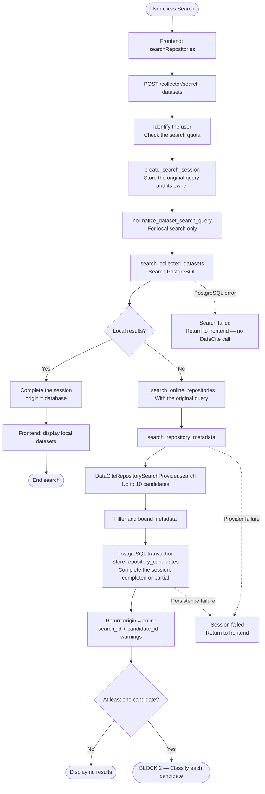
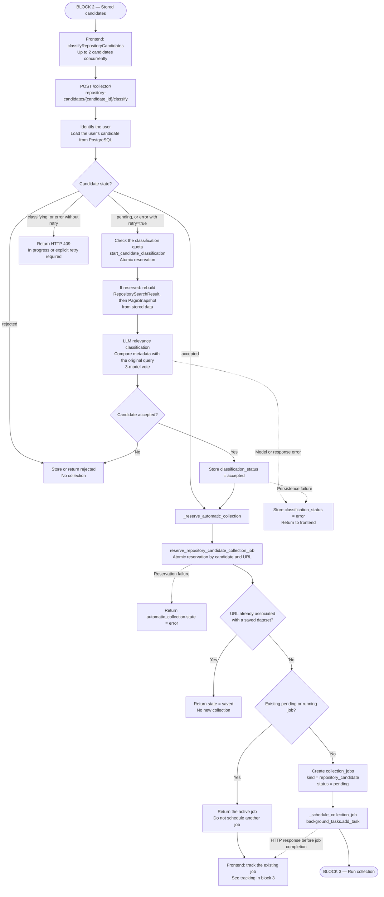
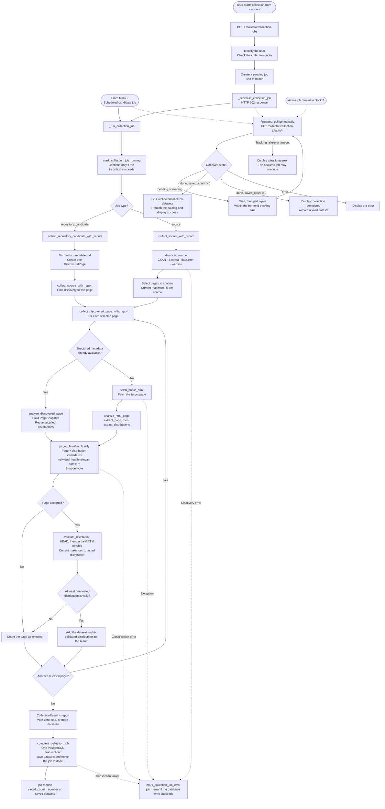

# Global Health Pipeline — Corrected Version

Verified against the local code on September 11, 2026.

The three blocks run in sequence. Manual collection enters directly into the third block. The diagrams use Mermaid, and their source files remain editable.

Both classification stages run DeepSeek, Gemma Meditron, and Apertus Meditron in parallel. Two positive votes are required, and all three responses must be usable.

## 1. Search

Editable source: `01-search.mmd`.

## 2. Classification and Collection Reservation

Editable source: `02-classification.mmd`.

## 3. Collection, Persistence, and Tracking

Editable source: `03-collection-and-tracking.mmd`.

## Reading Notes

- Persistence covers metadata and links, not complete dataset files.
- Tasks run inside the backend process. On restart, searches, classifications, and jobs left active are marked as errors.
- A reused active job continues its existing execution; it is not scheduled again.
- A new request can create another attempt after a job finishes without a dataset or with an error, as long as the dataset remains absent.
- If a classification reservation loses a race against a concurrent request, the server reloads the candidate state before responding.
- Error branches show the main cases. `_run_collection_job` handles every exception during job execution, including extraction and validation failures. A PostgreSQL outage can prevent the error itself from being recorded.
- Access denials, exhausted quotas, and invalid requests stop the affected request before expensive processing begins.
- The limits of 5 pages and 1 distribution reflect the collector's current configuration.
