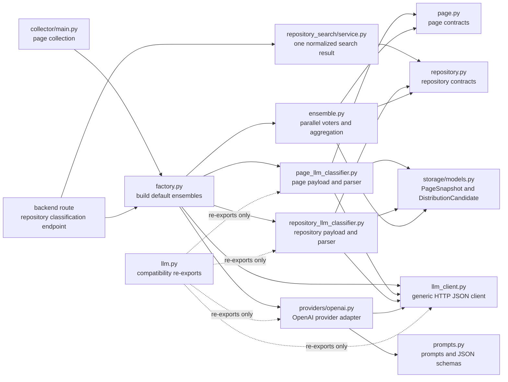
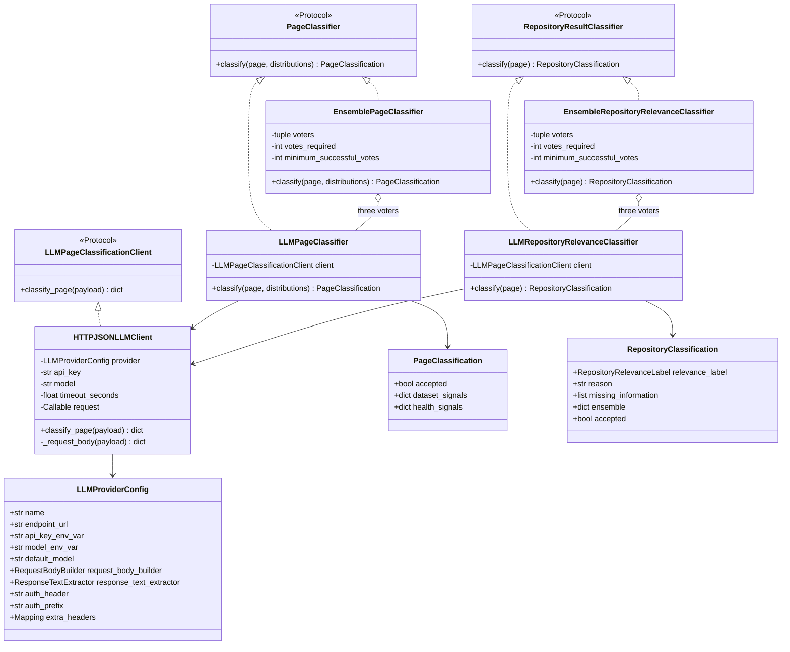
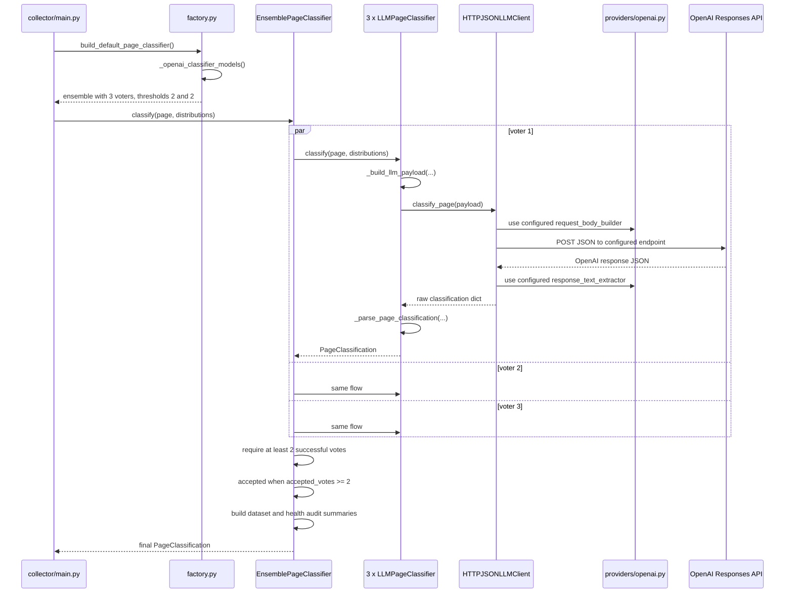
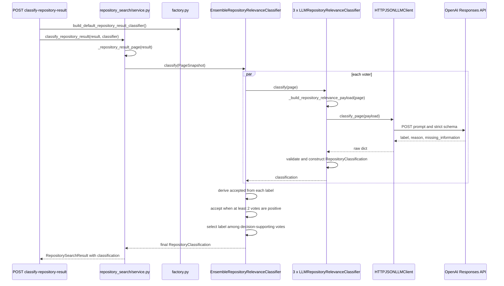
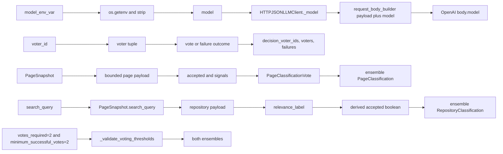

# Classification Architecture

This document describes every runtime module under `collector/classification/`,
the values exchanged between them, and the two classification flows. Private
helpers are included when they validate, transform, or aggregate data.

## Module Map

`classification/__init__.py` and `classification/providers/__init__.py` are
package markers. They do not run classification logic.

## Constructed Objects

The default factory currently creates three **OpenAI model voters**, not three
different LLM providers. They share the OpenAI endpoint and API key, but each
model name must be present and distinct.

## Page Classification Flow

The three calls are parallel inside a `ThreadPoolExecutor`. With the default
thresholds:

- `yes + yes + error` is accepted;
- `yes + no + error` is rejected with `insufficient_accept_votes`;
- only one successful response raises `PageClassificationError`.

## Repository Classification Flow

For repository results, `relevant` and `somewhat_relevant` are positive votes.
`not_relevant` and `insufficient_information` are negative votes. When labels
tie inside the group that supports the binary decision, the conservative order
is `not_relevant`, `insufficient_information`, `somewhat_relevant`, `relevant`.

## Function Inventory

### `factory.py`

| Function | Parameters | Returns | Calls and reuse |
|---|---|---|---|
| `build_default_page_classifier` | none | `PageClassifier` | Reuses the three triples returned by `_openai_classifier_models`; constructs one OpenAI provider config, HTTP client, and `LLMPageClassifier` per voter; wraps them in `EnsemblePageClassifier(2, 2)`. Called by the collector when no classifier is injected. |
| `build_default_repository_result_classifier` | none | `RepositoryResultClassifier` | Uses the same voter IDs and model names, but the repository prompt config and repository classifier. Called by the repository-classification API route. |
| `_openai_classifier_models` | none; reads three environment variables | tuple of `(voter_id, model_env_var, model)` | Rejects missing or duplicate model names. Both public factory functions call it independently. |

### `llm_client.py`

| Function or method | Parameters | Returns | Role |
|---|---|---|---|
| `LLMPageClassificationClient.classify_page` | normalized `payload` | raw classification `dict` | Protocol shared by both concrete LLM classifiers. |
| `HTTPJSONLLMClient.__init__` | `provider`, optional `api_key`, `model`, `timeout_seconds`, injectable `request` | client | Explicit key/model override environment lookup. The injectable request makes network behavior testable. |
| `HTTPJSONLLMClient.classify_page` | `payload` | decoded classification object | Resolves API key, builds headers and request body, performs POST, decodes provider response, extracts text, parses the second JSON layer, and rejects non-object output. |
| `HTTPJSONLLMClient._request_body` | `payload` | provider-specific body | Resolves model from explicit value, provider model environment variable, then provider default; invokes `request_body_builder`. |

`LLMProviderConfig` carries all provider-specific HTTP decisions. Its two
callables are reused by the generic client: `request_body_builder(payload,
model)` builds the outgoing body, while `response_text_extractor(response)`
finds the model's textual JSON output in the provider response.

### `providers/openai.py`

| Function | Parameters | Returns | Role |
|---|---|---|---|
| `openai_responses_provider_config` | display `name`, model env name, default model | `LLMProviderConfig` | Selects the page prompt/body builder and OpenAI response extractor. |
| `openai_repository_relevance_provider_config` | same parameters | `LLMProviderConfig` | Selects the repository prompt/body builder and the same extractor. |
| `_extract_openai_output_text` | decoded provider response | output text | Accepts either top-level `output_text` or nested `output[].content[].text`; otherwise raises a visible classification error. |

### `prompts.py`

| Function | Parameters | Returns | Role |
|---|---|---|---|
| `_build_openai_responses_request_body` | page `payload`, `model` | OpenAI request body | Adds page system prompt, user JSON, and strict page JSON schema. |
| `_build_openai_repository_relevance_request_body` | repository `payload`, `model` | OpenAI request body | Adds repository relevance prompt and strict repository schema. |
| `_system_prompt` | none | string | Defines an accepted page as an individual, health-relevant dataset/resource/API dataset and treats page data as untrusted evidence. |
| `_repository_relevance_system_prompt` | none | string | Defines relevance to the user query, four labels, missing-information behavior, and prompt-injection protection. |
| `_classification_schema` | none | JSON Schema | Requires `accepted`, `dataset_signals`, and `health_signals`, with exact `reason` and `evidence` strings. |
| `_repository_relevance_schema` | none | JSON Schema | Requires `label`, `reason`, and `missing_information`; forbids extra top-level fields. |

### `page_llm_classifier.py`

| Function or method | Parameters | Returns | Role |
|---|---|---|---|
| `LLMPageClassifier.__init__` | a client implementing `classify_page` | classifier | Dependency injection; it does not know which provider is used. |
| `LLMPageClassifier.classify` | `PageSnapshot`, list of `DistributionCandidate` | `PageClassification` | Builds payload, calls client, preserves known classification errors, wraps unexpected client errors, parses output. |
| `_build_llm_payload` | `page`, `distributions` | JSON-safe dict | Copies normalized page fields and metadata; caps headings at 20, page text at 4,000 characters, distributions at 10. |
| `_parse_page_classification` | raw dict | `PageClassification` | Requires a boolean decision and both exact signal objects. |
| `_required_bool` | object and field name | bool | Rejects missing values and non-booleans; it does not use `bool(value)`. |
| `_required_json_object` | object and field name | dict | Requires an object and delegates recursive JSON-safety validation. |
| `_required_signal_object` | object and field name | dict | Requires exactly `reason` and `evidence`, both strings. |
| `_json_safe_object` | dict and field name | dict | Converts low-level type/value failures into `PageClassificationError`. |
| `_json_safe_value` | any value | JSON-safe value | Recursively accepts null, strings, booleans, finite numbers, lists, and string-keyed dicts; rejects unsupported values and non-finite numbers. |

### `repository_llm_classifier.py`

| Function or method | Parameters | Returns | Role |
|---|---|---|---|
| `LLMRepositoryRelevanceClassifier.__init__` | shared LLM client | classifier | Uses the same transport abstraction as page classification. |
| `LLMRepositoryRelevanceClassifier.classify` | `PageSnapshot` | `RepositoryClassification` | Builds bounded query-aware payload, calls client, and validates the result. |
| `_build_repository_relevance_payload` | `page` | dict | Requires `search_query`; bounds query, URLs, title, description, publisher, text, and all normalized metadata values. |
| `_repository_metadata_value` | metadata `key`, `value` | bounded string | Applies field-specific size limits; reused for every metadata entry. |
| `_parse_repository_relevance_classification` | raw dict | `RepositoryClassification` | Validates label/reason/list; requires missing details only for `insufficient_information` and clears them for other labels. |
| `_required_relevance_label` | raw object and field name | supported label | Rejects unknown labels before the dataclass is created. |
| `_required_non_empty_string` | raw object and field name | stripped string | Rejects empty/non-string/overlong reasons. |
| `_required_string_list` | raw object and field name | normalized list | Rejects wrong types, too many entries, and overlong entries. |

### `page.py` and `repository.py`

| Element | Parameters or fields | Reuse |
|---|---|---|
| `PageClassificationError` | message and chained cause | Common visible failure type across transport, parsing, voters, factory, service, and route. |
| `PageClassification` | `accepted`, `dataset_signals`, `health_signals` | Returned by each page voter and by the final page ensemble. |
| `PageClassificationVote` | same result plus `voter_id` | Internal ensemble audit record. |
| `PageClassifier.classify` | `page`, `distributions` | Structural contract implemented by individual and ensemble page classifiers. |
| `RepositoryClassification` | label, reason, missing data, ensemble | Strips/validates semantic data and derives `accepted`; returned by individual and ensemble classifiers. |
| `RepositoryClassificationVote` | repository result plus `voter_id` | Internal repository ensemble record; also derives `accepted`. |
| `RepositoryResultClassifier.classify` | `page` | Structural contract implemented by individual and ensemble repository classifiers. |
| `_normalized_missing_information` | label and list | Deduplicates/strips values; requires a nonempty list only for `insufficient_information`; clears it otherwise. |

The value-object methods and accessors are also active parts of the contract:

| Method or object | Parameters | Effect or returned value |
|---|---|---|
| `RepositoryClassification.__post_init__` | the fields passed to the dataclass constructor | Strips and requires `reason`, normalizes missing information, and derives the non-init `accepted` field from `relevance_label`. |
| `RepositoryClassificationVote.__post_init__` | the fields passed to the vote constructor | Applies the same invariants to each ensemble vote. |
| `EnsemblePageClassifier.voter_ids` | none | Reconstructs the configured voter IDs as a tuple for inspection/tests. |
| `EnsemblePageClassifier.votes_required` | none | Exposes the validated positive-vote threshold. |
| `EnsemblePageClassifier.minimum_successful_votes` | none | Exposes the validated quorum. |
| Repository ensemble accessors | none | Expose the same three values for repository classification. |
| `_VoteOutcome` | `voter_id`, optional page vote, optional error | Represents exactly one successful page vote or one page-voter failure. |
| `_RepositoryVoteOutcome` | `voter_id`, optional repository vote, optional error | Equivalent repository-voter result. |

### Compatibility and package files

| File | Runtime effect |
|---|---|
| `llm.py` | Imports and re-exports the public client, provider, and concrete-classifier names. It contains no classification branch of its own. Existing imports can keep using this facade while new code imports the owning module directly. |
| `classification/__init__.py` | Declares the classification package and contains only its package description. |
| `providers/__init__.py` | Declares the provider-adapter package; it currently does not re-export provider names. |

### `ensemble.py`

| Function or method | Parameters | Returns | Role |
|---|---|---|---|
| `_validate_voting_thresholds` | voter count, required positive votes, minimum successful votes | normalized minimum | Enforces both thresholds within voter count and prevents the minimum-successful threshold from being lower than the acceptance threshold. |
| Both ensemble constructors | voters, `votes_required`, `minimum_successful_votes` | ensemble | Require at least one voter, unique IDs, immutable voter storage, valid thresholds. |
| Both `classify` methods | page and optionally distributions | final classification | Gather outcomes, separate successes/failures, enforce quorum, compute binary decision, select supporting votes, and build audit summary. |
| Both `_classify_voters` methods | input objects | ordered outcomes | Run every voter concurrently with one worker per voter. `executor.map` preserves configured voter order in returned outcomes. |
| `_classify_voter` | `(voter_id, classifier)`, page, distributions | `_VoteOutcome` | Converts successful classifications into votes and expected page failures into error outcomes. |
| `_classify_repository_voter` | `(voter_id, classifier)`, page | `_RepositoryVoteOutcome` | Same conversion; also treats repository dataclass `ValueError` as a voter failure. |
| `_minimum_votes_error` | minimum, success count, failures | error message | Includes each failed voter ID and error when quorum is not reached. |
| `_ensemble_summary` / `_vote_summary` | page votes, failures, thresholds, decision, `signal_kind` | audit dict | Builds parallel dataset/health audit views. `signal_kind` chooses which signal object each voter exposes. |
| `_repository_ensemble_summary` / `_repository_vote_summary` | repository votes and decision data | audit dict | Preserves labels, reasons, missing information, failures, and voter IDs. |
| `_decision_votes` | page votes and final boolean | supporting page votes | Rejects impossible state where no successful vote supports the final decision. |
| `_repository_decision_votes` | repository votes and final boolean | supporting repository votes | Same invariant for repository decisions. |
| `_decision_reason` / `_repository_decision_reason` | accepted flag, votes, threshold | reason code | Returns `enough_accept_votes`, `rejected_by_majority`, or `insufficient_accept_votes`. |
| `_majority_relevance_label` | supporting repository votes | final label | Counts labels and resolves ties conservatively. |
| `_relevance_reason` | supporting votes, final label | reason string | Takes the first reason from a vote with the selected label. |
| `_combined_missing_information` | supporting votes, final label | list | Returns a stable deduplicated union only for `insufficient_information`. |

## Reused Parameter Traces

The important distinction is:

- `votes_required` controls how many positive votes are needed to accept;
- `minimum_successful_votes` controls how many classifiers must return a usable
  response before any decision is allowed.

## Verified Boundaries and Open Decisions

1. Classification code performs no database writes and contains no destructive
   database operation. It returns domain objects to its callers.
2. LLM output is validated without truthy coercions or silent default objects.
   Invalid response JSON, wrong top-level type, unsupported labels, wrong signal
   shapes, and insufficient quorum all remain visible errors.
3. The repository prompt currently evaluates **relevance to the query only**.
   Unlike the page prompt, it does not independently require the result to be a
   global-health dataset. This behavior is explicit in the prompt and tests. It
   is correct only if repository providers/search queries already define the
   health boundary; otherwise a query-relevant non-health dataset can pass.
4. The page contract still requires and propagates `health_signals` separately
   from `dataset_signals`: prompt schema, response parser, vote object, ensemble,
   collected dataset, API response, and tests all use it. It is therefore not
   dead code today. If the intended final contract is only `accepted` plus one
   explanation, removing `health_signals` remains a cross-layer cleanup rather
   than a deletion in one classification file.
5. Repository payload fields are broadly size-bounded. The page payload caps
   page text, heading count, and distribution count, but does not cap every
   individual page, metadata, URL, or distribution string. That is a robustness
   difference to address if upstream extraction cannot guarantee reasonable
   lengths.
6. Three distinct model-name strings provide model diversity, but all default
   voters still depend on one OpenAI account, endpoint, and API-key path. This is
   not provider-level fault isolation.
7. The repository route allows two ensemble classifications at once, while each
   ensemble starts three model calls in parallel. The current process can
   therefore have up to six repository LLM HTTP calls running concurrently.
   The route-level limit is two candidate classifications, not two model calls.
