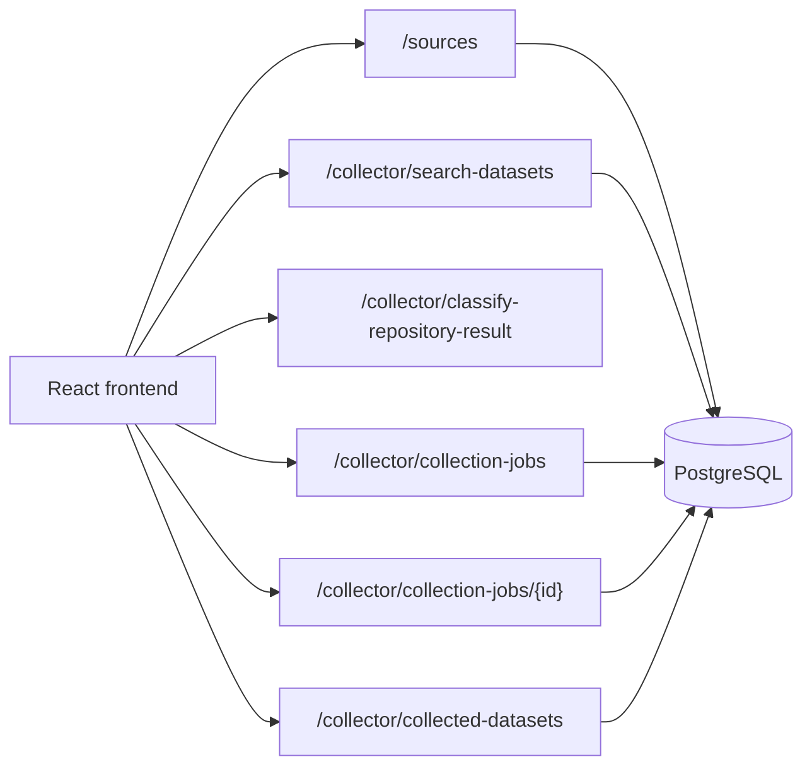
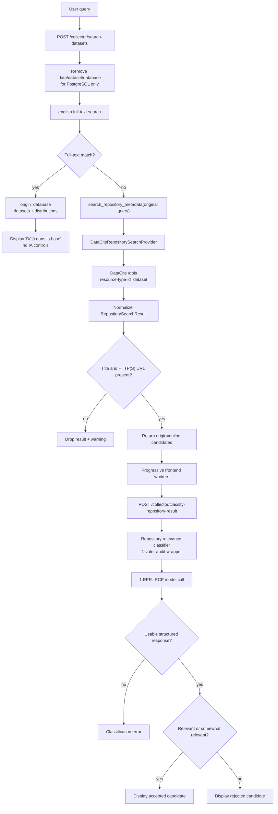
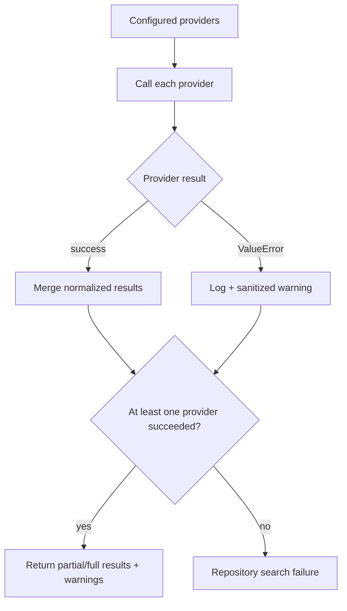
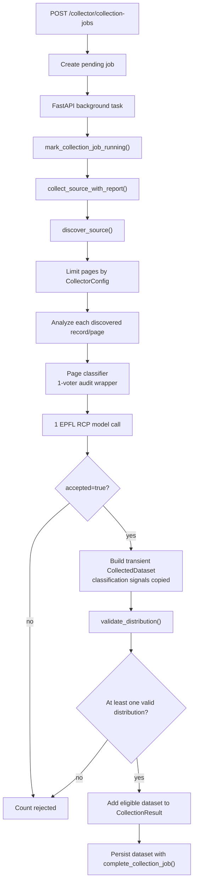
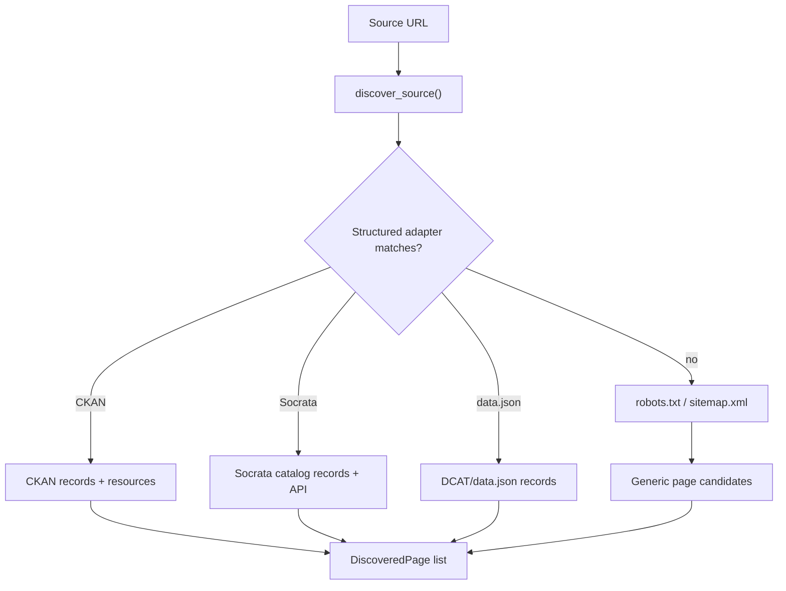
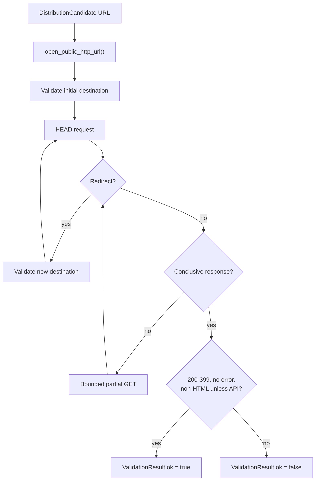
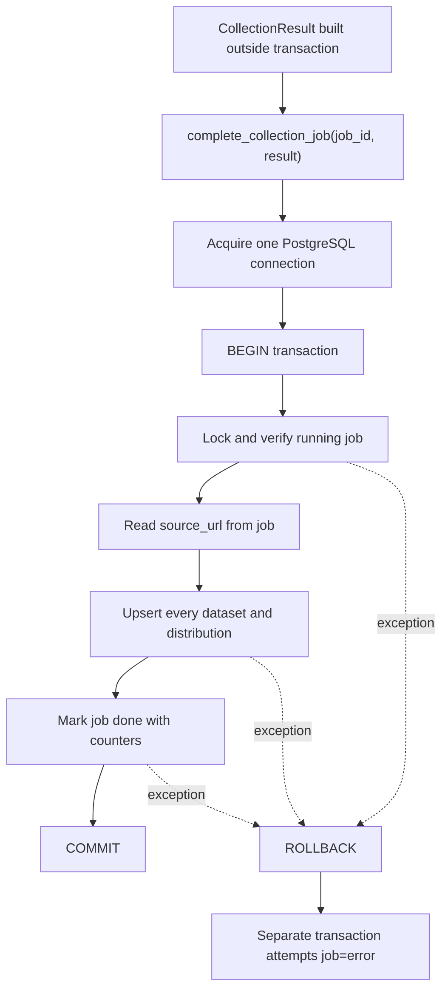

# Collector Pipeline Diagram

> Current runtime flow, last verified 2026-09-04.

The application has two separate flows. Repository search classifies candidates
for display. Source collection decides whether discovered records can be stored.

## 1. Complete HTTP Flow



There is no current manual pasted-HTML/URL test route. Repository search and
source collection are separate API workflows.

## 2. Repository Search Pipeline



Database search covers title, description, publisher, hosting platform,
uploader, geography, and dataset URL. PostgreSQL weights title highest and
orders matches by rank then update time. Both `tsvector` and `tsquery` use the
`english` configuration. The original query is preserved for the API, DataCite,
LLM classification, and display. A database error ends the request with HTTP
500; it is not treated as an empty result. Local retrieval is optimized for
primarily English metadata; complete bilingual search is not implemented.

Repository positive labels are `relevant` and `somewhat_relevant`. The prompt
judges relevance to the user query from repository metadata. It does not
independently validate health relevance, source authority, licence policy, or a
working data distribution.

Online repository results remain in React state. There is no repository-search save to
PostgreSQL and no automatic transition into the source collection pipeline.

### Normalized Repository Metadata Contract

Every provider result is normalized to the same ten fields before repository
classification:

| Field | Meaning |
| --- | --- |
| `Title` | Dataset title |
| `Geography` | Geographic coverage |
| `Date of publication` | Publication or issued date |
| `Dataset URL` | Dataset landing or canonical URL |
| `Disease(s)` | Explicit or extracted disease topics |
| `Size of dataset` | Record, byte, or coverage size when available |
| `Demographic information` | Population characteristics |
| `Sharing license` | Licence or rights metadata |
| `Modality of data` | Tabular, structured, image, audio, or other modality |
| `Description of dataset` | Dataset description or abstract |

Missing values are represented as `NA`; they are not treated as positive
evidence. The LLM also receives the user query and bounded repository fields
such as URL, publisher, description, and metadata-derived text.

### Provider Failure Handling



Only DataCite is configured by default, so its failure currently means all
providers failed.

## 3. Source Collection Pipeline



The page classifier prompt requires both an individual dataset/data resource and
health relevance. Its `dataset_signals` are copied into the `CollectedDataset`
for persistence and audit display.

`CollectionReport.accepted_count` is the number of eligible datasets retained
after distribution validation, not the number of positive page-classifier
responses. `rejected_count` includes inaccessible HTML pages, negative page
decisions, invalid structured URLs, and candidates left without a valid
distribution. Unexpected classifier or validation exceptions abort the job
instead of incrementing that counter.

## 4. Discovery Pipeline



Structured metadata can be classified without downloading an HTML page. Generic
page candidates are fetched and extracted first. Dataverse is a proposed future
adapter and is not part of the active `ADAPTERS` tuple.

## 5. Distribution Validation



Private, loopback, link-local, multicast, reserved, and unspecified destinations
are blocked for initial URLs and redirects. Validation is a lightweight network
and content-type check, not a complete dataset download.

## 6. Atomic Completion



The `done` status cannot commit unless every dataset write succeeds. If
PostgreSQL is completely unavailable, the separate attempt to persist `error`
can also fail.

## 7. Final Storage Condition

```text
The EPFL RCP page response is valid and accepted=true
AND
At least one considered distribution validates successfully
THEN
The eligible dataset is included in CollectionResult
AND
complete_collection_job() persists it while atomically marking the job done
```

An exact conflict on the normalized `dataset_url` updates the existing
`collected_datasets` record. The current schema does not deduplicate semantically
by DOI, title, version, or mirror.

For detailed contracts, see
[Classification Architecture](classification-architecture.md),
[Database Schema Diagram](database-schema-diagram.md), and the
[Dataset Collection & Quality Policy](dataset-collection-and-quality-policy.md).
