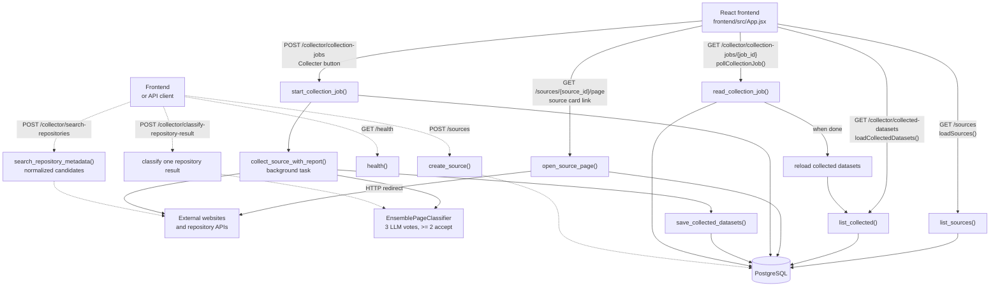
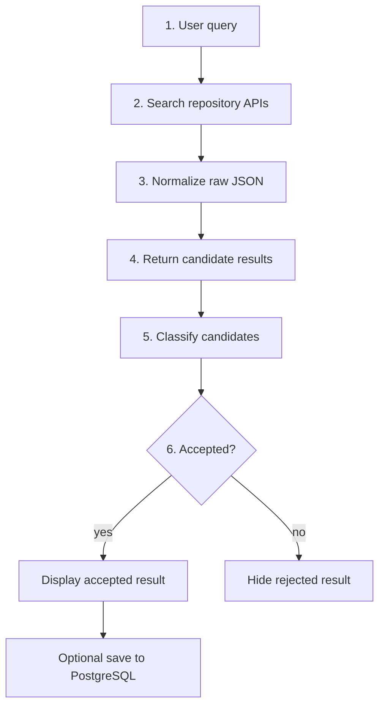
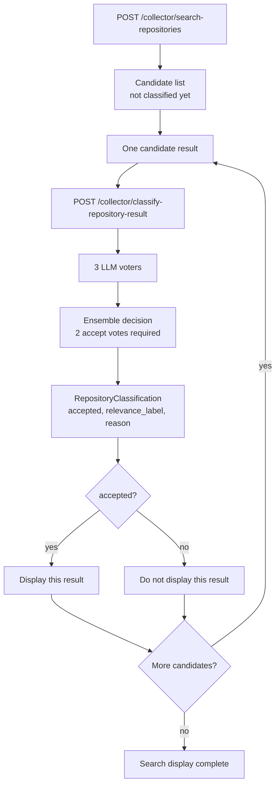
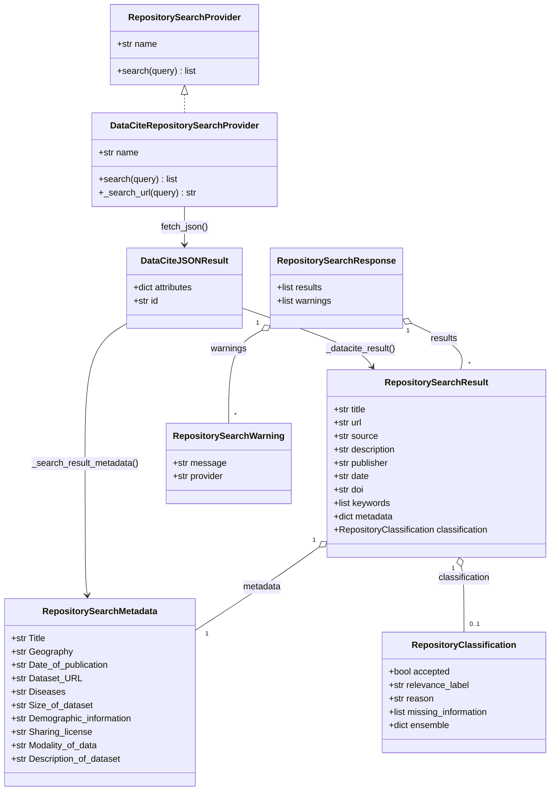
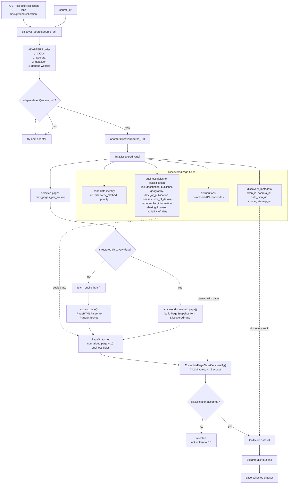

# Collector Pipeline Diagram

This document is a compact visual reference for the collector data flow and
repository-search metadata.

## HTTP API Call Flow

Legend:

- Solid arrows are calls already made by `frontend/src/App.jsx`.
- Dotted arrows are backend routes that exist but are currently API/manual or
  future-UI flows.
- Background collection jobs run inside FastAPI `BackgroundTasks`; the frontend
  only polls their status.



| Caller today | Method | Endpoint | Main backend work | DB write? | Purpose |
| --- | --- | --- | --- | --- | --- |
| Frontend | `GET` | `/sources` | Reads saved source definitions. | No | Populate the source catalogue cards. |
| API/manual | `POST` | `/sources` | Validates and creates a source definition. | Yes | Add a new source to the catalogue. There is no current React form for this. |
| Frontend | `GET` | `/sources/{source_id}/page` | Reads the source, then redirects to `page_url`. | No | Open the official source page from a source card. |
| API/manual | `GET` | `/health` | Returns `{"status": "ok"}`. | No | Health check for backend availability. |
| Frontend | `GET` | `/collector/collected-datasets` | Reads accepted/saved collected datasets. | No | Display datasets already written to PostgreSQL. |
| Frontend | `POST` | `/collector/collection-jobs` | Creates a job and starts `collect_source_with_report()` in the background. | Yes | Main source collection flow from the `Collecter` button. |
| Frontend | `GET` | `/collector/collection-jobs/{job_id}` | Reads job status and counters. | No | Poll until the background collection is `done` or `error`. |
| Frontend or API/manual | `POST` | `/collector/search-repositories` | Searches repository APIs and normalizes candidate metadata. | No | Query-first repository search. Returns candidates, not final accepted datasets. |
| Frontend or API/manual | `POST` | `/collector/classify-repository-result` | Converts one candidate to a `PageSnapshot`, then runs the ensemble classifier. Backend concurrency is limited to two candidates per process. | No | Progressive per-result classification; frontend shows only accepted results. |

Current runtime summary:

```text
App mount
  -> GET /sources
  -> GET /collector/collected-datasets

Click "Ouvrir"
  -> GET /sources/{source_id}/page
  -> redirect to external page_url

Click "Collecter"
  -> POST /collector/collection-jobs
  -> background collect_source_with_report()
  -> repeated GET /collector/collection-jobs/{job_id}
  -> GET /collector/collected-datasets after success

Repository search flow
  -> POST /collector/search-repositories
  -> POST /collector/classify-repository-result for each candidate
  -> frontend filters/display accepted candidates
```

## Repository Search Metadata

Repository search results expose a business-facing `metadata` object. Each key is
always present; missing values are represented as `"NA"`.

```text
{
    "Title": "...",
    "Geography": "...",
    "Date of publication": "...",
    "Dataset URL": "...",
    "Disease(s)": "...",
    "Size of dataset": "...",
    "Demographic information": "...",
    "Sharing license": "...",
    "Modality of data": "...",
    "Description of dataset": "..."
}
```

## Main User Query Pipeline

This is the current interactive user flow. The main user enters a query. The
manual URL/HTML collector flow is an admin/debug flow, not the main user flow.

`POST /collector/search-repositories` returns repository candidates without LLM
classification. `POST /collector/classify-repository-result` classifies one
candidate at a time, so the frontend displays accepted results progressively.

### Simple Flow



### Progressive Classification

`search-repositories` returns candidate metadata quickly. Then the frontend should
send one classification request per candidate. Each request returns one JSON
decision, so accepted results can appear as soon as their own classification
finishes.



Short version:

```text
query -> repository APIs -> normalized candidates -> one LLM classification per
candidate -> frontend displays accepted candidates
```

## Repository Search Pipeline



`RepositorySearchMetadata` represents the exact JSON keys returned in
`RepositorySearchResult.metadata`: `Title`, `Geography`,
`Date of publication`, `Dataset URL`, `Disease(s)`, `Size of dataset`,
`Demographic information`, `Sharing license`, `Modality of data`, and
`Description of dataset`.

`PageSnapshot` stores the typed source values and derives the same metadata
contract only when it is exported or sent to a classifier.
`_PageHTMLParser` only extracts raw HTML fields; `extract_page()` converts those
raw fields into normalized `PageSnapshot` fields before classification.

## Discovery Adapter Pipeline

This is the adapter path used by asynchronous collection jobs.



`discovery_metadata` is deliberately not part of the classification contract. It
keeps adapter/debug information about how the candidate was found. The classifier
reads the normalized `PageSnapshot` business fields plus distributions.

The default classifier is an `EnsemblePageClassifier`: it requires three distinct
OpenAI model names in `OPENAI_CLASSIFIER_MODEL_1`, `OPENAI_CLASSIFIER_MODEL_2`,
and `OPENAI_CLASSIFIER_MODEL_3`. A page is accepted when at least two successful
votes return `accepted=true`. Dataset and health reasons are retained separately
for every successful voter.

## Collector Pipeline

`PageHTMLParser` in this diagram represents the private `_PageHTMLParser`
implementation in `collector/extraction/extractor.py`.

```mermaid
classDiagram
    class FetchedPage {
        +str url
        +str final_url
        +int status_code
        +str content_type
        +str html
    }

    class PageHTMLParser {
        +list title_parts
        +list h1_parts
        +list heading_parts
        +list text_parts
        +list links
        +list json_ld
        +str canonical_url
        +str meta_description
        +str og_title
        +str og_description
        +str publisher
        +list geography
    }

    class PageSnapshot {
        +str url
        +str canonical_url
        +str title
        +str h1
        +str meta_description
        +str og_title
        +str og_description
        +tuple headings
        +str text
        +str publisher
        +tuple geography
        +str hosting_platform
        +str uploader
        +str date_of_publication
        +str dataset_url
        +tuple diseases
        +str size_of_dataset
        +tuple demographic_information
        +str sharing_license
        +tuple modality_of_data
        +str description_of_dataset
        +dict dataset_metadata()
        +tuple links
        +tuple json_ld
    }

    class LinkCandidate {
        +str url
        +str anchor
        +str nearby_text
        +str extension
        +bool same_domain
        +str dom_path
    }

    class DistributionCandidate {
        +str url
        +str format
        +float probability
        +str anchor
        +str extension
        +str mime_type
        +str nearby_text
        +bool same_domain
        +str dom_path
        +dict signals
        +str first_seen_at
        +str last_seen_at
        +str last_checked_at
    }

    class PageClassification {
        +bool accepted
        +dict dataset_signals
        +dict health_signals
    }

    class EnsemblePageClassifier {
        +list voters
        +int votes_required
        +classify(page, distributions) PageClassification
    }

    class PageClassificationVote {
        +str voter_id
        +bool accepted
        +dict dataset_signals
        +dict health_signals
    }

    class CollectedDataset {
        +str dataset_url
        +str title
        +str description
        +str publisher
        +tuple geography
        +str hosting_platform
        +str uploader
        +dict dataset_signals
        +dict health_signals
        +list distributions
        +list validation_results
        +str source_url
        +int database_id
        +str first_seen_at
        +str last_seen_at
        +str updated_at
    }

    class ValidationResult {
        +str url
        +str final_url
        +str format
        +bool ok
        +int http_status
        +str mime_type
        +int size_bytes
        +str etag
        +str last_modified
        +str content_disposition
        +str error
    }

    class CollectionReport {
        +int discovered_count
        +int analyzed_count
        +int accepted_count
        +int rejected_count
        +int invalid_distribution_count
        +tuple discovery_methods
    }

    class CollectionResult {
        +list datasets
        +CollectionReport report
    }

    FetchedPage --> PageHTMLParser : html parsed by
    PageHTMLParser --> PageSnapshot : extract_page() creates
    PageSnapshot "1" o-- "*" LinkCandidate
    PageSnapshot --> DistributionCandidate : extract_distributions()
    PageSnapshot --> EnsemblePageClassifier : classify() reads normalized fields
    EnsemblePageClassifier --> PageClassificationVote : collects 3 votes
    PageClassificationVote --> PageClassification : majority creates final verdict
    PageSnapshot --> CollectedDataset : accepted page becomes
    PageClassification --> CollectedDataset : scores copied into
    CollectedDataset "1" o-- "*" DistributionCandidate
    CollectedDataset "1" o-- "*" ValidationResult
    CollectionResult "1" o-- "*" CollectedDataset
    CollectionResult "1" o-- "1" CollectionReport
```


