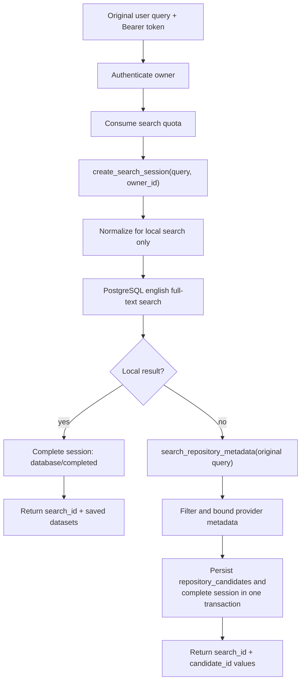
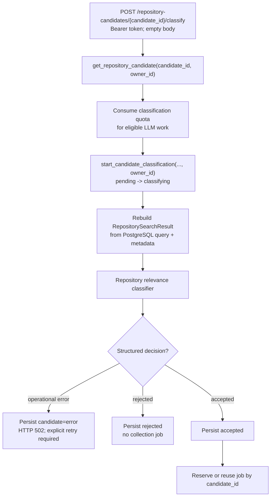
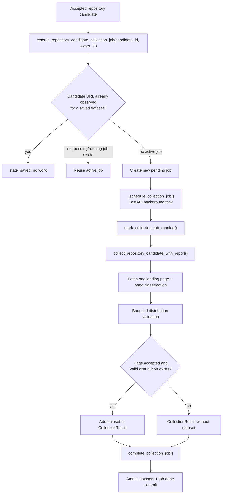

# Collector Pipeline Diagram

> Current runtime flow, verified 2026-09-08.

Repository search persists searches and candidates for trusted classification.
Only the collection pipeline can create or update catalogue datasets.

## Repository Search



The local normalizer never changes the query stored in `search_sessions` or
sent to DataCite and the LLM. Provider failure completes the search as `error`;
warnings produce `partial`. A candidate batch and its successful session
completion commit atomically. After a session is created, failures while
completing a local result or bounding and persisting external candidates also
attempt to close the session as `error`.

## Candidate Classification



The frontend cannot supply the URL, query, owner, or metadata used by the classifier.
The owner comes from the authenticated Bearer token, and every candidate read or
state transition verifies it through `search_sessions`; another owner receives
a not-found response.
Atomic state reservation prevents simultaneous LLM calls for one candidate.
React classifies at most two candidates concurrently and ignores responses whose
`search_id` no longer matches the active search.
If the final accepted or rejected decision cannot be persisted, the route
attempts to move the still-`classifying` candidate to `error` before returning
HTTP 500. That recovery write can also fail while PostgreSQL is unavailable.

Repository acceptance means relevance to the user query. It does not by itself
prove health relevance, source authority, licence acceptability, or file
availability.

## Automatic Collection



DataCite metadata is not copied into `collected_datasets`. The collector fetches
the candidate landing page and applies the existing page and file gates. A done
job with `saved_count=0` is shown as collection completed without a valid file;
an exception is stored as job `error`. A later accepted request creates a new
attempt after either terminal outcome if the dataset is still absent. The old
terminal row is retained as attempt history.

## Collection Entry Point

The website starts collection automatically for accepted repository candidates.
Source administration and manual source collection have been removed from the
website, including the former `POST /collector/collection-jobs` endpoint.
The source discovery library remains available for maintenance outside the UI.

## Limits And Execution

- DataCite returns at most 10 candidates per query.
- React and the backend executor allow at most two candidate classifications at
  once.
- Collection concurrency defaults to two jobs per backend process.
- Source page and distribution limits come from `CollectorConfig`; repository
  collection is additionally restricted to one landing page.
- HTML, JSON, sitemap, and distribution reads are bounded and all redirects are
  revalidated by `open_public_http_url()`.
- Background work is process-local, not a durable queue. `_schedule_collection_job()`
  is the single scheduling point intended for a future queue replacement.

On single-process startup, interrupted searches, jobs, and candidate
classifications are marked `error`. Static Bearer tokens, candidate ownership,
and persistent per-owner quotas are implemented for the MVP. OAuth/OIDC, roles,
multi-worker job ownership, and infrastructure-level traffic limits remain
future production work.

## Final Save Condition

```text
repository candidate accepted (for automatic collection only)
AND page classifier accepted=true
AND at least one considered distribution validates successfully
THEN the dataset enters CollectionResult
AND complete_collection_job() atomically upserts it and marks the job done
```

See [Classification Architecture](classification-architecture.md) for prompts
and [Database Schema](database-schema-diagram.md) for persisted state.
