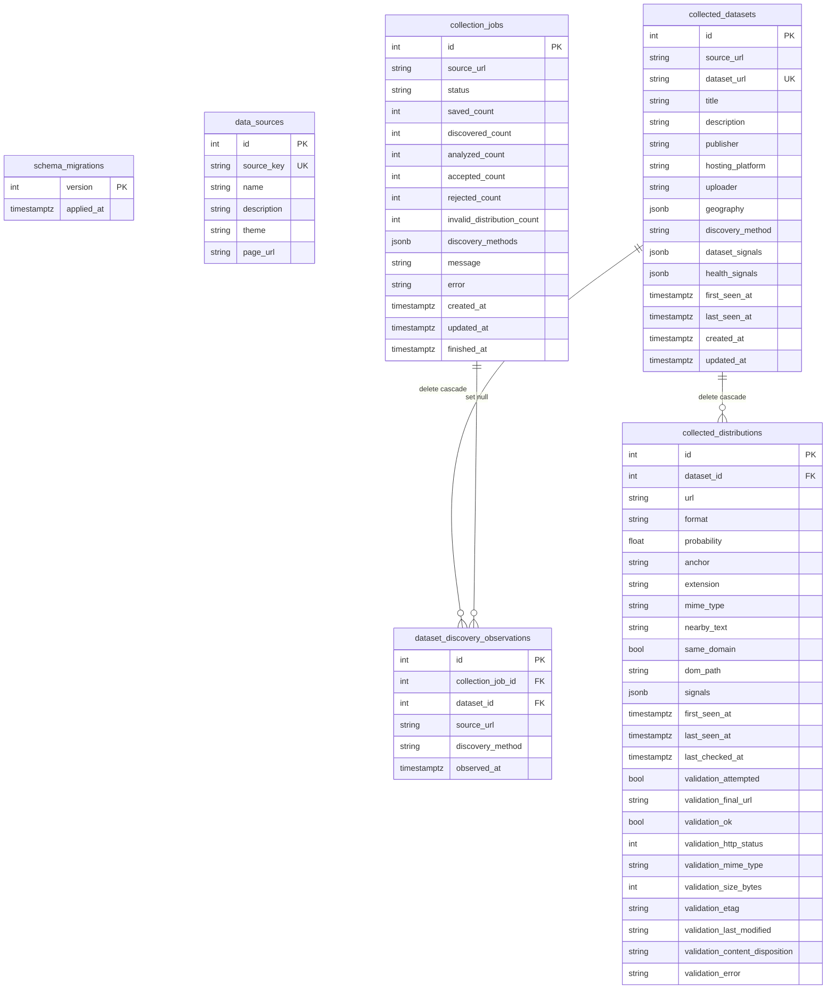

# Database Schema Diagram

This document is a compact visual reference for the PostgreSQL schema managed by
the application.

The PostgreSQL database is managed by the application. A new database starts at
the current application schema, recorded in `schema_migrations`.

