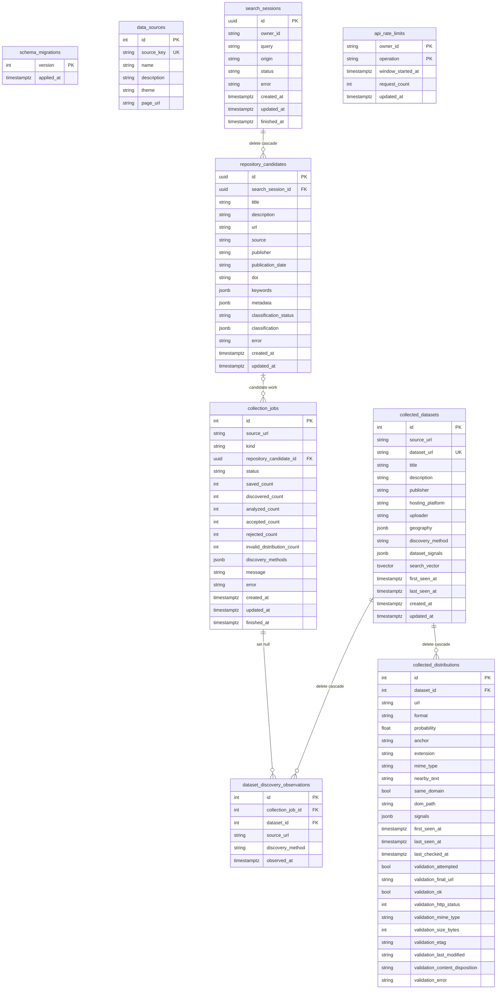

# Database Schema Diagram

This document is a compact visual reference for the PostgreSQL schema managed by
the application.

The PostgreSQL database is managed by the application. A new database starts at
the current application schema, recorded in `schema_migrations`.

This diagram describes the current schema only. Proposed review status,
persistent identifiers, licensing, quality, and lifecycle work is tracked in
the [roadmap](roadmap.md).

`collected_datasets.search_vector` is maintained by a trigger and indexed by
`collected_datasets_search_vector_idx` using GIN. It covers title, description,
publisher, hosting platform, uploader, geography, and dataset URL with decreasing
weights. The vector and matching query both use PostgreSQL's `english`
configuration. This pre-stable schema update has no migration; older local
databases, including those built with the previous `simple` configuration, must
be recreated. This currently favors primarily English metadata; full bilingual
search is not implemented.

`CollectedDataset` normalizes an HTTP(S) identity before insertion, and the
database deduplicates only exact matches of that normalized `dataset_url`.
Separate URLs for the same DOI, version, or mirror remain separate records.
Distributions are unique by `(dataset_id, url, format)`; rediscovery refreshes
their evidence without deleting distributions absent from a later crawl.

Repository candidates are unique by `(search_session_id, source, url)`. Their
classification JSON is present only for accepted or rejected terminal states;
operational failures use the separate `error` state. Candidate collection jobs
carry `kind=repository_candidate` and a foreign key to the candidate. A partial
unique index allows at most one `pending` or `running` job per candidate.
Another partial unique index prevents active repository jobs for different
candidates from duplicating the same normalized source URL. Only `pending` and
`running` jobs block a reservation. Terminal `error` and empty `done` attempts
remain unchanged as history but allow a new pending job while no corresponding
dataset has been saved.

`search_sessions.owner_id` is derived from the authenticated server-side token
mapping. Candidate reads and state transitions require that owner, so a UUID
cannot cross user boundaries. `api_rate_limits` stores atomic fixed-minute
counters with one row per `(owner_id, operation)` and resets the stored window
atomically. It intentionally has no foreign key because owner identities are
configuration-backed in the current MVP rather than rows in an accounts table.

These tables belong to the current pre-release initial schema, including the
owner column and `api_rate_limits`. There is no
upgrade migration from an older local schema; recreate the local database when
startup reports that managed tables are missing.
