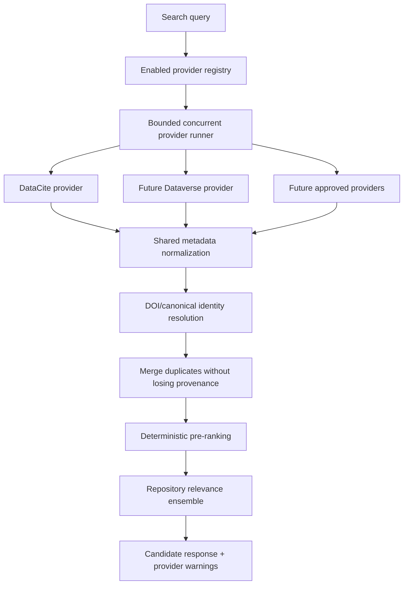

# Proposed Multi-Repository Search Architecture

| Field | Value |
| --- | --- |
| Status | Proposal; not implemented |
| Last reviewed | 2026-09-02 |
| Decision owner | Unassigned |

This document preserves the detailed multi-repository direction without
presenting it as current architecture. The current runtime uses only
`DataCiteRepositorySearchProvider` for repository search. CKAN, Socrata, and
data.json are active source-discovery adapters, not repository-search providers.
Dataverse is not active in either registry.

## 1. Goals

- search several repository APIs behind one stable backend contract;
- preserve provider provenance and partial-failure information;
- normalize heterogeneous metadata before LLM classification;
- bound latency, payload size, concurrency, and provider quotas;
- avoid duplicate cards for the same DOI or canonical dataset;
- keep repository candidates separate from collection/publication approval.

## 2. Non-Goals

- repository relevance must not directly persist a dataset;
- adding providers must not weaken health, distribution, provenance, licence, or
  review gates;
- the search service must not become a second source-collection engine;
- provider ranking must not be described as scientific quality certification.

## 3. Proposed Components



### Provider registry

Each enabled provider should have configuration independent of its
implementation:

| Setting | Purpose |
| --- | --- |
| `provider_id` | Stable API/logging identifier |
| `enabled` | Controlled rollout switch |
| `timeout_seconds` | Provider-specific latency budget |
| `result_limit` | Bound response and classification cost |
| `max_concurrency` | Respect provider and application capacity |
| `priority` | Deterministic ordering before relevance classification |
| `health_scope` | Whether provider content is health-specific or general |

The registry should be server-controlled. A client must not provide an arbitrary
provider endpoint.

### Provider interface

The current `RepositorySearchProvider.search(query)` protocol is sufficient for
simple providers. A multi-provider implementation should additionally return or
associate:

- provider request identifier and timing;
- result count before and after local filtering;
- sanitized warning category;
- retryability;
- quota/rate-limit metadata when exposed safely.

Provider-specific API shapes remain under `repository_search/providers/`.
Normalization, deduplication, failure policy, and classification remain shared.

## 4. Normalized Metadata Contract

Every result must supply the current ten-field contract:

1. `Title`
2. `Geography`
3. `Date of publication`
4. `Dataset URL`
5. `Disease(s)`
6. `Size of dataset`
7. `Demographic information`
8. `Sharing license`
9. `Modality of data`
10. `Description of dataset`

Missing values remain `NA`. Provider names, identifiers, authors, raw metadata,
and provenance may be retained outside this normalized object, but must not be
invented to fill missing fields.

## 5. Identity and Duplicate Merging

Proposed identity order:

1. normalized DOI or another approved persistent identifier;
2. canonical dataset URL after safe normalization;
3. provider-native identifier scoped by provider;
4. no merge when identity remains ambiguous.

A merge should preserve all provider observations rather than choosing one
source silently. Conflicting titles, publishers, licences, or dates should be
recorded as conflicts and may require review. Fuzzy title matching alone must not
merge records automatically.

## 6. Failure Semantics

The current partial-success rule should remain:

- one provider failure produces a sanitized warning;
- successful providers still return candidates;
- the request fails only when every enabled provider fails;
- malformed individual records are dropped without failing valid records;
- provider errors are logged with internal details but API responses expose no
  credentials or sensitive payloads.

The future runner should execute providers concurrently within a total request
budget. Retry should be limited to transient failures, honor rate limits, and
never multiply a request beyond the configured budget.

## 7. Classification and Acceptance Boundary

Repository LLM classification remains query-relevance classification. It may use
the normalized metadata and provider provenance, but it must not be treated as
proof that:

- the record is health-related;
- the source is authoritative;
- a file/API is accessible;
- the licence is acceptable;
- the candidate can be published.

An accepted search candidate must enter the normal source-collection and policy
gates before persistence. The API and UI should use the word `candidate` until
those gates pass.

## 8. API Evolution

The existing response can remain backward compatible while adding optional
fields:

```text
query
items[]
warnings[]
providers[]: id, status, duration, returned_count
```

Provider status should use stable categories such as `ok`, `timeout`,
`unavailable`, `rate_limited`, and `invalid_response`. Raw exception messages
should remain server-side.

## 9. Security and Operations

- all provider base URLs are fixed server configuration;
- all untrusted result URLs remain data until opened by the protected collection
  fetch layer;
- redirect and private-network protections apply whenever a candidate URL is
  fetched;
- provider response sizes and parsing depth must be bounded;
- metrics should cover latency, error category, result count, duplicate rate,
  LLM acceptance rate, and classification cost by provider;
- no API key or provider payload containing secrets may enter logs or warnings.

## 10. Proposed Rollout

1. Approve target providers and benchmark queries.
2. Add provider contract tests and recorded response fixtures.
3. Implement bounded concurrent execution and per-provider outcomes.
4. Add identifier-aware deduplication with conflict preservation.
5. Integrate one new provider behind a disabled-by-default flag.
6. Compare recall, precision, latency, cost, and duplicate rate against DataCite.
7. Enable only after product/data approval.

## 11. Open Decisions

- Is Dataverse a required provider or only a future possibility?
- Should CKAN/data.json portals participate in query search, or remain source
  collection adapters?
- What total latency and classification-cost budget applies per user query?
- Which identifiers are trusted for automatic merging?
- How should conflicting provider metadata be displayed and reviewed?
- Does provider priority influence ranking, or only deterministic tie-breaking?
