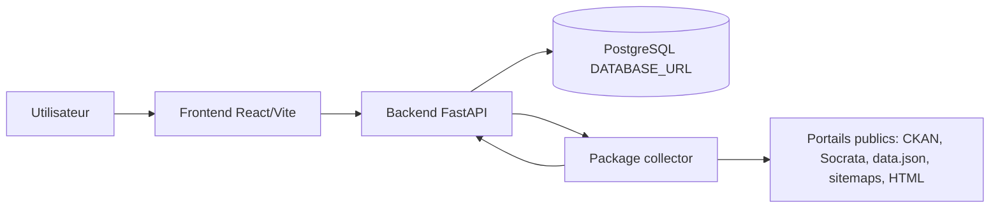
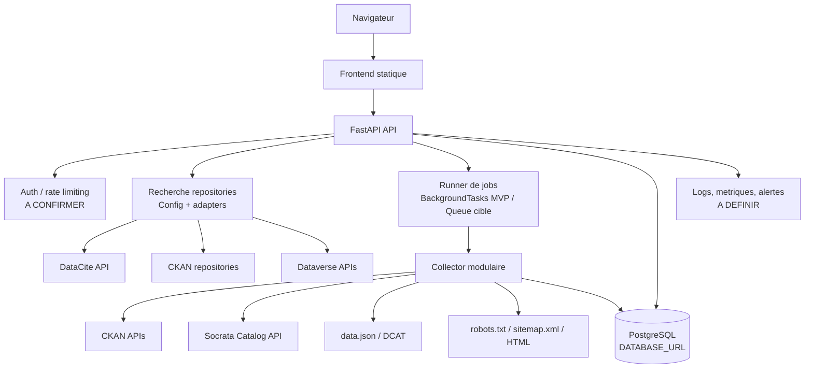
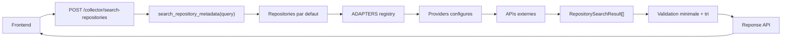
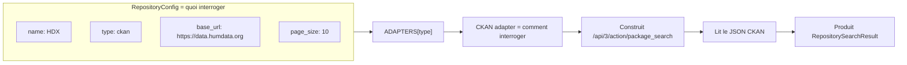
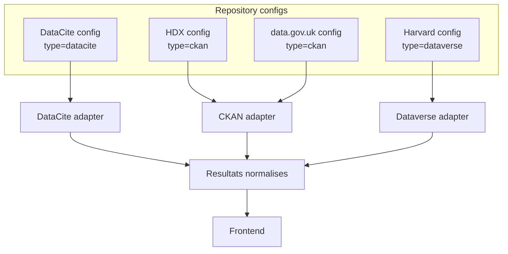
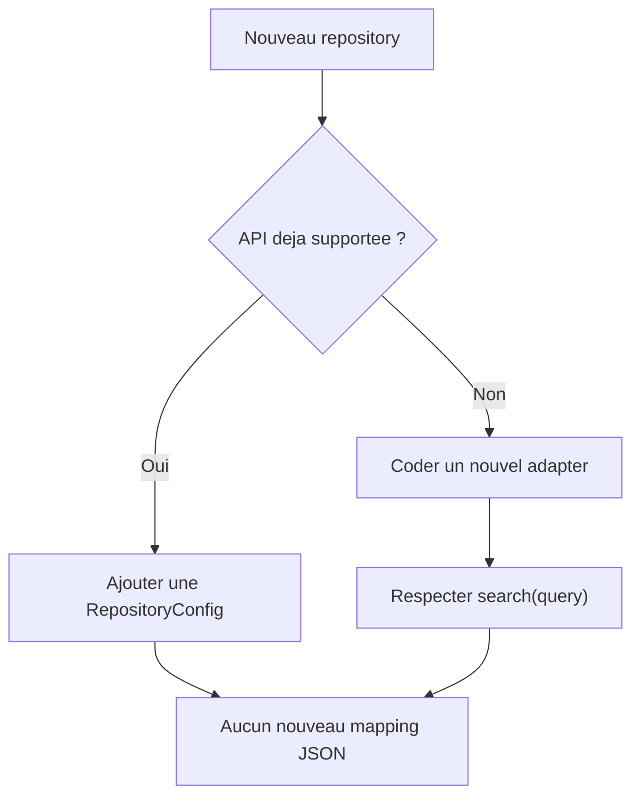
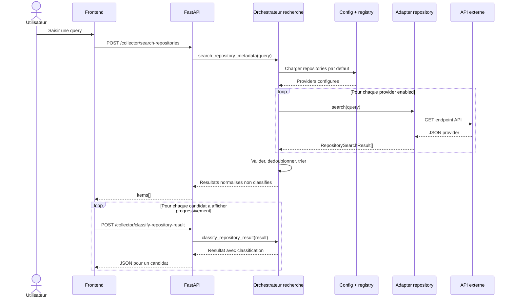
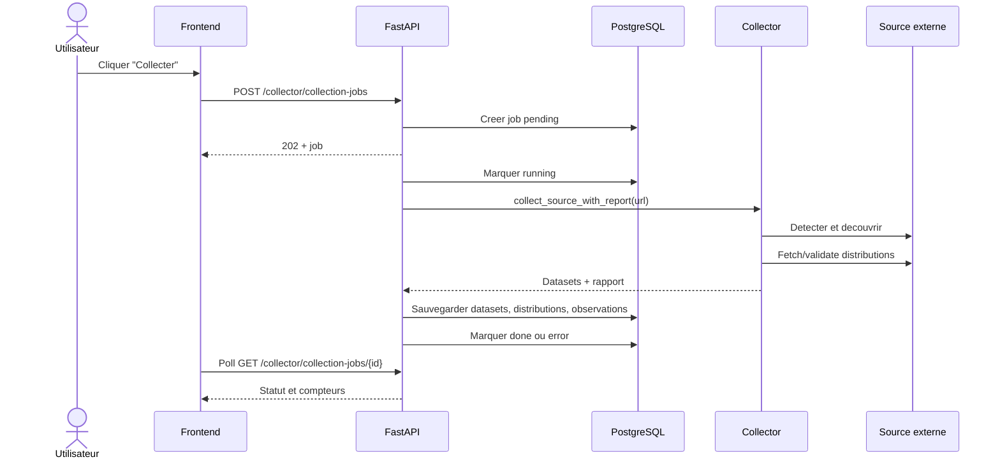
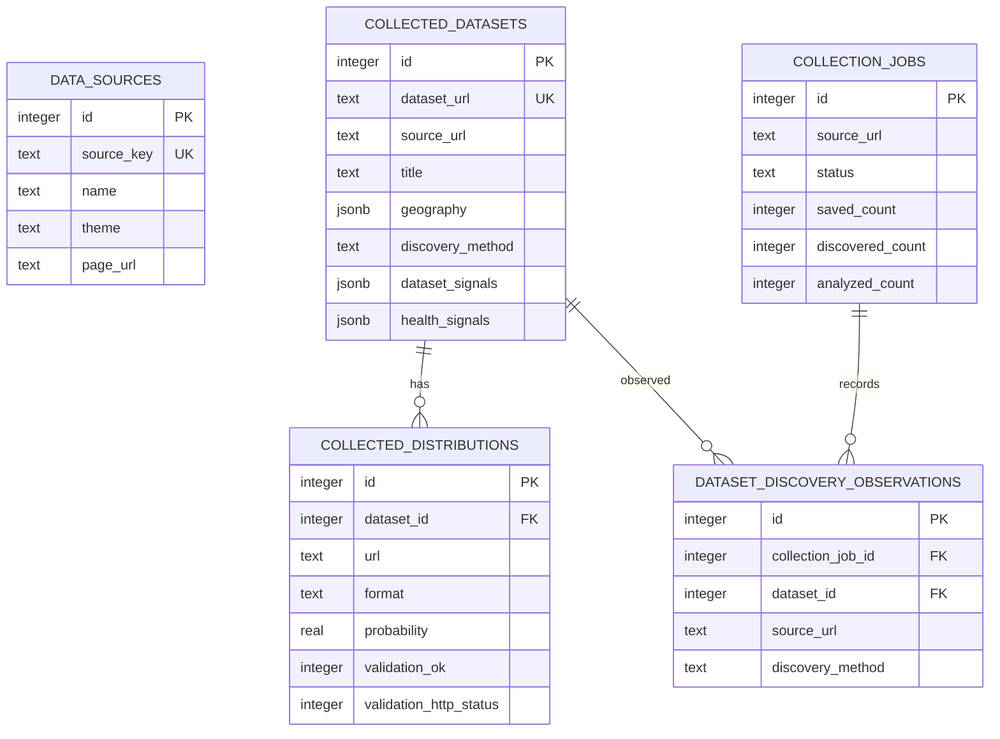

# Technical Design Document - Global Health Dataset Catalog

> Etat 2026-08-23 : les sections d'analyse SQLite de ce TDD sont historiques.
> Toute mention de SQLite, `GLOBAL_HEALTH_DB_PATH`, `backend/global_health.db`,
> `sqlite3`, `PRAGMA user_version` ou migration de donnees SQLite doit etre lue
> comme non applicable au code courant.

## Statut courant depuis la migration PostgreSQL

- Le backend est PostgreSQL-only via `DATABASE_URL`.
- La couche DB est async avec `psycopg` et `psycopg_pool.AsyncConnectionPool`.
- Il n'y a ni fallback SQLite, ni migration des anciennes donnees SQLite.
- La base PostgreSQL est geree par l'application et doit etre vide au premier
  demarrage. Le schema courant est initialise par `schema_migrations`.
- Le README et `docs/ONBOARDING.md` refletent le setup local courant.

## Analyse de la documentation existante

### Documents analyses

| Document | Type | Sujet | Informations importantes | Fiabilite / actualite |
| --- | --- | --- | --- | --- |
| Consignes utilisateur jointes | Specification de livrable | Structure attendue du TDD | Demande une analyse complete avant redaction, une separation entre confirme, deduction, hypothese et information manquante, et un TDD utilisable par responsables et equipes techniques. | Haute. Source de cadrage du document. |
| `README.md` | Documentation projet | Vue globale, lancement, endpoints, checks | Projet React + FastAPI pour cataloguer des pages officielles de datasets sante. Le README courant documente PostgreSQL local, `DATABASE_URL`, `TEST_DATABASE_URL`, les endpoints et les controles. | Haute pour le setup courant. |
| `pyproject.toml` | Configuration Python | Packaging et outillage | Projet `global-health-dataset-catalog` version 0.1.0, Python >= 3.9, packages `backend/app` et `collector`, ruff et pytest en dependances de dev. | Haute pour le code Python. |
| `backend/requirements.txt` | Configuration backend | Dependances runtime backend | Dependances runtime : FastAPI, Uvicorn, `psycopg` et `psycopg-pool`. | Haute pour les contraintes minimales. |
| `frontend/package.json` et `frontend/package-lock.json` | Configuration frontend | React/Vite et versions verrouillees | React 18.3.1, React DOM 18.3.1, Vite 5.4.21, plugin React Vite 4.7.0. Scripts `dev`, `build`, `preview`. | Haute pour l'environnement frontend local. |
| `backend/app/main.py` | Code source backend | Application FastAPI | Initialisation de la base au demarrage, CORS limite a `localhost`/`127.0.0.1:5173`, routes `/sources`, `/collector`, `/health`. | Haute. |
| `backend/app/database.py` et `backend/app/db/*.py` | Code source backend | Couche DB PostgreSQL async | `database.py` garde l'interface historique ; les modules `db/connection.py`, `db/schema.py`, `db/sources.py`, `db/collected_datasets.py`, `db/collection_jobs.py` et `db/serialization.py` portent l'implementation. | Haute pour l'intention applicative actuelle. |
| `backend/app/routes/*.py` | Code source backend | API HTTP | Routes de catalogue, analyse HTML/URL, decouverte, collecte synchrone, jobs asynchrones, recherche repositories, liste des datasets collectes. | Haute. |
| `collector/**/*.py` | Code source collecteur | Extraction, classification, decouverte, validation, recherche repositories | Collecteur generique, adaptateurs CKAN/Socrata/data.json/site generique, scoring dataset/sante, detection de distributions, validation HEAD puis GET partiel, recherche DataCite normalisee. | Haute. |
| `frontend/src/App.jsx`, `frontend/src/styles.css` | Code source frontend | Interface utilisateur | Catalogue des sources, filtres, lancement et polling de jobs, liste des datasets collectes, panneau de test collecteur. | Haute. |
| `tests/*.py` | Tests automatises | Comportement attendu | Tests base, routes, pipeline collecteur, discovery adapters et sitemaps. Les tests DB PostgreSQL utilisent `TEST_DATABASE_URL` et un schema isole par test. | Haute si executes avec PostgreSQL reel ; sinon les tests DB sont skippes. |
| `backend/global_health.db` | Archive historique SQLite | Anciennes donnees locales | Ancienne base SQLite locale, non utilisee par le code courant et non migree. | Historique seulement. Non applicable au runtime courant. |
| `.gitignore` et metadonnees Git | Configuration depot | Etat projet | Branche courante `collector-update`, tag `v0.1.0-no-collector`, dernier commit local observe `e32eca2 Make stored JSON errors explicit`. | Haute pour le contexte local. |

Fichiers exclus de l'analyse fonctionnelle : `.venv`, `frontend/node_modules`, `frontend/dist`, caches pytest/ruff, `__pycache__`, artefacts Git internes. Ils sont generes ou vendorises et ne constituent pas des specifications projet.

### Comprehension globale du projet

Le projet **Global Health Dataset Catalog** vise a maintenir un catalogue local de pages officielles de datasets de sante mondiale. L'application permet de referencer des sources, de consulter les pages externes, de decouvrir des pages candidates depuis des catalogues publics, de classifier ces pages comme datasets et comme contenus sante, puis de sauvegarder uniquement les metadonnees et les liens de distributions valides. Le projet ne stocke pas les fichiers de donnees eux-memes.

L'architecture actuelle est une application locale ou MVP : un frontend React/Vite consomme une API FastAPI, laquelle persiste dans PostgreSQL via une couche DB async et orchestre un package Python `collector`. Le collecteur est volontairement generique : il privilegie d'abord les catalogues structures CKAN, Socrata et `data.json`/DCAT, puis bascule vers une decouverte par `robots.txt`/`sitemap.xml` et analyse HTML.

Les utilisateurs identifies sont principalement des personnes techniques ou data qui veulent inventorier des sources de datasets sante, tester la detection du collecteur, lancer des collectes et inspecter les resultats. Aucun role metier, administrateur, equipe de production ou utilisateur final externe n'est documente.

### Informations confirmees

- **CONFIRME** - Le projet est nomme `global-health-dataset-catalog` et versionne `0.1.0` dans `pyproject.toml` et `frontend/package.json`.
- **CONFIRME** - Le backend est FastAPI et expose `/health`, `/sources`, `/sources/{id}/page`, `/collector/collection-jobs`, `/collector/collection-jobs/{job_id}`, `/collector/search-repositories`, `/collector/classify-repository-result` et `/collector/collected-datasets`.
- **CONFIRME** - Le frontend utilise React/Vite et pointe par defaut vers `http://127.0.0.1:8001`.
- **CONFIRME** - La base cible du code courant est PostgreSQL, configuree par `DATABASE_URL`. L'application echoue au demarrage si cette variable est absente.
- **CONFIRME** - Les seeds applicatifs reserves sont `who_gho_indicators` et `who_gho_life_expectancy`.
- **CONFIRME** - La classification par defaut utilise un `EnsemblePageClassifier` avec trois votes LLM et accepte une page quand au moins deux votes LLM l'acceptent. Les raisons et preuves dataset/sante sont conservees comme signaux d'audit.
- **CONFIRME** - Les limites par defaut du collecteur sont `max_pages_per_source = 5`, `max_distributions_per_dataset = 1`.
- **CONFIRME** - Les adaptateurs de decouverte sont executes dans l'ordre CKAN, Socrata, `data_json`, puis site generique.
- **CONFIRME** - Les liens PDF et formats image/HTML sont exclus des distributions de donnees par defaut.
- **CONFIRME** - Les URLs fetchables par l'API d'analyse URL sont limitees aux schemes HTTP/HTTPS et les IP privees/locales sont rejetees.
- **CONFIRME** - Les controles courants passent hors serveur PostgreSQL local : `ruff check .`, `pytest` avec tests DB skippes sans `TEST_DATABASE_URL`, et build frontend Vite. Les tests DB doivent etre executes avec PostgreSQL reel avant merge.

### Deductions

- **DEDUCTION** - L'architecture actuelle est un MVP local/interne plutot qu'une solution production : les fichiers analyses documentent le lancement local, mais pas d'authentification, d'hebergement, de CI/CD, de monitoring ou de sauvegardes.
- **DEDUCTION** - Les utilisateurs cibles actuels sont des profils techniques/data : l'interface expose des scores, signaux, URLs, compteurs de jobs et validations HTTP plutot qu'un parcours grand public.
- **DEDUCTION** - Le collecteur est concu pour stocker des metadonnees et des validations de liens, pas les donnees dataset elles-memes : le README le dit explicitement et le schema PostgreSQL ne contient pas de stockage de fichiers.
- **DEDUCTION** - L'ancienne base SQLite `backend/global_health.db` est une archive historique non applicable au runtime courant. Aucune migration de ces donnees n'est prevue dans la migration PostgreSQL.
- **DEDUCTION** - Les sources institutionnelles sont le coeur du cas d'usage : les seeds sont WHO et la base locale contient HDX/CDC, mais la politique d'acceptation des sources reste a valider.
- **DEDUCTION** - La recherche repositories doit etre etendue par famille d'API et non par site individuel : DataCite est implemente, CKAN/Dataverse/WHO/World Bank restent des adapters cibles a ajouter.

### Informations manquantes

- **INFORMATION MANQUANTE** - Environnement cible de production, hebergement, reseau, DNS, HTTPS et reverse proxy.
- **INFORMATION MANQUANTE** - Strategie d'authentification, autorisation, roles et audit.
- **INFORMATION MANQUANTE** - Proprietaires metier, reviewers, approbateurs et equipe de support.
- **INFORMATION MANQUANTE** - Volumetrie attendue : nombre de sources, frequence de collecte, taille des sitemaps, nombre d'utilisateurs.
- **INFORMATION MANQUANTE** - Politique de conservation des metadonnees, des jobs et des resultats de validation.
- **INFORMATION MANQUANTE** - Liste officielle des repositories interroges par defaut et politique de degradation si un provider externe echoue.
- **INFORMATION MANQUANTE** - Strategie de validation PostgreSQL en CI/staging avec `TEST_DATABASE_URL` et donnees de test realistes.
- **INFORMATION MANQUANTE** - CI/CD, environnements de test/QA/staging/production, monitoring et alerting.
- **INFORMATION MANQUANTE** - Politique d'acceptation pour les sources non officielles comme Kaggle, HDX ou portails gouvernementaux externes.

### Contradictions detectees

| Sujet | Source A | Source B | Impact | Decision necessaire |
| --- | --- | --- | --- | --- |
| Historique SQLite pre-migration | Les anciennes analyses mentionnent `backend/global_health.db`, `GLOBAL_HEALTH_DB_PATH`, `sqlite3` et `PRAGMA user_version`. | Le code courant est PostgreSQL-only via `DATABASE_URL`. | Moyen. Risque de confusion si le lecteur ignore la note de statut courant. | Conserver ces mentions comme historique seulement ; utiliser README/ONBOARDING pour le setup courant. |
| Formats de distributions affiches dans l'UI | `frontend/src/App.jsx` affiche "Aucun lien CSV/XLSX/API trouve" dans le panneau collecteur. | `collector/extraction/distributions.py` supporte aussi TSV, XLS, JSON, JSONL, XML, PARQUET, ZIP, GZ, SAV, DTA, SAS7BDAT, GEOJSON et API. | Faible a moyen. L'UI sous-decrit les capacites reelles. | Ajuster le libelle UI ou limiter officiellement les formats acceptes. |

### Hypotheses de travail

| Hypothese | Pourquoi elle est necessaire | Risque si incorrecte | A valider avec |
| --- | --- | --- | --- |
| Le projet cible d'abord un MVP local/interne avant production. | Aucune configuration prod, auth, CI/CD ou deploiement n'est documentee. | Sous-dimensionnement de la securite et de l'exploitation si exposition publique. | Responsables projet, equipe infra/securite. |
| Les donnees stockees sont des metadonnees publiques, pas des donnees personnelles de sante. | Le collecteur stocke URLs, titres, descriptions, publishers, signaux et validations, pas les fichiers dataset. | Risque legal/confidentialite si des sources contiennent des donnees sensibles ou non publiques. | DPO/securite, owner data. |
| PostgreSQL convient au MVP local mais son exploitation doit etre definie pour un usage multi-utilisateur ou planifie. | Le code persiste dans PostgreSQL et utilise des background tasks FastAPI simples. | Pool sizing, sauvegarde, supervision et jobs longs restent a cadrer. | Architecture, exploitation. |
| Les portails officiels ou institutionnels sont prioritaires. | README parle de pages officielles de datasets sante, seeds WHO, base locale HDX/CDC. | Mauvaise qualite catalogue si des sources communautaires/non officielles sont acceptees sans gouvernance. | Responsable metier/data governance. |
| Les jobs de collecte peuvent rester courts et bornes. | `max_pages_per_source = 5` et `max_distributions_per_dataset = 1`. | Timeouts ou resultats incomplets si les sources sont grandes. | Product owner, equipe data. |

## 1. Informations generales

| Champ | Valeur |
| --- | --- |
| Nom du projet | Global Health Dataset Catalog |
| Version document | 0.1 |
| Date | 2026-08-19 |
| Auteur | Codex, d'apres analyse du projet local |
| Statut | Brouillon pour revue |
| Reviewers / approbateurs | A confirmer / Information non disponible dans la documentation analysee |

Historique des versions :

| Version | Date | Auteur | Modification |
| --- | --- | --- | --- |
| 0.1 | 2026-08-19 | Codex | Creation du TDD apres analyse du projet local. |

## 2. Executive Summary

Le projet repond a un besoin d'inventaire et de qualification de pages de datasets de sante mondiale. Il fournit un catalogue local de sources, un collecteur capable de decouvrir des pages candidates sur des portails publics, un scoring pour determiner si une page est un dataset et si elle est liee a la sante, puis une validation legere des liens de fichiers ou d'API.

La solution actuelle est une application MVP composee d'un frontend React/Vite, d'une API FastAPI, d'un package collecteur Python et d'une base PostgreSQL. L'architecture est simple, testee et adaptee au developpement local. Elle n'est pas encore documentee comme une architecture de production.

Le principal risque technique restant est l'absence de validation systematique contre un serveur PostgreSQL reel en CI/staging. Avant tout usage fiable, les tests DB doivent etre executes avec `TEST_DATABASE_URL` et une politique d'exploitation PostgreSQL doit etre definie.

Les decisions importantes a valider concernent le perimetre des sources officielles, la strategie de migration, l'authentification, l'hebergement, l'observabilite et la frequence des collectes.

## 3. Contexte et probleme

### Situation actuelle

Le catalogue stable initial est decrit comme `v0.1.0-no-collector`. La branche courante `collector-update` ajoute une couche de collecte generique. Le systeme permet deja de :

- lister et ajouter des sources de pages dataset ;
- rediriger vers les pages externes ;
- tester une analyse de HTML colle ou d'URL publique ;
- decouvrir des pages via CKAN, Socrata, `data.json`/DCAT ou sitemap ;
- lancer des jobs de collecte en arriere-plan ;
- sauvegarder et afficher les datasets collectes et leurs distributions validees.

### Probleme rencontre

Les organisations qui travaillent avec des datasets sante doivent retrouver les pages officielles, distinguer catalogues et datasets individuels, identifier les formats disponibles et eviter de sauvegarder des liens invalides. La recherche manuelle est fragile et difficile a maintenir.

### Limitations existantes

- L'architecture de production n'est pas definie.
- L'ancienne base SQLite locale presente un schema historique incompatible avec le code actuel et n'est plus utilisee.
- Les criteres metier d'officialite et de qualite des sources ne sont pas formalises.
- L'authentification, les roles et la protection de l'API ne sont pas implementes.
- L'observabilite est limitee aux messages de jobs et a quelques exceptions/logs.

## 4. Objectifs

### Objectifs metier

- Centraliser des pages de datasets sante dans un catalogue consultable.
- Reduire le travail manuel de detection de datasets pertinents.
- Identifier les distributions de donnees exploitables, sans telecharger ni stocker les datasets eux-memes.
- Fournir des signaux d'audit : source, publisher, methode de decouverte, preuves dataset/sante des votants LLM et validation HTTP.

### Objectifs techniques

- Maintenir une API backend simple et testable.
- Isoler la logique collecteur dans des modules reutilisables et site-agnostiques.
- Persister les metadonnees collectees avec historique minimal de decouverte.
- Proteger les fetchs publics contre les URLs locales/privees.
- Fournir un frontend de pilotage pour test, collecte et consultation.

### Criteres de reussite

| Critere | Mesure actuelle ou cible |
| --- | --- |
| Tests backend/collecteur | CONFIRME : 110 tests passent localement, dont 30 skips sans PostgreSQL de test. |
| Build frontend | CONFIRME : `npm --prefix frontend run build` passe localement. |
| Base demarrable | A confirmer : actuellement bloque par la base locale historique. |
| Qualite des resultats | A definir : precision/recall de la classification LLM. |
| Exploitation | A definir : health checks, logs structures, alertes et sauvegardes. |

## 5. Perimetre

### Inclus dans le projet

- Catalogue local de sources de datasets.
- API CRUD partielle pour creation/listing de sources et redirection page.
- Collecte asynchrone depuis une URL de source publique.
- Decouverte CKAN, Socrata, `data.json`/DCAT et sitemaps.
- Scoring dataset et scoring sante.
- Extraction de distributions probables.
- Validation HEAD puis GET partiel des liens.
- Jobs de collecte asynchrones via FastAPI background tasks.
- Persistance PostgreSQL des metadonnees collectees.
- Frontend React de consultation, filtrage, test collecteur et suivi de jobs.

### Hors perimetre

- Telechargement et stockage des fichiers datasets eux-memes.
- Authentification et gestion de roles.
- Orchestration planifiee ou recurrente des collectes.
- Deploiement cloud/production.
- Monitoring avance, dashboards et alertes.
- Review humaine des datasets collectes.
- Interface d'administration complete.

Elements non clairement definis : gouvernance des sources, SLA, volumetrie, politique de conservation, securite production.

## 6. Utilisateurs et acteurs

| Acteur | Role | Interaction avec le systeme |
| --- | --- | --- |
| Utilisateur data / analyste | Consulte et filtre les sources et datasets collectes. | Frontend React, liens externes, panneau collecteur. |
| Developpeur | Maintient backend, collecteur, frontend et tests. | Code Python/React, tests, migrations. |
| Administrateur catalogue | HYPOTHESE : ajoute ou valide des sources. | API `/sources`, future interface d'administration. |
| Portails externes CKAN | Source de metadonnees structurees. | API `/api/3/action/status_show` et `/package_search`. |
| Portails Socrata | Source de metadonnees et exports. | `https://api.us.socrata.com/api/catalog/v1` et exports `/resource/{id}.csv/json`. |
| Catalogues `data.json`/DCAT | Source de datasets structures. | Fichier `data.json` a la racine du site ou URL donnee. |
| Sites generiques | Fallback de decouverte. | `robots.txt`, `sitemap.xml`, pages HTML. |
| Base PostgreSQL | Persistance applicative. | Acces async par backend via `psycopg` et pool `psycopg_pool`. |

## 7. Exigences fonctionnelles principales

| Fonctionnalite | Objectif | Entree | Traitement | Resultat | Erreurs possibles | Dependances |
| --- | --- | --- | --- | --- | --- | --- |
| Lister les sources | Afficher les sources cataloguees. | GET `/sources` | Lecture PostgreSQL async et tri par theme/nom. | Liste `DataSource`. | Schema non initialise, base indisponible. | PostgreSQL. |
| Ajouter une source | Creer une source utilisateur. | `source_key`, `name`, `description`, `theme`, `page_url`. | Validation Pydantic, refus des keys reservees, insertion PostgreSQL. | Source sauvegardee. | 400 key reservee ou URL invalide, 409 key deja existante. | FastAPI, PostgreSQL. |
| Ouvrir une source | Rediriger vers la page externe. | `source_id`. | Recherche source par id. | Redirect HTTP. | 404 source inconnue. | PostgreSQL. |
| Analyser du HTML | Tester le collecteur sans fetch reseau. | URL + HTML. | Extraction page, distributions, scoring dataset/sante. | Scores, signaux, distributions, acceptation. | HTML vide refuse par modele. | Collecteur. |
| Analyser une URL | Tester une page publique. | URL HTTP/HTTPS. | Controle URL publique, fetch HTML, analyse. | Meme reponse qu'analyse HTML. | 400 fetch impossible, URL locale/privee, page trop grosse. | Reseau externe. |
| Rechercher des repositories | Trouver des datasets dans des catalogues externes sans ajouter une source manuellement. | Query texte. | Orchestrateur `search_repository_metadata`, providers configures par defaut, normalisation en `RepositorySearchResult`. | Liste de resultats normalises non classifies. | 400 query vide, 502 erreur provider actuelle. | APIs externes, adapters repository. |
| Classifier un resultat repository | Juger un candidat repository avec les 3 LLM sans attendre la classification de toute la liste. | `RepositorySearchResult` normalise. | Conversion en `PageSnapshot`, ensemble LLM, decision `accepted`. | Resultat normalise avec `classification`. | 502 erreur classification. | LLM provider. |
| Decouvrir une URL | Identifier des pages candidates. | URL source. | Adaptateur CKAN/Socrata/data.json/generic. | Liste `DiscoveredPage`. | 400 erreur de decouverte. | APIs externes, sitemaps. |
| Collecter une URL | Decouvrir, classifier, valider et optionnellement sauvegarder. | URL + `save`. | Pipeline `collect_source`, validation, persistance si `save=true`. | Datasets collectes, compteur sauvegarde. | 400 source invalide. | Collecteur, reseau, PostgreSQL. |
| Lancer un job de collecte | Executer la collecte en arriere-plan. | URL source. | Creation job `pending`, tache FastAPI background, mise a jour statut. | 202 + job. | Erreur persistee dans job. | FastAPI background tasks, PostgreSQL. |
| Suivre un job | Afficher statut et compteurs. | `job_id`. | Lecture PostgreSQL. | Job avec status/counters/message. | 404 job inconnu. | PostgreSQL. |
| Afficher datasets collectes | Consulter les resultats persistants. | GET `/collector/collected-datasets`. | Jointure logique datasets/distributions. | Datasets, distributions, validations. | JSON signaux corrompu, schema incompatible. | PostgreSQL. |

## 8. Exigences non fonctionnelles

| Domaine | Etat confirme | Besoin / A confirmer |
| --- | --- | --- |
| Performance | Limites par defaut : 5 pages analysees par source, 1 distribution validee par dataset, timeout 10 s. | Volumetrie cible et temps de reponse attendus non documentes. |
| Disponibilite | Aucune architecture HA documentee. | SLA, redemarrage, supervision et sauvegardes a definir. |
| Scalabilite | PostgreSQL et background tasks FastAPI conviennent au MVP local. | Pour production, evaluer queue de jobs, pool sizing et exploitation DB. |
| Securite | Controle anti-URL privee pour fetch public, CORS local limite. | Auth, authorization, rate limiting, secrets, HTTPS, audit a definir. |
| Confidentialite | Le code stocke des metadonnees et URLs, pas les fichiers dataset. | Confirmer absence de donnees personnelles/sensibles. |
| Resilience | Validation fallback HEAD vers GET partiel. Erreurs de job persistantes. | Retries, backoff, reprise apres incident non documentes. |
| Observabilite | Messages et compteurs de jobs, logging minimal en base. | Logs structures, metriques, dashboards, alertes non definis. |
| Maintenabilite | Modules separes, tests nombreux, ruff configure. | Procedure ADR/revue architecture a formaliser. |
| Accessibilite | UI responsive, labels de formulaires presents. | Audit accessibilite non documente. |
| Sauvegarde | Non documentee. | Politique backup/restore PostgreSQL requise. |

## 9. Architecture actuelle - AS-IS



Composants confirmes :

- `frontend/` : application React mono-page.
- `backend/app/` : API FastAPI, pool PostgreSQL async, routes.
- `collector/` : modules d'extraction, classification, decouverte, validation.
- `tests/` : tests unitaires et d'integration legere.

Limite AS-IS majeure : les tests DB PostgreSQL doivent etre executes avec un serveur reel via `TEST_DATABASE_URL` avant merge ou deploiement.

## 10. Architecture cible - TO-BE

La cible proposee conserve l'architecture modulaire actuelle et ajoute les capacites minimales necessaires a un usage fiable : migration explicite, configuration d'environnement, securisation de l'API, observabilite et execution de jobs plus robuste si le volume augmente.

| Composant | Responsabilite | Technologie | Entrees | Sorties | Dependances |
| --- | --- | --- | --- | --- | --- |
| Frontend | Consultation, filtres, test collecteur, lancement et suivi de jobs. | React 18, Vite 5 | API JSON | Interface utilisateur | Backend API |
| Recherche repositories | Recherche federee dans des catalogues externes configures. | Python, providers JSON | Query utilisateur | `RepositorySearchResult[]` | APIs DataCite/CKAN/Dataverse/WHO/World Bank |
| API backend | Validation HTTP, orchestration, exposition des routes. | FastAPI, Pydantic | Requetes HTTP | JSON, redirects | PostgreSQL, collecteur |
| Collecteur | Decouverte, extraction, scoring, validation des distributions. | Python stdlib + modules projet | URLs, HTML, metadonnees externes | `CollectedDataset`, rapports | Reseau public |
| Stockage | Persistance des sources, datasets, distributions, observations, jobs. | PostgreSQL async | Donnees applicatives | Resultats consultables | Migrations, sauvegardes |
| Worker jobs | Execution des collectes longues. | CONFIRME FastAPI BackgroundTasks ; HYPOTHESE queue dediee | Jobs de collecte | Statuts et resultats | API, collecteur, stockage |
| Observabilite | Suivi erreurs, performances, volumes. | A definir | Logs, metriques | Alertes, dashboards | Infra cible |



### Recherche multi-repositories - cible

Objectif : permettre une recherche federee dans plusieurs catalogues externes sans ecrire une classe par repository individuel. La generalisation se fait par famille d'API : un adapter CKAN peut servir HDX, `data.gov.uk` ou un autre portail CKAN ; un adapter Dataverse peut servir Harvard Dataverse ou LSHTM Data Compass.

Etat courant confirme : `collector/repository_search/` contient un `DataCiteRepositorySearchProvider`, un protocole `RepositorySearchProvider`, un modele `RepositorySearchResult` et l'orchestrateur `search_repository_metadata`. La structure ci-dessous est la cible recommandee pour etendre cette approche.

Schema global :



Difference entre config et adapter :



Reutilisation d'un meme adapter :



Regle pour ajouter un repository :



```text
POST /collector/search-repositories
        |
        v
search_repository_metadata(query)
        |
        v
default_repository_providers()
        |
        v
[
  DataCiteProvider(config DataCite),
  CKANProvider(config HDX),
  CKANProvider(config data.gov.uk),
  DataverseProvider(config Harvard)
]
        |
        v
RepositorySearchResult[]
        |
        v
validation minimale + tri
        |
        v
reponse frontend
```

Note de scope MVP : avec DataCite comme seul provider actif, le backend applique seulement des garde-fous minimaux avant affichage : query bornee, forme de reponse DataCite explicite, URL `http/https` ou fallback DOI, score normalise. Un filtre metier strict et une validation de sauvegarde restent reserves a la pipeline de collecte/ecriture DB. Le dedoublonnage global par DOI/URL devient utile quand plusieurs providers actifs peuvent renvoyer le meme dataset.

Structures cibles :

```python
@dataclass(frozen=True)
class RepositoryConfig:
    name: str
    type: str
    base_url: str
    page_size: int = 10
    enabled: bool = True
```

`RepositoryConfig` decrit quoi interroger. Il ne contient pas la logique HTTP ni la logique de parsing JSON.

```python
DEFAULT_REPOSITORIES = [
    RepositoryConfig("DataCite", "datacite", "https://api.datacite.org"),
    RepositoryConfig("HDX", "ckan", "https://data.humdata.org"),
    RepositoryConfig("Harvard Dataverse", "dataverse", "https://dataverse.harvard.edu"),
]
```

```python
ADAPTERS = {
    "datacite": DataCiteRepositorySearchProvider,
    "ckan": CKANRepositorySearchProvider,
    "dataverse": DataverseRepositorySearchProvider,
}
```

Le registre `ADAPTERS` choisit comment parler a un repository selon son `type`.

```python
class RepositorySearchProvider(Protocol):
    name: str

    def search(self, query: str) -> list[RepositorySearchResult]:
        ...
```

Tous les adapters exposent le meme contrat : `search(query)`.

```python
@dataclass(frozen=True)
class RepositorySearchResult:
    title: str
    url: str
    source: str
    description: str = ""
    publisher: str = ""
    date: str = ""
    doi: str = ""
    keywords: list[str] = field(default_factory=list)
    metadata: dict[str, object] = field(default_factory=dict)
```

`RepositorySearchResult` est le format commun renvoye a l'API et au frontend. Le frontend ne doit pas connaitre la structure JSON DataCite, CKAN ou Dataverse.

Squelette commun recommande quand au moins deux familles d'API existent :

```python
class BaseJsonRepositorySearchProvider:
    def __init__(self, config: RepositoryConfig):
        self.config = config

    def search(self, query: str) -> list[RepositorySearchResult]:
        url = self.build_search_url(query)
        data = fetch_json(url)
        items = self.extract_items(data)
        return [
            self.normalize_item(item, rank)
            for rank, item in enumerate(items)
        ]

    def build_search_url(self, query: str) -> str:
        raise NotImplementedError

    def extract_items(self, data: dict[str, object]) -> list[object]:
        raise NotImplementedError

    def normalize_item(self, item: object, rank: int) -> RepositorySearchResult | None:
        raise NotImplementedError
```

Ce squelette generalise la mecanique HTTP/JSON/liste/resultats. Chaque adapter conserve le mapping propre a son API :

| Adapter | Config exemples | URL recherche type | Extraction items | Normalisation |
| --- | --- | --- | --- | --- |
| `DataCiteRepositorySearchProvider` | DataCite | `/dois?query=...&resource-type-id=dataset` | `data[]` | `attributes.titles`, `attributes.publisher`, DOI, subjects |
| `CKANRepositorySearchProvider` | HDX, `data.gov.uk`, portails CKAN | `/api/3/action/package_search?q=...` | `result.results[]` | `title`, `notes`, `organization`, `resources` |
| `DataverseRepositorySearchProvider` | Harvard Dataverse, LSHTM Data Compass | `/api/search?q=...&type=dataset` | `data.items[]` | `name`, `global_id`, `description`, `published_at` |
| `WHORepositorySearchProvider` | WHO data APIs | A definir | A definir selon API retenue | Mapping specifique WHO |
| `WorldBankRepositorySearchProvider` | World Bank data/catalog APIs | A definir | A definir selon API retenue | Mapping specifique World Bank |

Regle d'extension :

- Nouveau repository utilisant une API deja supportee : ajouter une `RepositoryConfig`.
- Nouvelle famille d'API : ajouter un adapter.
- Ne pas creer `HDXProvider`, `DataGovUkProvider`, `HarvardProvider` si ces sites utilisent deja CKAN ou Dataverse.

## 11. Flux fonctionnels principaux

### Recherche repositories



### Collecte asynchrone depuis une source



### Ajout d'une source

1. Acteur : utilisateur ou administrateur catalogue.
2. Action : POST `/sources` avec `source_key`, `name`, `theme`, `page_url`.
3. Traitement : validation Pydantic, controle key reservee, insertion PostgreSQL.
4. Reponse : source creee, erreur 400, ou erreur 409 si `source_key` existe deja.
5. Acces donnees : table `data_sources`.

## 12. Logique metier

- Une page est acceptee comme dataset collectable si le classificateur par defaut obtient au moins deux votes LLM `accepted=true` sur trois votes.
- Une collecte persistante ne conserve un dataset que s'il possede au moins une distribution validee `ok=True`.
- Chaque votant fournit des raisons et preuves separees dans `dataset_signals` et `health_signals`; ces signaux sont conserves pour l'audit.
- Les preuves fortes incluent Schema.org `Dataset` et `dcat:Dataset`.
- Les signaux d'acces incluent API, CSV, XLSX, export, downloads et distributions directes.
- Les classificateurs LLM doivent juger explicitement si la page est un dataset individuel et si elle concerne la sante globale/publique, clinique, epidemiologique, healthcare, disease, mortality, morbidity, vaccination ou sujet similaire.
- Les distributions PDF, HTML et images sont exclues.
- La validation tente `HEAD`, puis un `GET` partiel si HEAD est interdit, sans content-type utile ou retourne HTML.
- Les source keys WHO seed sont reservees pour la creation utilisateur publique ;
  les synchronisations internes autorisees peuvent les rafraichir explicitement.
- Les signaux JSON stockes doivent etre des objets JSON valides ; les erreurs sont explicites.

### Seed des sources par defaut

L'application insere les sources par defaut pendant l'initialisation de la base.
Ces lignes sont creees seulement si leur `source_key` n'existe pas deja. Une
ligne existante n'est jamais mise a jour automatiquement par le seed de startup.

Ce choix est intentionnel : le demarrage applicatif ne doit pas ecraser
silencieusement des metadonnees de source modifiees par le collecteur ou par un
administrateur. Si un seed par defaut doit changer pour des bases existantes, ce
changement doit passer par une migration de donnees explicite ou une operation
admin controlee, pas par le seed implicite du startup.

### Upsert interne des sources

Les sources sont identifiees par leur `source_key`.
`upsert_collector_data_source()` est reserve aux synchronisations internes
autorisees et peut creer ou mettre a jour une source existante, y compris une
source seed systeme.

Ce comportement est volontaire : dans le modele actuel, le collecteur et
l'administrateur sont des acteurs autorises a rafraichir les metadonnees d'une
source. Les sources seed systeme restent protegees contre la creation publique
directe et contre le seed implicite de startup, mais pas contre un upsert interne
explicite.

## 13. Modele de donnees

### Entites principales

| Entite | Description | Champs principaux | Relations |
| --- | --- | --- | --- |
| `data_sources` | Sources configurees du catalogue. | `id`, `source_key`, `name`, `description`, `theme`, `page_url`. | Source logique de collectes. |
| `collected_datasets` | Metadonnees de datasets acceptes. | `dataset_url`, `title`, `publisher`, `geography`, `discovery_method`, scores, signaux, timestamps. | 1-n vers distributions et observations. |
| `collected_distributions` | Liens de fichiers/API detectes et valides. | `url`, `format`, `probability`, signaux, validation HTTP, timestamps. | n-1 vers dataset. |
| `dataset_discovery_observations` | Historique des observations d'un dataset. | `collection_job_id`, `dataset_id`, `source_url`, `discovery_method`, `observed_at`. | n-1 vers dataset, optionnellement job. |
| `collection_jobs` | Jobs de collecte et compteurs. | `source_url`, `status`, compteurs, `discovery_methods`, message, error, timestamps. | Lie les observations quand collecte asynchrone. |



Note critique : ce modele correspond au schema applicatif courant, maintenant porte par PostgreSQL. L'ancienne base SQLite locale est historique et non migree.

### Database schema policy before stable release

Before the first stable release, the database schema may change without
preserving old local development databases.

Local development databases created with an older schema are considered
disposable and are not guaranteed to be migrated.

If the schema changes before the first stable release, developers should recreate
the local PostgreSQL database/schema from scratch.

After the first stable release, every schema change must include an explicit
migration that preserves existing data.

## 14. APIs et interfaces

### API interne FastAPI

| Methode | Endpoint | Objectif | Auth | Request | Response |
| --- | --- | --- | --- | --- | --- |
| GET | `/health` | Health check applicatif. | Non documentee | Aucune | `{status: "ok"}` |
| GET | `/sources` | Lister les sources. | Non documentee | Aucune | `{items: DataSource[]}` |
| POST | `/sources` | Creer une source utilisateur ; doublon `source_key` refuse en 409. | Non documentee | `DataSourceCreate` | `DataSource`, status 201 |
| GET | `/sources/{id}/page` | Rediriger vers la page externe. | Non documentee | Path `source_id` | Redirect ou 404 |
| POST | `/collector/collection-jobs` | Lancer une collecte async. | Non documentee | `{url}` | `{job}`, status 202 |
| GET | `/collector/collection-jobs/{job_id}` | Lire un job. | Non documentee | Path `job_id` | `{job}` ou 404 |
| POST | `/collector/search-repositories` | Rechercher des datasets dans les repositories externes configures, sans classification LLM. | Non documentee | `{query}` | `{query, items: RepositorySearchResult[], warnings: RepositorySearchWarning[]}` |
| POST | `/collector/classify-repository-result` | Classifier un seul resultat repository pour permettre l'affichage progressif. | Non documentee | `RepositorySearchResult` | `RepositorySearchResult` avec `classification` |
| GET | `/collector/collected-datasets` | Lister les datasets sauvegardes. | Non documentee | Aucune | `{items: CollectorCollectedDataset[]}` |

### Interfaces externes

| Interface | Systeme source | Protocole | Auth | Donnees echangees | Retry / timeout |
| --- | --- | --- | --- | --- | --- |
| DataCite `/dois` | DataCite | HTTPS JSON | Non documentee | DOI datasets, titres, publisher, sujets, score | Timeout 10 s via fetch JSON commun, pas de retry documente. |
| CKAN `status_show` et `package_search` | Portails CKAN | HTTPS JSON | Non documentee | Status catalogue, packages, resources | Timeout 10 s, pas de retry documente. |
| Dataverse `/api/search` | Portails Dataverse | HTTPS JSON | Non documentee | Resultats dataset, identifiants, descriptions | Cible TO-BE, adapter non confirme dans le code courant. |
| WHO / World Bank APIs | Catalogues institutionnels | HTTPS JSON | A confirmer | Metadonnees datasets/indicateurs | Cible TO-BE, choix API et adapter a definir. |
| Socrata Catalog API | `api.us.socrata.com` | HTTPS JSON | Non documentee | Resultats catalogue, metadata resources | Timeout 10 s, pas de retry documente. |
| `data.json` / DCAT | Sites open data | HTTPS JSON | Non documentee | Datasets et distributions | Timeout 10 s, pas de retry documente. |
| `robots.txt` / `sitemap.xml` | Sites generiques | HTTPS texte/XML | Non documentee | URLs candidates | Timeout 10 s, limites 10 sitemaps/1000 URLs. |
| Pages HTML publiques | Sites generiques | HTTPS HTML | Non documentee | HTML jusqu'a 1 MB pour analyse URL | Timeout 10 s. |
| Validation distributions | Liens fichiers/API | HEAD puis GET partiel | Non documentee | Headers, statut HTTP, echantillon partiel | Timeout 10 s, GET partiel 65 536 bytes. |

## 15. Architecture du code

```text
project/
├── backend/
│   ├── app/
│   │   ├── main.py
│   │   ├── database.py
│   │   ├── db/
│   │   │   ├── connection.py
│   │   │   ├── schema.py
│   │   │   ├── sources.py
│   │   │   ├── collected_datasets.py
│   │   │   ├── collection_jobs.py
│   │   │   └── serialization.py
│   │   └── routes/
│   │       ├── sources.py
│   │       └── collector.py
│   ├── requirements.txt
├── collector/
│   ├── classification/
│   ├── discovery/
│   ├── extraction/
│   ├── storage/
│   ├── validation/
│   ├── config.py
│   ├── fetch.py
│   ├── repository_search.py
│   └── main.py
├── frontend/
│   ├── src/
│   │   ├── App.jsx
│   │   ├── main.jsx
│   │   └── styles.css
│   ├── package.json
│   └── vite.config.js
├── tests/
├── docs/
└── pyproject.toml
```

Separation des responsabilites :

- Backend : transport HTTP, validation request/response, persistance, orchestration jobs.
- Collector : logique domaine, decouverte, extraction, scoring, validation.
- Repository search : orchestration de recherche externe, adapters par famille d'API, normalisation en `RepositorySearchResult`.
- Storage models : dataclasses partagees entre collecteur et backend.
- Frontend : experience utilisateur et polling.
- Tests : specification executable du comportement.

## 16. Technologies

| Domaine | Technologie | Version si connue | Justification |
| --- | --- | --- | --- |
| Langage backend | Python | >= 3.9 | Configure dans `pyproject.toml`. |
| API | FastAPI | Requirement >= 0.115 ; installe localement 0.128.8 | API REST rapide, validation Pydantic, background tasks. |
| Validation modele | Pydantic | Installe localement 2.13.4 | Modeles request/response FastAPI. |
| Serveur local | Uvicorn standard | Requirement >= 0.30 ; installe localement 0.39.0 | Execution ASGI locale. |
| Base | PostgreSQL | 16 en Docker Compose local | Stockage serveur, contraintes natives, JSONB et acces async. |
| Frontend | React | 18.3.1 | UI reactive mono-page. |
| Build frontend | Vite | 5.4.21 | Dev server et build rapides. |
| Tests Python | pytest | >= 8.3 | Tests unitaires et tests DB PostgreSQL via `TEST_DATABASE_URL`. |
| Lint Python | ruff | >= 0.6 | Configure avec `E`, `F`, `I`, `B`, `UP`. |
| Packaging | hatchling | >= 1.25 | Build backend/collector. |
| CI/CD | Non documente | A confirmer | Aucun workflow CI observe. |
| Monitoring | Non documente | A confirmer | A definir pour production. |

## 17. Decisions techniques

### Decision 1 - FastAPI pour l'API backend

- Contexte : besoin d'exposer rapidement des endpoints JSON et redirects.
- Options etudiees dans la documentation : aucune alternative documentee.
- Solution retenue : FastAPI.
- Raisons : modele deja implemente, Pydantic, tests directs des handlers.
- Inconvenients : auth, rate limiting et production hardening non couverts.
- Consequences : conserver FastAPI et ajouter les couches manquantes plutot que replateformer.

### Decision 2 - PostgreSQL pour le MVP

- Contexte : catalogue local qui doit pouvoir evoluer vers un environnement partage.
- Solution retenue : PostgreSQL via `DATABASE_URL`.
- Avantages : contraintes serveur, `JSONB`, transactions robustes, meilleur chemin vers un usage multi-utilisateur.
- Inconvenients : dependance a une base locale ou distante pour les tests DB reels.
- Consequences : garder PostgreSQL, documenter l'exploitation et executer les tests avec `TEST_DATABASE_URL`.

### Decision 3 - Collecteur generique avec adaptateurs

- Contexte : sources variees, besoin d'eviter du code specifique dans le coeur.
- Solution retenue : adaptateurs CKAN, Socrata, `data_json`, fallback generique.
- Avantages : extensible, testable, priorise les metadonnees structurees.
- Inconvenients : couverture dependante des portails et de leurs metadonnees.
- Consequences : ajouter les futures sources via adaptateurs, pas dans le classifier.

### Decision 4 - Ensemble de trois classificateurs LLM

- Contexte : juger conjointement si une page decrit un dataset individuel et si elle concerne la sante.
- Solution retenue : trois votants LLM distincts, decision a la majorite de deux votes. Deux votes `accepted=true` suffisent meme si le troisieme provider echoue ; moins de deux reponses exploitables provoquent une erreur de classification.
- Avantages : decision explicite et raisons dataset/sante conservees par votant.
- Inconvenients : cout, latence et dependance aux providers LLM.
- Consequences : le transport JSON avec authentification par header reste generique dans `llm_client.py`, les prompts et schemas restent dans `prompts.py`, et la configuration de chaque API est isolee dans `collector/classification/providers/`. Ajouter un provider compatible exige sa configuration de requete/reponse et son enregistrement dans `factory.py`, sans modifier les ensembles. Mesurer les faux positifs/faux negatifs et surveiller les echecs de providers.

### Decision 5 - Base PostgreSQL geree par l'application

- Contexte : eviter une migration implicite destructrice.
- Solution retenue : la base doit etre vide au premier demarrage. Si des tables applicatives non versionnees existent, l'application refuse de migrer automatiquement. Si `schema_migrations` indique une version supportee, le schema est considere comme gere par l'application.
- Avantages : protege les donnees existantes sans maintenir un verificateur exhaustif de schemas modifies a la main.
- Inconvenients : exige une initialisation PostgreSQL propre et ne supporte pas les schemas partiels ou modifies manuellement.
- Consequences : toute evolution future doit ajouter une migration explicite ; les bases restaurees ou modifiees hors application doivent etre controlees par des procedures d'exploitation separees.

### Decision 6 - Recherche repositories par config et adapters

- Contexte : besoin d'interroger plusieurs catalogues externes sans multiplier les classes par site.
- Solution retenue : separer `RepositoryConfig` (quoi interroger), adapter par famille d'API (comment interroger), orchestrateur `search_repository_metadata` (regrouper, valider, dedoublonner, trier).
- Avantages : ajout d'un nouveau repository CKAN/Dataverse par simple configuration, contrat unique `search(query)`, frontend decouple des JSON externes.
- Inconvenients : chaque nouvelle famille d'API necessite un adapter dedie.
- Consequences : ajouter CKAN/Dataverse/WHO/World Bank via adapters de famille d'API, pas via `HDXProvider` ou `HarvardProvider` individuels. Pour le MVP DataCite-only, limiter le filtrage a la qualite minimale d'affichage ; reserver les regles strictes a la collecte et a l'ecriture DB.

## 18. Securite

Controles confirmes :

- CORS autorise seulement `http://localhost:5173` et `http://127.0.0.1:5173`.
- Les URLs collectees acceptent seulement HTTP/HTTPS.
- Les IP privees, loopback, link-local, multicast et reservees sont bloquees avant les fetchs publics.
- Les payloads HTTP sont valides via Pydantic.
- La classification repository est limitee a deux candidats simultanes par processus FastAPI.
- Les champs repository sont bornes, les metadonnees sont tronquees avant les LLM et le prompt les declare explicitement non fiables.
- Les erreurs detaillees de classification repository sont journalisees cote serveur sans etre exposees dans la reponse publique.
- Les requetes SQL utilisent des parametres, pas de concatenation utilisateur directe sauf placeholders controles.

Points a valider :

- Authentification et autorisation inexistantes dans le code analyse.
- Aucun role administrateur/utilisateur n'est documente.
- Pas de rate limiting, quotas, CSRF ou protection API publique documentee.
- Gestion des secrets non documentee.
- HTTPS et reverse proxy non documentes.
- Audit logs non documentes.
- Politique de traitement des donnees personnelles non documentee.

## 19. Gestion des erreurs

- Erreurs de source reservee : `ReservedDataSourceKeyError`, convertie en HTTP 400.
- Source inconnue : HTTP 404 sur `/sources/{id}/page`.
- Erreurs fetch/analyse URL : `ValueError` convertie en HTTP 400.
- Job inconnu : HTTP 404.
- Erreurs provider recherche repositories : `ValueError` convertie en HTTP 502 dans l'endpoint courant.
- Erreur de collecte asynchrone : capture large et stockage dans `collection_jobs.error`.
- JSON stocke invalide dans les signaux : `StoredJSONError` explicite.
- Validation distribution : resultat `ok=false` avec statut, headers et message d'erreur si disponible.

Manques :

- Pas de typologie d'erreurs standardisee cote API.
- Pas de correlation id.
- Pas de retry/backoff documente.
- Pas encore de degradation partielle documentee pour la recherche multi-providers si un provider echoue.
- Pas d'alerte exploitation.

## 20. Logging, monitoring et observabilite

Etat actuel :

- Erreurs JSON stockees remontees via `StoredJSONError` dans la couche DB.
- Jobs de collecte stockent status, message, error, compteurs et dates.
- Endpoint `/health` disponible.

TO-BE recommande :

- Logs structures JSON avec request id/job id/source url.
- Metriques : jobs lances, duree, accepted/rejected, invalid distributions, erreurs par adaptateur, temps de fetch, taux de validation.
- Metriques recherche repositories : duree par provider, resultats par provider, erreurs provider, taux de dedoublonnage.
- Dashboard exploitation pour statut collectes et erreurs recentes.
- Alertes sur echecs repetes, schema DB invalide, hausse des timeouts, indisponibilite API.

## 21. Performance et scalabilite

Confirmations :

- Timeout HTTP par defaut : 10 secondes.
- Analyse URL limitee a 1 MB de HTML.
- Sitemaps : 10 sitemaps max et 1000 URLs max dans le module sitemap.
- Generic adapter limite par defaut a 50 URLs sitemap.
- Collecte source : 5 pages max par source, 1 distribution max par dataset.
- Validation : HEAD puis GET partiel de 65 536 bytes.

Analyse :

- Ces bornes protegent le MVP contre les collectes trop longues.
- Les jobs FastAPI background tasks conviennent a une execution simple mais ne garantissent pas la reprise apres crash.
- PostgreSQL apporte un stockage serveur plus robuste, mais les jobs longs restent a separer du process API si le volume augmente.

A confirmer :

- Nombre de sources cible.
- Frequence de re-collecte.
- Nombre d'utilisateurs simultanes.
- Acceptation d'un resultat partiel limite aux 5 premieres pages.

## 22. Tests

| Type de test | Objectif | Outil | Responsable |
| --- | --- | --- | --- |
| Tests base | Schema, seeds, migrations, contraintes, upserts, jobs, JSON stocke. | pytest | Developpeurs backend. |
| Tests pipeline collecteur | Extraction, scoring, validation, collecte structuree/generique. | pytest | Developpeurs collecteur. |
| Tests routes | Handlers FastAPI, erreurs 400/404, jobs. | pytest | Developpeurs backend. |
| Tests adaptateurs | CKAN, Socrata, data.json, generic fallback. | pytest | Developpeurs collecteur. |
| Tests recherche repositories | URL de recherche, normalisation provider, tri, erreurs route. | pytest | Developpeurs backend/collecteur. |
| Tests sitemap | robots, parsing XML, scoring URL. | pytest | Developpeurs collecteur. |
| Build frontend | Verifier compilation UI. | Vite build | Developpeurs frontend. |
| Tests E2E | INFORMATION MANQUANTE | A definir | A definir. |
| Tests securite/performance | INFORMATION MANQUANTE | A definir | A definir. |

Validation locale du 2026-08-19 :

- `76 passed in 0.39s`
- Build frontend Vite reussi.

Validation ciblee du 2026-08-21 :

- `.venv/bin/pytest tests/test_repository_search.py tests/test_collector_routes.py -q` : `25 passed`.

## 23. CI/CD

Flux recommande a partir des controles existants :

```text
Developpeur
    ↓
Git branch / Pull Request
    ↓
Ruff
    ↓
Pytest
    ↓
Frontend build
    ↓
Review
    ↓
Deploy test
    ↓
Validation
    ↓
Production
```

Etat confirme : aucun workflow CI/CD n'a ete observe dans les fichiers analyses. A confirmer avant toute industrialisation.

## 24. Environnements

| Environnement | Usage | Infrastructure | Donnees | Acces |
| --- | --- | --- | --- | --- |
| Local | Developpement et tests. | `.venv`, PostgreSQL local via Docker Compose, FastAPI Uvicorn port 8001, Vite port 5173. | Seeds WHO initialisees au startup. | Developpeur local. |
| Development | A confirmer. | Non documente. | Non documente. | Non documente. |
| Test / QA | A confirmer. | Non documente. | Non documente. | Non documente. |
| Staging | A confirmer. | Non documente. | Non documente. | Non documente. |
| Production | A confirmer. | Non documente. | Non documente. | Non documente. |

## 25. Deploiement

### Confirme localement

- Backend :
  - installer `backend/requirements.txt` ;
  - lancer Uvicorn avec `PYTHONPATH=..` depuis `backend` ;
  - port documente : `8001`.
- Frontend :
  - `VITE_API_BASE_URL=http://127.0.0.1:8001 npm run dev` ;
  - port documente : `5173`.

### A definir pour production

- Packaging frontend statique.
- Serveur ASGI et mode process manager.
- Reverse proxy HTTPS.
- Base cible et migrations.
- Gestion des secrets/configuration.
- Strategie rollback.
- Sauvegardes DB.
- Politique de purge jobs/resultats.

## 26. Migration

La migration SQLite vers PostgreSQL a ete decidee sans preservation des anciennes donnees SQLite.

Etat confirme :

- Le code courant attend `CURRENT_SCHEMA_VERSION = 1`.
- Le code courant utilise PostgreSQL via `DATABASE_URL`.
- La version de schema est stockee dans `schema_migrations`.
- L'application refuse les tables applicatives non versionnees au lieu de deviner ou ecraser des donnees.
- Une base versionnee est consideree comme geree par l'application ; les schemas partiels ou modifies a la main ne sont pas migres automatiquement.

Plan recommande :

1. Lancer PostgreSQL localement ou en CI.
2. Definir `DATABASE_URL`.
3. Laisser le startup FastAPI executer `init_database()`.
4. Executer les tests DB avec `TEST_DATABASE_URL`.
5. Pour les futures versions, ajouter une migration explicite vers `schema_migrations`.

Les anciennes donnees SQLite ne sont pas migrees. Si une preservation devenait necessaire plus tard, elle devrait etre traitee comme un import/export separe et controle.

## 27. Dependances

| Dependance | Type | Responsable | Criticite | Impact si indisponible |
| --- | --- | --- | --- | --- |
| FastAPI / Pydantic / Uvicorn | Bibliotheques backend | Equipe dev | Haute | API indisponible. |
| PostgreSQL | Stockage | Equipe dev/infra | Haute | Donnees catalogue et jobs indisponibles. |
| React / Vite | Frontend | Equipe dev | Moyenne | UI indisponible, API utilisable manuellement. |
| CKAN APIs | Source externe | Fournisseurs catalogues | Moyenne/haute | Decouverte structuree CKAN impossible. |
| Socrata Catalog API | Source externe | Socrata / fournisseurs | Moyenne/haute | Decouverte Socrata impossible. |
| `data.json` / DCAT | Source externe | Fournisseurs open data | Moyenne | Fallback necessaire via sitemap/HTML. |
| Sites publics et sitemaps | Source externe | Fournisseurs web | Moyenne | Collecte incomplete ou impossible. |
| Reseau internet sortant | Infrastructure | Infra | Haute | Analyse URL, discovery et validation impossibles. |
| pytest / ruff | Qualite | Equipe dev | Moyenne | Baisse confiance livraison. |

## 28. Risques

| Risque | Probabilite | Impact | Criticite | Mitigation | Responsable |
| --- | --- | --- | --- | --- | --- |
| Tests DB PostgreSQL non executes avec serveur reel | Moyenne | Eleve | Elevee | Executer `TEST_DATABASE_URL="$DATABASE_URL" .venv/bin/python -m pytest` avant merge/deploiement. | Lead dev / backend |
| Schema PostgreSQL versionne mais incomplet ou modifie hors application | Faible/moyenne | Eleve | Moyenne | Contrat d'exploitation : base vide au premier demarrage, migrations explicites ensuite, pas de support pour schemas modifies a la main. | Backend / infra |
| Absence d'auth si exposition hors local | Moyenne | Eleve | Elevee | Ajouter auth, roles, rate limiting avant production. | Securite / backend |
| Classification LLM avec faux positifs/faux negatifs | Moyenne | Moyen | Moyenne | Jeu d'evaluation, revue humaine et suivi des votes/signaux. | Data owner / collecteur |
| BackgroundTasks insuffisant pour jobs longs | Moyenne | Moyen/eleve | Moyenne | Queue dediee, retries, reprise apres crash. | Architecture |
| Dependances externes indisponibles ou lentes | Elevee | Moyen | Moyenne | Timeouts, retries, cache, degradation controlee. | Backend / infra |
| Recherche repositories bloquee par un provider indisponible | Moyenne | Moyen | Moyenne | Resultats partiels avec warning/logs, timeout par provider, tests d'erreur. | Backend / collecteur |
| Donnees sensibles dans metadonnees externes | Faible/moyenne | Eleve | Moyenne | Validation legal/data governance, filtrage, politique retention. | DPO / data owner |
| Pas de monitoring | Moyenne | Moyen | Moyenne | Logs structures, metriques et alertes. | Infra / backend |
| Perimetre des sources non formalise | Moyenne | Moyen | Moyenne | Regles d'acceptation et workflow de validation. | Product owner |

## 29. Alternatives etudiees

Les alternatives ne sont pas documentees dans le projet. Les options suivantes sont des **deductions/propositions** pour les decisions restantes :

| Sujet | Option A | Option B | Recommandation |
| --- | --- | --- | --- |
| Stockage | PostgreSQL courant | Service PostgreSQL manage | Garder PostgreSQL ; choisir le mode d'exploitation selon l'environnement cible. |
| Jobs | FastAPI BackgroundTasks | Queue dediee type Celery/RQ/worker | BackgroundTasks pour MVP ; queue si jobs longs/retries requis. |
| Classification | Ensemble LLM courant | Modele specialise | Conserver l'ensemble jusqu'a disposer d'un jeu d'evaluation permettant une comparaison fiable. |
| Discovery | Adaptateurs generiques | Scrapers par site | Garder adaptateurs generiques ; ajouter adaptateurs specifiques uniquement si necessaire. |
| Recherche repositories | Adapter par famille d'API + config | Provider par repository individuel | Retenir adapter par famille d'API ; nouveau site CKAN/Dataverse par config seulement. |
| Migration | Migration in-place | Export/recreation/import | Migration in-place si preservation complete requise ; export/recreation si base locale non critique. |

## 30. Plan d'implementation

### Phase 1 - Stabilisation donnees

- Objectif : rendre PostgreSQL async fiable localement et en CI.
- Taches : `DATABASE_URL`, pool async, `schema_migrations`, refus des tables applicatives non versionnees, tests avec `TEST_DATABASE_URL`, update README.
- Livrable : backend PostgreSQL-only initialise au startup.

### Phase 2 - Hardening backend

- Objectif : fiabiliser API et erreurs.
- Taches : schemas d'erreur, logs structures, correlation id, configuration env.
- Livrable : API exploitable localement et prete test/QA.

### Phase 3 - Gouvernance collecteur

- Objectif : ameliorer qualite des resultats.
- Taches : jeu de validation, seuils documentes, vocabulaire sante, regles officialite.
- Livrable : criteres d'acceptation mesurables.

### Phase 4 - Recherche repositories

- Objectif : generaliser la recherche externe sans creer une classe par site.
- Taches : `RepositoryConfig`, liste `DEFAULT_REPOSITORIES`, registry adapters, adapter CKAN, adapter Dataverse, validation URL minimale, dedoublonnage lorsque plusieurs providers sont actifs, gestion resultats partiels.
- Livrable : recherche multi-repositories avec DataCite + au moins une famille d'API supplementaire.

### Phase 5 - Frontend operationnel

- Objectif : faciliter supervision et review.
- Taches : details jobs, erreurs par source, affichage recherche repositories, export metadonnees, clarifier formats supportes.
- Livrable : UI de pilotage catalogue.

### Phase 6 - Securite et exploitation

- Objectif : preparer environnement partage ou production.
- Taches : auth, rate limiting, HTTPS, backup, monitoring, alertes.
- Livrable : checklist production.

### Phase 7 - CI/CD et deploiement

- Objectif : automatiser validation et livraison.
- Taches : pipeline ruff/pytest/build, artefacts, deploiement test/staging/prod.
- Livrable : chaine CI/CD documentee.

## 31. Questions ouvertes

| ID | Question | Impact | Personne / equipe a consulter | Priorite |
| --- | --- | --- | --- | --- |
| Q1 | Quel environnement PostgreSQL cible utiliser pour CI/staging/prod ? | Conditionne secrets, backups, pooling et tests reels. | Lead dev / infra | Haute |
| Q2 | Quel est l'environnement cible : local interne, serveur partage, production publique ? | Dimensionne securite, infra et CI/CD. | Responsables projet / infra | Haute |
| Q3 | Quelles sources sont considerees officielles ou acceptables ? | Qualite du catalogue. | Product owner / data governance | Haute |
| Q4 | Faut-il une authentification et des roles ? | Securite API et ajout de sources. | Securite / product owner | Haute |
| Q5 | Quelle volumetrie et frequence de collecte viser ? | Dimensionne pool PostgreSQL, background task vs queue et retention. | Data owner / architecture | Haute |
| Q6 | Quelle politique de retention pour jobs, observations et validations ? | Taille DB, audit, conformite. | DPO / infra / data owner | Moyenne |
| Q7 | Quels indicateurs de qualite pour la classification LLM ? | Mesure faux positifs/faux negatifs. | Data owner / dev collecteur | Moyenne |
| Q8 | Faut-il exposer une API d'administration complete ? | Périmètre frontend/backend. | Product owner | Moyenne |
| Q9 | Quel monitoring minimum avant usage partage ? | Support et exploitation. | Infra / backend | Moyenne |
| Q10 | Quels repositories doivent etre interroges par defaut et lesquels doivent etre optionnels ? | Cout reseau, qualite resultats, bruit et latence. | Product owner / data owner | Haute |
| Q11 | Une erreur provider doit-elle bloquer toute la recherche ou retourner des resultats partiels ? | UX, fiabilite, observabilite. | Backend / product owner | Haute |

## 32. Decisions necessaires des responsables

- **DECISION NECESSAIRE** - Environnement PostgreSQL cible et execution des tests DB reels.
- **DECISION NECESSAIRE** - Environnement cible et niveau de production attendu.
- **DECISION NECESSAIRE** - Politique d'authentification, roles et exposition reseau.
- **DECISION NECESSAIRE** - Perimetre des sources officielles et non officielles.
- **DECISION NECESSAIRE** - Strategie backup/restore PostgreSQL.
- **DECISION NECESSAIRE** - Strategie jobs : background tasks MVP ou worker/queue.
- **DECISION NECESSAIRE** - Liste des repositories par defaut et politique de resultats partiels.
- **DECISION NECESSAIRE** - CI/CD minimal obligatoire avant livraison.
- **DECISION NECESSAIRE** - Monitoring, sauvegardes et retention.

## Liste priorisee des informations a obtenir

1. Decision migration/recreation de la base existante.
2. Confirmation de l'environnement cible et du niveau de securite attendu.
3. Liste des sources officielles et regles d'acceptation.
4. Volumetrie cible et frequence des collectes.
5. Repositories externes recherches par defaut.
6. Responsables metier, techniques, securite et approbateurs.
7. Strategie deploiement, CI/CD, monitoring et sauvegarde.
8. Politique de retention et de conformite des metadonnees.
