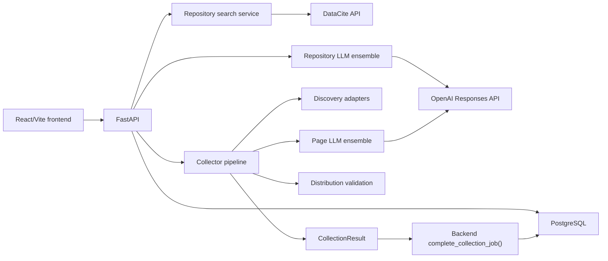
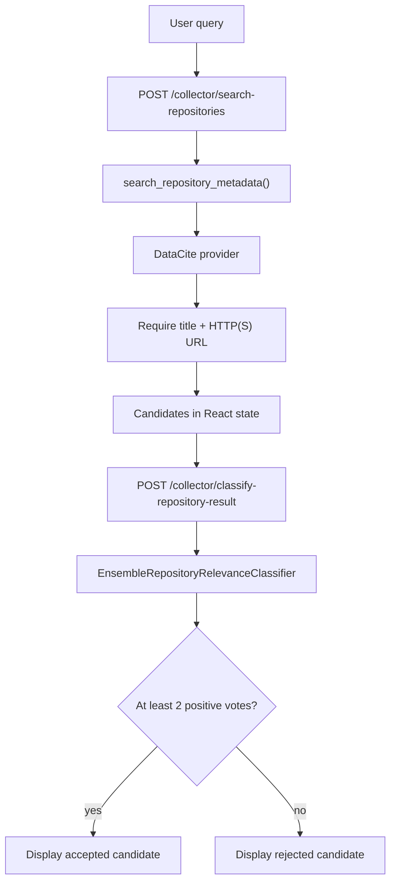
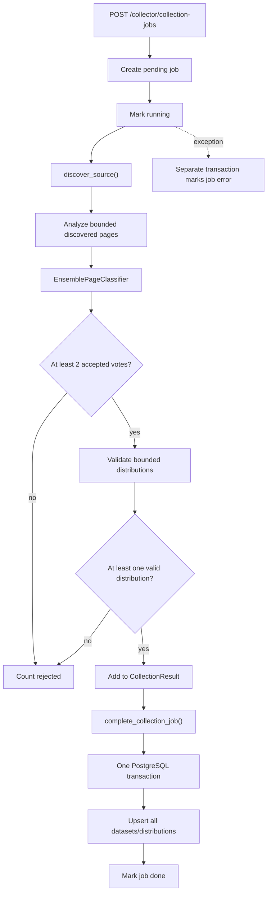

# Technical Design Document - Global Health Dataset Catalog

| Field | Value |
| --- | --- |
| Status | Current architecture |
| Last verified | 2026-09-02 |
| Runtime | React/Vite, FastAPI, Python collector, PostgreSQL |

This document describes the system that exists now. Proposed product,
multi-repository, governance, and production work is kept in the
[roadmap](roadmap.md). The historical SQLite decision is kept in
[ADR 0001](adr/0001-postgresql-only.md).

## 1. Purpose and Scope

The application helps a technical user:

- search DataCite for dataset candidates relevant to a query;
- inspect progressive three-model relevance decisions;
- maintain a catalogue of source portals;
- launch asynchronous collection jobs against those sources;
- discover candidate dataset records and distributions;
- classify records as individual health-relevant datasets;
- validate file/API links lightly;
- inspect datasets persisted in PostgreSQL.

The application stores metadata and links. It does not download and retain
dataset files, prove scientific validity, enforce source officiality, or provide
a production review workflow.

## 2. Current Architecture



The runtime has four main ownership boundaries:

| Area | Responsibility | Main paths |
| --- | --- | --- |
| Frontend | Search, progressive status, source collection, saved-result display | `frontend/src/App.jsx`, `frontend/src/components/` |
| Backend | HTTP contracts, validation, job orchestration | `backend/app/main.py`, `backend/app/routes/` |
| Collector | Discovery, extraction, classification, validation | `collector/` |
| Database | Schema, sources, jobs, atomic completion, upserts | `backend/app/db/` |

## 3. Frontend Capabilities

`frontend/src/App.jsx` coordinates three extracted sections:

- `RepositorySearchSection.jsx` searches repository metadata and shows candidate
  counts, progressive classification, warnings, rejected results, and errors;
- `SourceCatalogSection.jsx` filters configured sources and starts collection
  jobs;
- `CollectedDatasetsSection.jsx` lists persisted datasets, distributions, and
  validation information.

Repository candidate classification runs progressively with two frontend
workers. Accepted repository cards link to the external record; they do not
offer persistence or collection. Source collection creates a job and polls until
`done` or `error`, then refreshes persisted datasets.

There is no obsolete manual pasted-HTML collector flow in the current UI.

## 4. HTTP API Inventory

| Method | Route | Current behavior |
| --- | --- | --- |
| GET | `/health` | Returns `{"status":"ok"}`; it does not test dependencies |
| GET | `/sources` | Lists configured source records |
| POST | `/sources` | Creates a source after Pydantic and DB validation |
| GET | `/sources/{source_id}/page` | Redirects to the configured source URL |
| POST | `/collector/search-repositories` | Searches repository providers and returns normalized candidates/warnings |
| POST | `/collector/classify-repository-result` | Runs the repository relevance ensemble for one candidate |
| POST | `/collector/collection-jobs` | Creates and schedules a background collection job |
| GET | `/collector/collection-jobs/{job_id}` | Returns job status and counters |
| GET | `/collector/collected-datasets` | Lists persisted datasets and distributions |

FastAPI background tasks are process-local. There is no durable worker queue,
retry scheduler, or multi-process job ownership mechanism.

## 5. Repository Search Flow



DataCite is the only provider enabled by default. Its query includes
`resource-type-id=dataset`, a page size, and relevance sorting. Provider output
is normalized into a fixed metadata contract.

Partial-provider handling is implemented: a provider `ValueError` is logged and
returned as a warning when another provider succeeds. The operation fails only
when every active provider fails. With the current one-provider default, a
DataCite failure therefore fails the search.

Repository classification asks whether the metadata is relevant to the user's
query. It does not independently establish health relevance, source trust,
working distributions, or publication eligibility. Results remain frontend
candidates and are not persisted.

## 6. Source Collection Flow



Collection, network access, and LLM calls happen outside PostgreSQL
transactions. `complete_collection_job()` locks the running job, derives the
authoritative `source_url` from it, saves every dataset, and marks the job done
inside one transaction. A failed write rolls back the entire completion.

## 7. Discovery

The discovery manager composes adapters for supported catalogue families and a
generic fallback. The active `ADAPTERS` tuple contains CKAN, Socrata, data.json,
and the generic website adapter. The generic adapter uses sitemap-driven page
discovery and falls back to the source URL.

A Dataverse module exists in the source tree but is not imported or registered
by `collector/discovery/adapters/__init__.py`; Dataverse support is therefore not
an active runtime capability.

Structured records become `DiscoveredPage` objects with normalized metadata and
distribution candidates. Generic HTML pages are fetched and extracted before
classification. Discovery is bounded by `CollectorConfig`.

Provider-specific rules belong under `collector/discovery/adapters/`. Shared
metadata and URL utilities remain in shared collector modules.

## 8. Classification

Three required, distinct model names are loaded from:

- `OPENAI_CLASSIFIER_MODEL_1`;
- `OPENAI_CLASSIFIER_MODEL_2`;
- `OPENAI_CLASSIFIER_MODEL_3`.

All calls use `OPENAI_API_KEY` and the OpenAI Responses API. Both default
ensembles require two successful responses and two positive votes. One model
failure is tolerated; fewer than two usable responses is an error.

The classifiers are intentionally separate:

| Classifier | Input | Decision |
| --- | --- | --- |
| `EnsembleRepositoryRelevanceClassifier` | User query plus repository metadata | Query relevance label |
| `EnsemblePageClassifier` | Page metadata/text plus distributions | Individual dataset and health relevance |

Although model names are distinct, all voters share one provider, endpoint,
account, and API-key path. This is not provider-independent fault isolation.

Exact prompts, payloads, schemas, aggregation, and failure behavior are described
in [Classification Architecture](classification-architecture.md).

## 9. Distribution Validation

`validate_distribution()` sends `HEAD` first and uses a bounded partial `GET`
when the response is inconclusive. A validation succeeds when:

- no network error is reported;
- the status is between 200 and 399;
- a non-API distribution does not return HTML.

Headers and a small sample may refine the detected format. This is an
availability/type probe, not a complete file download or content audit.

Untrusted HTTP requests for HTML, JSON, sitemaps, and distributions pass through
`open_public_http_url()`. It rejects private/local destinations before opening
and revalidates every redirect destination, mitigating direct and redirect-based
SSRF against local services.

## 10. Persistence and Schema

The application uses PostgreSQL through an async psycopg pool. The current
schema contains:

- `schema_migrations`;
- `data_sources`;
- `collection_jobs`;
- `collected_datasets`;
- `collected_distributions`;
- `dataset_discovery_observations`.

`collected_datasets.dataset_url` is unique. Repeated exact URLs update the
existing record and create a discovery observation. This is not semantic
deduplication by DOI, title, version, or mirror relationship.

The complete schema is shown in
[Database Schema Diagram](database-schema-diagram.md). PostgreSQL-only startup
and the decision not to migrate the historical SQLite data are recorded in
[ADR 0001](adr/0001-postgresql-only.md).

## 11. Configuration

| Variable | Required | Purpose |
| --- | --- | --- |
| `DATABASE_URL` | Yes for backend | PostgreSQL connection |
| `OPENAI_API_KEY` | Yes for classification | OpenAI authentication |
| `OPENAI_CLASSIFIER_MODEL_1` | Yes for classification | Primary voter model |
| `OPENAI_CLASSIFIER_MODEL_2` | Yes for classification | Secondary voter model |
| `OPENAI_CLASSIFIER_MODEL_3` | Yes for classification | Tertiary voter model |
| `VITE_API_BASE_URL` | No | Frontend API base; defaults to `http://127.0.0.1:8001` |
| `TEST_DATABASE_URL` | No | Enables PostgreSQL integration tests |

The project dependency constraints are defined in `pyproject.toml`,
`backend/requirements.txt`, and `frontend/package.json`. Locally installed
package versions are deliberately not duplicated here.

## 12. Non-Functional Requirements and Runtime Limits

The current MVP prioritizes bounded work and visible failure over exhaustive
crawling. The limits below are code defaults, not production capacity targets.

| Concern | Current limit | Enforcement point |
| --- | ---: | --- |
| Collector HTTP timeout | 10 seconds/request | `CollectorConfig.request_timeout_seconds` |
| OpenAI HTTP timeout | 20 seconds/request | `HTTPJSONLLMClient` |
| Pages analyzed per source | 5 | `CollectorConfig.max_pages_per_source` |
| Distributions validated per dataset | 1 | `CollectorConfig.max_distributions_per_dataset` |
| Distribution partial-GET sample | 65,536 bytes | `CollectorConfig.max_sample_bytes` |
| HTML response body | 1,000,000 bytes | `fetch_public_html()` |
| JSON discovery response body | 5,000,000 bytes | `fetch_json_url()` |
| Sitemap/robots response body | 5,000,000 bytes | `fetch_text_url()` |
| Sitemaps traversed | 10/source | `MAX_SITEMAPS_PER_SOURCE` |
| Generic adapter sitemap results | 50/source | `GenericWebsiteAdapter.max_sitemap_urls` |
| Sitemap utility hard cap | 1,000/source | `MAX_URLS_PER_SOURCE` |
| DataCite search results | 10/query | provider `page_size` |
| CKAN/Socrata/data.json rows | 5/discovery call | adapter `rows` defaults |
| Repository candidate classifications | 2 concurrent ensembles | frontend workers and backend executor |
| Repository LLM calls | up to 6 concurrently | 2 ensembles x 3 parallel voters |
| Page text sent to a page LLM | 4,000 characters | `MAX_PAGE_TEXT_CHARS` |
| Distributions sent to a page LLM | 10 | `MAX_DISTRIBUTIONS` |
| Repository query | 300 characters | repository classification contract |
| Repository metadata JSON | 100,000 bytes | route bounding logic |

Network bodies are read one byte beyond their limit to detect overflow and then
rejected. Distribution validation reads only a bounded sample when a partial
`GET` is needed. These limits reduce memory and latency risk but do not provide
global request-rate limiting or per-user quotas.

Availability expectations are intentionally local-MVP level:

- no uptime service-level objective is defined;
- process restart may interrupt background jobs;
- no automatic retry budget is configured for external APIs or LLM calls;
- PostgreSQL is a mandatory startup dependency;
- the frontend expects the API at one configured base URL.

## 13. External Dependency Matrix

| Dependency | Used for | Timeout/bound | Failure behavior | Current fallback |
| --- | --- | --- | --- | --- |
| DataCite API | Repository search metadata | 10-second JSON fetch; 5 MB; 10 results | Provider raises `ValueError`; route returns 502 when all providers fail | Partial results are supported across providers, but only DataCite is active |
| CKAN API | Adapter detection and package discovery | 10-second JSON fetch; 5 MB; 5 rows | Detection failure returns `False`; failure after a positive detection propagates to the collection job | Next adapter is tried only when detection returns false |
| Socrata catalog API | Adapter detection and record discovery | 10-second JSON fetch; 5 MB; 5 rows | Same detect/discover distinction as CKAN | Next adapter on failed detection |
| data.json/DCAT endpoint | Adapter detection and record discovery | 10-second JSON fetch; 5 MB; 5 selected records | Same detect/discover distinction as CKAN | Next adapter on failed detection |
| Generic website/sitemap | Page discovery and HTML extraction | 10 seconds; 5 MB text; 1 MB HTML | robots/sitemap failures are skipped; HTML fetch failure rejects that page | Source URL fallback when sitemap discovery yields no entries |
| OpenAI Responses API | Repository and page classification | 20 seconds/model call; bounded payloads | One failed voter is tolerated; fewer than two usable votes raises classification error | No provider fallback; all voters share OpenAI |
| PostgreSQL | Sources, jobs, collected metadata, transactions | Pool defaults 1-10 connections | Startup fails without DB; persistence rolls back on error; writing job `error` can also fail during outage | No storage fallback |

All untrusted collector destinations use the shared public-HTTP guard. OpenAI
uses a server-configured endpoint and does not consume a URL supplied by a
collected page.

Dataverse is intentionally absent from this matrix because it is not registered
at runtime. Its proposed integration is described in
[Multi-Repository Architecture](multi-repository-architecture.md).

## 14. Seed and Upsert Rules

### Source seeds

The schema defines two WHO source seeds:

- `who_gho_indicators`;
- `who_gho_life_expectancy`.

Startup inserts missing seeds with `ON CONFLICT(source_key) DO NOTHING`.
Therefore startup never overwrites an existing source row, including local
changes to a seed. Seed keys are reserved and cannot be created through the
public `POST /sources` path.

`upsert_collector_data_source()` is a separate internal operation. It may update
name, description, theme, and URL for an existing key, including a seed key. It
must not be confused with non-destructive startup seeding.

### Collected dataset upsert

`collected_datasets` conflicts on exact `dataset_url`:

- `source_url`, classification signals, `last_seen_at`, and `updated_at` are
  refreshed;
- incoming non-empty title, description, publisher, hosting platform, uploader,
  and discovery method replace stored values;
- empty incoming text does not erase an existing non-empty value;
- incoming geography replaces stored geography only when non-empty;
- `first_seen_at` remains the original timestamp.

Every successful observation inserts a `dataset_discovery_observations` row so
the collection job, source URL, discovery method, and observation time remain
auditable.

### Distribution upsert

Distributions conflict on `(dataset_id, url, format)`. Discovery fields and
`last_seen_at` are refreshed. A new validation result replaces the stored
validation fields and advances `last_checked_at`; if a later crawl observes the
distribution without validating it, the previous validation result is
preserved.

All dataset, distribution, observation, and job-completion writes occur inside
the single `complete_collection_job()` transaction.

## 15. Security Boundaries

Implemented controls include:

- Pydantic validation and bounded repository payload fields;
- JSON-schema-constrained OpenAI responses plus local parsing;
- untrusted prompt fields treated as evidence, not instructions;
- public HTTP(S) destination validation and redirect checks;
- bounded HTML, JSON, sitemap, and distribution reads;
- parameterized SQL;
- atomic completion transactions.

Current limitations include:

- no authentication or authorization;
- permissive local-development CORS origins only;
- no source allowlist or complete trust-tier enforcement;
- no enforced license policy;
- no automated privacy/sensitivity review;
- no production secret-management or audit-log design.

Policy requirements that exceed current enforcement are explicit in the
[Dataset Collection & Quality Policy](dataset-collection-and-quality-policy.md).

## 16. Error Handling and Observability

Repository provider failures produce sanitized API warnings for partial success.
Repository classification failures return HTTP 502 and are logged with source
and URL context. Background collection exceptions attempt to mark the job
`error`; if PostgreSQL itself is unavailable, that status write can also fail.

Collection jobs persist counters, messages, errors, discovery methods, and
timestamps. Application logging exists, but there is no metrics backend,
distributed tracing, alerting, or centralized log policy.

## 17. Tests and Quality Checks

Test areas include routes, database behavior, collection, discovery adapters,
sitemaps, repository search, page/repository ensembles, LLM payload parsing, and
safe HTTP fetching.

Last verified locally without `TEST_DATABASE_URL`:

```text
pytest: 117 passed, 33 skipped
ruff on changed Python files: passed
```

The skipped tests require a reachable PostgreSQL server. The complete check is:

```bash
.venv/bin/ruff check .
TEST_DATABASE_URL="$DATABASE_URL" .venv/bin/pytest
npm --prefix frontend run build
```

Counts are verification evidence for the stated date, not an architectural
contract.

## 18. Risk Register

| Priority | Risk | Current exposure | Mitigation or next control |
| --- | --- | --- | --- |
| High | Unauthenticated mutation/collection routes | Any caller that can reach the API can add a source or start work | Keep deployment private until authentication and authorization exist |
| High | Process-local background jobs | Restart or multi-worker deployment can leave jobs unfinished | Introduce a durable queue, leases, retries, and recovery |
| High | Repository relevance mistaken for catalogue approval | Repository cards can look accepted although health/file gates did not run | Keep candidate wording and connect save only through collection gates |
| High | Source authority, licence, and sensitivity not enforced | Technically valid records may still be unsuitable for publication | Implement policy gates and human review before public catalogue claims |
| Medium | One distribution validated by default | A valid secondary file can be missed | Validate ranked alternatives within a bounded budget |
| Medium | Exact-URL duplicate identity | DOI-equivalent versions and mirrors can create separate records | Add persistent identifiers and version/mirror relationships |
| Medium | One LLM provider for all voters | Provider/account outage defeats all three model votes | Decide whether provider-level diversity is required |
| Medium | External APIs have no retries | Transient failures can fail detection, search, or jobs | Add bounded retry/backoff with idempotent behavior |
| Medium | PostgreSQL tests can be skipped locally | DB regressions may escape a non-DB test run | Require `TEST_DATABASE_URL` in CI |
| Low | Volatile test counts in documentation | Counts become stale as tests change | Keep a verification date and update counts during review |

The security correction for private distribution URLs and redirect-based SSRF is
implemented; it is no longer listed as an open risk. DNS resolution and network
egress policy should still receive production infrastructure review.

## 19. Open Decisions

| Decision | Owner | Status | Needed outcome |
| --- | --- | --- | --- |
| Meaning and allowed use of "official" | Policy owner | Unassigned / open | Approved source tiers and UI wording |
| Repository candidate to collection workflow | Product + technical owner | Unassigned / open | Decide user action, validation gates, and persistence contract |
| Multi-repository scope and Dataverse activation | Product/data owner | Unassigned / open | Approve providers, ordering, quotas, and benchmark |
| Human-review workflow | Data-governance owner | Unassigned / open | Define triggers, roles, decisions, and audit retention |
| Acceptable licences and restricted-access data | Legal/policy owner | Unassigned / open | Allow/review/deny policy |
| Authentication and deployment boundary | Security/infra owner | Unassigned / open | Roles, identity provider, and exposed routes |
| Durable job technology | Backend/infra owner | Unassigned / open | Queue, worker, retry, and recovery design |
| Provider-independent LLM voting | ML/technical owner | Unassigned / open | Decide resilience requirement and evaluation plan |
| Stable-release migration policy | Backend/data owner | Unassigned / open | Data-preserving migration and rollback process |

No owner assignment or decision in this table is implied by the current code.
The detailed provider proposal is isolated in
[Multi-Repository Architecture](multi-repository-architecture.md).

## 20. Current Limitations

- repository search is not connected to collection/persistence;
- repository relevance does not independently enforce global-health relevance;
- source officiality and publisher authority are not enforced;
- licence acceptance is not enforced;
- exact-URL deduplication does not model versions or mirrors;
- background jobs are not durable outside the FastAPI process;
- no human-review, publication status, or lifecycle workflow exists;
- no CI/staging/production architecture is defined in code.

These items belong to the [roadmap](roadmap.md), not to the current architecture
description.

## 21. Related Documents

- [Onboarding](ONBOARDING.md)
- [Collector Pipeline Diagram](collector-pipeline-diagram.md)
- [Classification Architecture](classification-architecture.md)
- [Database Schema Diagram](database-schema-diagram.md)
- [Dataset Collection & Quality Policy](dataset-collection-and-quality-policy.md)
- [Roadmap](roadmap.md)
- [Multi-Repository Architecture](multi-repository-architecture.md)
- [ADR 0001 - PostgreSQL-only persistence](adr/0001-postgresql-only.md)
