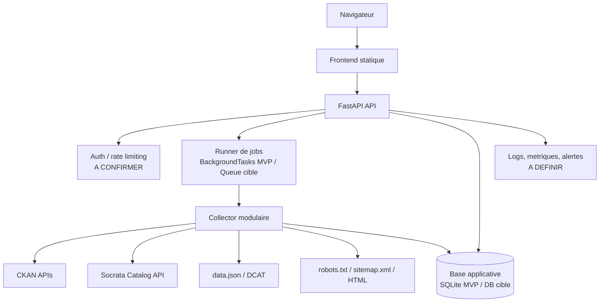
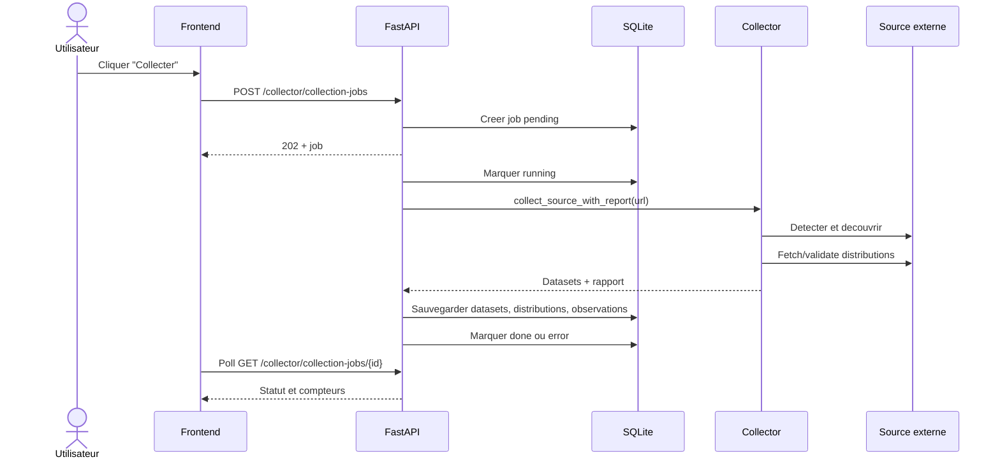
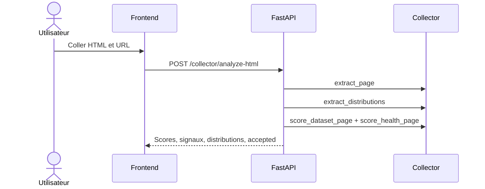
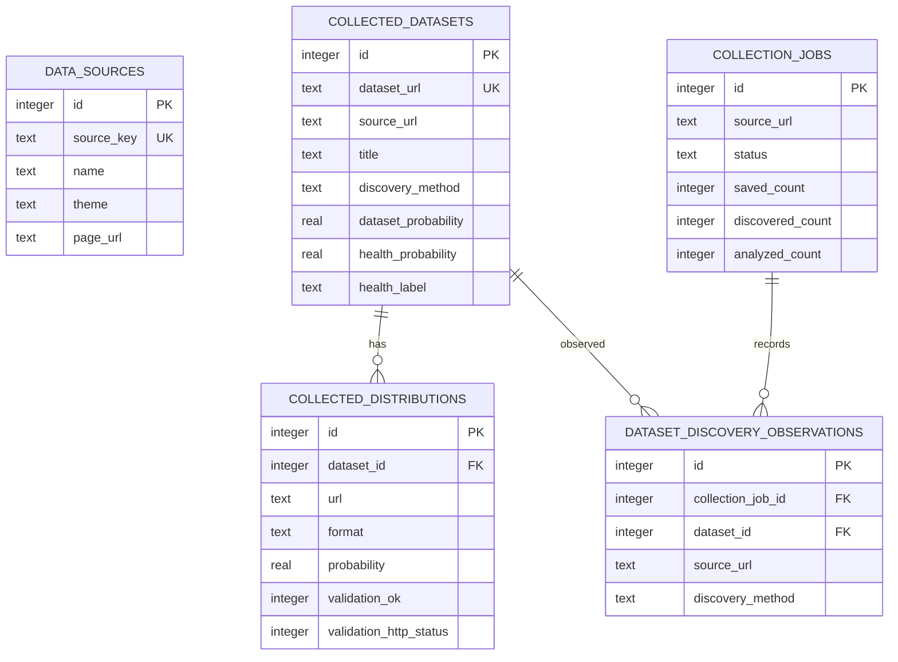

# Technical Design Document - Global Health Dataset Catalog

## Analyse de la documentation existante

### Documents analyses

| Document | Type | Sujet | Informations importantes | Fiabilite / actualite |
| --- | --- | --- | --- | --- |
| Consignes utilisateur jointes | Specification de livrable | Structure attendue du TDD | Demande une analyse complete avant redaction, une separation entre confirme, deduction, hypothese et information manquante, et un TDD utilisable par responsables et equipes techniques. | Haute. Source de cadrage du document. |
| `README.md` | Documentation projet | Vue globale, lancement, endpoints, checks | Projet React + FastAPI pour cataloguer des pages officielles de datasets sante. Le tag `v0.1.0-no-collector` est le baseline catalogue, la branche `collector-update` introduit le collecteur. Liste des endpoints et controles. | Haute, mais a croiser avec la base SQLite locale. |
| `pyproject.toml` | Configuration Python | Packaging et outillage | Projet `global-health-dataset-catalog` version 0.1.0, Python >= 3.9, packages `backend/app` et `collector`, ruff et pytest en dependances de dev. | Haute pour le code Python. |
| `backend/requirements.txt` | Configuration backend | Dependances runtime backend | Dependances minimales : FastAPI >= 0.115 et Uvicorn standard >= 0.30. | Haute pour les contraintes minimales. |
| `frontend/package.json` et `frontend/package-lock.json` | Configuration frontend | React/Vite et versions verrouillees | React 18.3.1, React DOM 18.3.1, Vite 5.4.21, plugin React Vite 4.7.0. Scripts `dev`, `build`, `preview`. | Haute pour l'environnement frontend local. |
| `backend/app/main.py` | Code source backend | Application FastAPI | Initialisation de la base au demarrage, CORS limite a `localhost`/`127.0.0.1:5173`, routes `/sources`, `/collector`, `/health`. | Haute. |
| `backend/app/database.py` | Code source backend | Schema SQLite, migrations, queries | Schema courant version 1, seeds WHO reserves, tables sources, datasets collectes, distributions, observations de decouverte, jobs de collecte, contraintes et upserts. | Haute pour l'intention applicative actuelle. |
| `backend/app/routes/*.py` | Code source backend | API HTTP | Routes de catalogue, analyse HTML/URL, decouverte, collecte synchrone, jobs asynchrones, liste des datasets collectes. | Haute. |
| `collector/**/*.py` | Code source collecteur | Extraction, classification, decouverte, validation | Collecteur generique, adaptateurs CKAN/Socrata/data.json/site generique, scoring dataset/sante, detection de distributions, validation HEAD puis GET partiel. | Haute. |
| `frontend/src/App.jsx`, `frontend/src/styles.css` | Code source frontend | Interface utilisateur | Catalogue des sources, filtres, lancement et polling de jobs, liste des datasets collectes, panneau de test collecteur. | Haute. |
| `tests/*.py` | Tests automatises | Comportement attendu | 76 tests couvrent base, routes, pipeline collecteur, discovery adapters et sitemaps. Ils confirment les regles metier et les erreurs attendues. | Haute. Tests executes localement avec succes le 2026-08-19. |
| `backend/global_health.db` | Base SQLite locale | Donnees locales existantes | 4 sources, 10 datasets collectes, 10 distributions validees, 3 jobs. Schema historique non versionne (`PRAGMA user_version = 0`) et incomplet par rapport au code actuel. | Moyenne. Donnees utiles, mais schema incompatible avec l'application actuelle. |
| `.gitignore` et metadonnees Git | Configuration depot | Etat projet | Branche courante `collector-update`, tag `v0.1.0-no-collector`, dernier commit local observe `e32eca2 Make stored JSON errors explicit`. | Haute pour le contexte local. |

Fichiers exclus de l'analyse fonctionnelle : `.venv`, `frontend/node_modules`, `frontend/dist`, caches pytest/ruff, `__pycache__`, artefacts Git internes. Ils sont generes ou vendorises et ne constituent pas des specifications projet.

### Comprehension globale du projet

Le projet **Global Health Dataset Catalog** vise a maintenir un catalogue local de pages officielles de datasets de sante mondiale. L'application permet de referencer des sources, de consulter les pages externes, de decouvrir des pages candidates depuis des catalogues publics, de classifier ces pages comme datasets et comme contenus sante, puis de sauvegarder uniquement les metadonnees et les liens de distributions valides. Le projet ne stocke pas les fichiers de donnees eux-memes.

L'architecture actuelle est une application locale ou MVP : un frontend React/Vite consomme une API FastAPI, laquelle persiste dans une base SQLite locale et orchestre un package Python `collector`. Le collecteur est volontairement generique : il privilegie d'abord les catalogues structures CKAN, Socrata et `data.json`/DCAT, puis bascule vers une decouverte par `robots.txt`/`sitemap.xml` et analyse HTML.

Les utilisateurs identifies sont principalement des personnes techniques ou data qui veulent inventorier des sources de datasets sante, tester la detection du collecteur, lancer des collectes et inspecter les resultats. Aucun role metier, administrateur, equipe de production ou utilisateur final externe n'est documente.

### Informations confirmees

- **CONFIRME** - Le projet est nomme `global-health-dataset-catalog` et versionne `0.1.0` dans `pyproject.toml` et `frontend/package.json`.
- **CONFIRME** - Le backend est FastAPI et expose `/health`, `/sources`, `/sources/{id}/page`, `/collector/analyze-html`, `/collector/analyze-url`, `/collector/discover-url`, `/collector/collect-url`, `/collector/collection-jobs`, `/collector/collection-jobs/{job_id}` et `/collector/collected-datasets`.
- **CONFIRME** - Le frontend utilise React/Vite et pointe par defaut vers `http://127.0.0.1:8001`.
- **CONFIRME** - La base cible du code est SQLite, configuree par `GLOBAL_HEALTH_DB_PATH` ou par defaut `backend/global_health.db`.
- **CONFIRME** - Les seeds applicatifs reserves sont `who_gho_indicators` et `who_gho_life_expectancy`.
- **CONFIRME** - Les seuils par defaut du collecteur sont `min_dataset_probability = 0.6`, `min_health_probability = 0.35`, `max_pages_per_source = 5`, `max_distributions_per_dataset = 1`.
- **CONFIRME** - Les adaptateurs de decouverte sont executes dans l'ordre CKAN, Socrata, `data_json`, puis site generique.
- **CONFIRME** - Les liens PDF et formats image/HTML sont exclus des distributions de donnees par defaut.
- **CONFIRME** - Les URLs fetchables par l'API d'analyse URL sont limitees aux schemes HTTP/HTTPS et les IP privees/locales sont rejetees.
- **CONFIRME** - Les tests Python passent : `76 passed in 0.39s`. Le build frontend passe avec Vite 5.4.21.

### Deductions

- **DEDUCTION** - L'architecture actuelle est un MVP local/interne plutot qu'une solution production : les fichiers analyses documentent le lancement local, mais pas d'authentification, d'hebergement, de CI/CD, de monitoring ou de sauvegardes.
- **DEDUCTION** - Les utilisateurs cibles actuels sont des profils techniques/data : l'interface expose des scores, signaux, URLs, compteurs de jobs et validations HTTP plutot qu'un parcours grand public.
- **DEDUCTION** - Le collecteur est concu pour stocker des metadonnees et des validations de liens, pas les donnees dataset elles-memes : le README le dit explicitement et le schema SQLite ne contient pas de stockage de fichiers.
- **DEDUCTION** - Une migration de donnees est necessaire avant de considerer `backend/global_health.db` comme utilisable avec le code courant : le code refuse les schemas non versionnes avec tables gerees, et la base locale est precisement dans cet etat.
- **DEDUCTION** - Les sources institutionnelles sont le coeur du cas d'usage : les seeds sont WHO et la base locale contient HDX/CDC, mais la politique d'acceptation des sources reste a valider.

### Informations manquantes

- **INFORMATION MANQUANTE** - Environnement cible de production, hebergement, reseau, DNS, HTTPS et reverse proxy.
- **INFORMATION MANQUANTE** - Strategie d'authentification, autorisation, roles et audit.
- **INFORMATION MANQUANTE** - Proprietaires metier, reviewers, approbateurs et equipe de support.
- **INFORMATION MANQUANTE** - Volumetrie attendue : nombre de sources, frequence de collecte, taille des sitemaps, nombre d'utilisateurs.
- **INFORMATION MANQUANTE** - Politique de conservation des metadonnees, des jobs et des resultats de validation.
- **INFORMATION MANQUANTE** - Strategie de migration de la base SQLite locale historique vers le schema versionne courant.
- **INFORMATION MANQUANTE** - CI/CD, environnements de test/QA/staging/production, monitoring et alerting.
- **INFORMATION MANQUANTE** - Politique d'acceptation pour les sources non officielles comme Kaggle, HDX ou portails gouvernementaux externes.

### Contradictions detectees

| Sujet | Source A | Source B | Impact | Decision necessaire |
| --- | --- | --- | --- | --- |
| Schema SQLite courant vs base locale | `backend/app/database.py` definit `CURRENT_SCHEMA_VERSION = 1`, une table `dataset_discovery_observations`, des contraintes et des champs `first_seen_at`, `last_seen_at`, `last_checked_at`, `validation_attempted`. | `backend/global_health.db` a `user_version = 0`, ne contient pas `dataset_discovery_observations` et conserve un ancien schema. | Elevé. Le demarrage sur la base locale echoue : le code refuse les tables gerees non versionnees. | Creer une migration historique explicite ou regenerer la base apres export/import controle. |
| README indique une base locale creee par le backend | `README.md` liste `backend/global_health.db` comme base SQLite locale creee par le backend. | L'initialisation du code actuel refuse cette base car elle contient deja des tables gerees non versionnees. | Elevé. Risque de confusion au lancement local. | Mettre a jour le README et fournir une procedure de migration ou de recreation. |
| Formats de distributions affiches dans l'UI | `frontend/src/App.jsx` affiche "Aucun lien CSV/XLSX/API trouve" dans le panneau collecteur. | `collector/extraction/distributions.py` supporte aussi TSV, XLS, JSON, JSONL, XML, PARQUET, ZIP, GZ, SAV, DTA, SAS7BDAT, GEOJSON et API. | Faible a moyen. L'UI sous-decrit les capacites reelles. | Ajuster le libelle UI ou limiter officiellement les formats acceptes. |

### Hypotheses de travail

| Hypothese | Pourquoi elle est necessaire | Risque si incorrecte | A valider avec |
| --- | --- | --- | --- |
| Le projet cible d'abord un MVP local/interne avant production. | Aucune configuration prod, auth, CI/CD ou deploiement n'est documentee. | Sous-dimensionnement de la securite et de l'exploitation si exposition publique. | Responsables projet, equipe infra/securite. |
| Les donnees stockees sont des metadonnees publiques, pas des donnees personnelles de sante. | Le collecteur stocke URLs, titres, descriptions, publishers, signaux et validations, pas les fichiers dataset. | Risque legal/confidentialite si des sources contiennent des donnees sensibles ou non publiques. | DPO/securite, owner data. |
| SQLite convient au MVP mais devra etre reevalue pour un usage multi-utilisateur ou planifie. | Le code persiste dans SQLite et utilise des background tasks FastAPI simples. | Blocages de concurrence, sauvegarde et scalabilite limitees. | Architecture, exploitation. |
| Les portails officiels ou institutionnels sont prioritaires. | README parle de pages officielles de datasets sante, seeds WHO, base locale HDX/CDC. | Mauvaise qualite catalogue si des sources communautaires/non officielles sont acceptees sans gouvernance. | Responsable metier/data governance. |
| Les jobs de collecte peuvent rester courts et bornes. | `max_pages_per_source = 5` et `max_distributions_per_dataset = 1`. | Timeouts ou resultats incomplets si les sources sont grandes. | Product owner, equipe data. |

## 1. Informations generales

| Champ | Valeur |
| --- | --- |
| Nom du projet | Global Health Dataset Catalog |
| Version document | 0.1 |
| Date | 2026-08-19 |
| Auteur | Codex, d'apres analyse du projet local |
| Statut | Brouillon pour revue |
| Reviewers / approbateurs | A confirmer / Information non disponible dans la documentation analysee |

Historique des versions :

| Version | Date | Auteur | Modification |
| --- | --- | --- | --- |
| 0.1 | 2026-08-19 | Codex | Creation du TDD apres analyse du projet local. |

## 2. Executive Summary

Le projet repond a un besoin d'inventaire et de qualification de pages de datasets de sante mondiale. Il fournit un catalogue local de sources, un collecteur capable de decouvrir des pages candidates sur des portails publics, un scoring pour determiner si une page est un dataset et si elle est liee a la sante, puis une validation legere des liens de fichiers ou d'API.

La solution actuelle est une application MVP composee d'un frontend React/Vite, d'une API FastAPI, d'un package collecteur Python et d'une base SQLite. L'architecture est simple, testee et adaptee au developpement local. Elle n'est pas encore documentee comme une architecture de production.

Le principal risque technique identifie est la divergence entre le schema SQLite attendu par le code actuel et la base locale existante. Avant tout usage fiable, il faut decider si la base locale doit etre migree, recreee ou remplacee par une base cible plus robuste.

Les decisions importantes a valider concernent le perimetre des sources officielles, la strategie de migration, l'authentification, l'hebergement, l'observabilite et la frequence des collectes.

## 3. Contexte et probleme

### Situation actuelle

Le catalogue stable initial est decrit comme `v0.1.0-no-collector`. La branche courante `collector-update` ajoute une couche de collecte generique. Le systeme permet deja de :

- lister et ajouter des sources de pages dataset ;
- rediriger vers les pages externes ;
- tester une analyse de HTML colle ou d'URL publique ;
- decouvrir des pages via CKAN, Socrata, `data.json`/DCAT ou sitemap ;
- lancer des jobs de collecte en arriere-plan ;
- sauvegarder et afficher les datasets collectes et leurs distributions validees.

### Probleme rencontre

Les organisations qui travaillent avec des datasets sante doivent retrouver les pages officielles, distinguer catalogues et datasets individuels, identifier les formats disponibles et eviter de sauvegarder des liens invalides. La recherche manuelle est fragile et difficile a maintenir.

### Limitations existantes

- L'architecture de production n'est pas definie.
- La base SQLite locale presente un schema historique incompatible avec le code actuel.
- Les criteres metier d'officialite et de qualite des sources ne sont pas formalises.
- L'authentification, les roles et la protection de l'API ne sont pas implementes.
- L'observabilite est limitee aux messages de jobs et a quelques exceptions/logs.

## 4. Objectifs

### Objectifs metier

- Centraliser des pages de datasets sante dans un catalogue consultable.
- Reduire le travail manuel de detection de datasets pertinents.
- Identifier les distributions de donnees exploitables, sans telecharger ni stocker les datasets eux-memes.
- Fournir des signaux de confiance : source, publisher, methode de decouverte, score dataset, score sante, validation HTTP.

### Objectifs techniques

- Maintenir une API backend simple et testable.
- Isoler la logique collecteur dans des modules reutilisables et site-agnostiques.
- Persister les metadonnees collectees avec historique minimal de decouverte.
- Proteger les fetchs publics contre les URLs locales/privees.
- Fournir un frontend de pilotage pour test, collecte et consultation.

### Criteres de reussite

| Critere | Mesure actuelle ou cible |
| --- | --- |
| Tests backend/collecteur | CONFIRME : 76 tests passent localement. |
| Build frontend | CONFIRME : `npm --prefix frontend run build` passe localement. |
| Base demarrable | A confirmer : actuellement bloque par la base locale historique. |
| Qualite des resultats | A definir : precision/recall des heuristiques non documentees. |
| Exploitation | A definir : health checks, logs structures, alertes et sauvegardes. |

## 5. Perimetre

### Inclus dans le projet

- Catalogue local de sources de datasets.
- API CRUD partielle pour creation/listing de sources et redirection page.
- Analyse HTML/URL publique.
- Decouverte CKAN, Socrata, `data.json`/DCAT et sitemaps.
- Scoring dataset et scoring sante.
- Extraction de distributions probables.
- Validation HEAD puis GET partiel des liens.
- Jobs de collecte asynchrones via FastAPI background tasks.
- Persistance SQLite des metadonnees collectees.
- Frontend React de consultation, filtrage, test collecteur et suivi de jobs.

### Hors perimetre

- Telechargement et stockage des fichiers datasets eux-memes.
- Authentification et gestion de roles.
- Orchestration planifiee ou recurrente des collectes.
- Deploiement cloud/production.
- Monitoring avance, dashboards et alertes.
- Review humaine des datasets collectes.
- Interface d'administration complete.

Elements non clairement definis : gouvernance des sources, SLA, volumetrie, politique de conservation, securite production.

## 6. Utilisateurs et acteurs

| Acteur | Role | Interaction avec le systeme |
| --- | --- | --- |
| Utilisateur data / analyste | Consulte et filtre les sources et datasets collectes. | Frontend React, liens externes, panneau collecteur. |
| Developpeur | Maintient backend, collecteur, frontend et tests. | Code Python/React, tests, migrations. |
| Administrateur catalogue | HYPOTHESE : ajoute ou valide des sources. | API `/sources`, future interface d'administration. |
| Portails externes CKAN | Source de metadonnees structurees. | API `/api/3/action/status_show` et `/package_search`. |
| Portails Socrata | Source de metadonnees et exports. | `https://api.us.socrata.com/api/catalog/v1` et exports `/resource/{id}.csv/json`. |
| Catalogues `data.json`/DCAT | Source de datasets structures. | Fichier `data.json` a la racine du site ou URL donnee. |
| Sites generiques | Fallback de decouverte. | `robots.txt`, `sitemap.xml`, pages HTML. |
| Base SQLite | Persistance locale. | Acces direct par backend via `sqlite3`. |

## 7. Exigences fonctionnelles principales

| Fonctionnalite | Objectif | Entree | Traitement | Resultat | Erreurs possibles | Dependances |
| --- | --- | --- | --- | --- | --- | --- |
| Lister les sources | Afficher les sources cataloguees. | GET `/sources` | Lecture SQLite et tri par theme/nom. | Liste `DataSource`. | Schema non initialise, base indisponible. | SQLite. |
| Ajouter une source | Ajouter ou mettre a jour une source utilisateur. | `source_key`, `name`, `description`, `theme`, `page_url`. | Validation Pydantic, refus des keys reservees, upsert SQLite. | Source sauvegardee. | 400 key reservee, URL invalide. | FastAPI, SQLite. |
| Ouvrir une source | Rediriger vers la page externe. | `source_id`. | Recherche source par id. | Redirect HTTP. | 404 source inconnue. | SQLite. |
| Analyser du HTML | Tester le collecteur sans fetch reseau. | URL + HTML. | Extraction page, distributions, scoring dataset/sante. | Scores, signaux, distributions, acceptation. | HTML vide refuse par modele. | Collecteur. |
| Analyser une URL | Tester une page publique. | URL HTTP/HTTPS. | Controle URL publique, fetch HTML, analyse. | Meme reponse qu'analyse HTML. | 400 fetch impossible, URL locale/privee, page trop grosse. | Reseau externe. |
| Decouvrir une URL | Identifier des pages candidates. | URL source. | Adaptateur CKAN/Socrata/data.json/generic. | Liste `DiscoveredPage`. | 400 erreur de decouverte. | APIs externes, sitemaps. |
| Collecter une URL | Decouvrir, classifier, valider et optionnellement sauvegarder. | URL + `save`. | Pipeline `collect_source`, validation, persistance si `save=true`. | Datasets collectes, compteur sauvegarde. | 400 source invalide. | Collecteur, reseau, SQLite. |
| Lancer un job de collecte | Executer la collecte en arriere-plan. | URL source. | Creation job `pending`, tache FastAPI background, mise a jour statut. | 202 + job. | Erreur persistee dans job. | FastAPI background tasks, SQLite. |
| Suivre un job | Afficher statut et compteurs. | `job_id`. | Lecture SQLite. | Job avec status/counters/message. | 404 job inconnu. | SQLite. |
| Afficher datasets collectes | Consulter les resultats persistants. | GET `/collector/collected-datasets`. | Jointure logique datasets/distributions. | Datasets, distributions, validations. | JSON signaux corrompu, schema incompatible. | SQLite. |

## 8. Exigences non fonctionnelles

| Domaine | Etat confirme | Besoin / A confirmer |
| --- | --- | --- |
| Performance | Limites par defaut : 5 pages analysees par source, 1 distribution validee par dataset, timeout 10 s. | Volumetrie cible et temps de reponse attendus non documentes. |
| Disponibilite | Aucune architecture HA documentee. | SLA, redemarrage, supervision et sauvegardes a definir. |
| Scalabilite | SQLite et background tasks FastAPI conviennent au MVP. | Pour production, evaluer queue de jobs et base serveur. |
| Securite | Controle anti-URL privee pour fetch public, CORS local limite. | Auth, authorization, rate limiting, secrets, HTTPS, audit a definir. |
| Confidentialite | Le code stocke des metadonnees et URLs, pas les fichiers dataset. | Confirmer absence de donnees personnelles/sensibles. |
| Resilience | Validation fallback HEAD vers GET partiel. Erreurs de job persistantes. | Retries, backoff, reprise apres incident non documentes. |
| Observabilite | Messages et compteurs de jobs, logging minimal en base. | Logs structures, metriques, dashboards, alertes non definis. |
| Maintenabilite | Modules separes, tests nombreux, ruff configure. | Procedure ADR/revue architecture a formaliser. |
| Accessibilite | UI responsive, labels de formulaires presents. | Audit accessibilite non documente. |
| Sauvegarde | Non documentee. | Politique backup/restore SQLite ou DB cible requise. |

## 9. Architecture actuelle - AS-IS


Composants confirmes :

- `frontend/` : application React mono-page.
- `backend/app/` : API FastAPI, initialisation SQLite, routes.
- `collector/` : modules d'extraction, classification, decouverte, validation.
- `backend/global_health.db` : base SQLite locale existante, mais schema historique.
- `tests/` : tests unitaires et d'integration legere.

Limite AS-IS majeure : la base fournie ne peut pas etre consideree comme compatible avec le code actuel sans migration.

## 10. Architecture cible - TO-BE

La cible proposee conserve l'architecture modulaire actuelle et ajoute les capacites minimales necessaires a un usage fiable : migration explicite, configuration d'environnement, securisation de l'API, observabilite et execution de jobs plus robuste si le volume augmente.

| Composant | Responsabilite | Technologie | Entrees | Sorties | Dependances |
| --- | --- | --- | --- | --- | --- |
| Frontend | Consultation, filtres, test collecteur, lancement et suivi de jobs. | React 18, Vite 5 | API JSON | Interface utilisateur | Backend API |
| API backend | Validation HTTP, orchestration, exposition des routes. | FastAPI, Pydantic | Requetes HTTP | JSON, redirects | SQLite/DB cible, collecteur |
| Collecteur | Decouverte, extraction, scoring, validation des distributions. | Python stdlib + modules projet | URLs, HTML, metadonnees externes | `CollectedDataset`, rapports | Reseau public |
| Stockage | Persistance des sources, datasets, distributions, observations, jobs. | SQLite MVP ; HYPOTHESE PostgreSQL si production multi-user | Donnees applicatives | Resultats consultables | Migrations, sauvegardes |
| Worker jobs | Execution des collectes longues. | CONFIRME FastAPI BackgroundTasks ; HYPOTHESE queue dediee | Jobs de collecte | Statuts et resultats | API, collecteur, stockage |
| Observabilite | Suivi erreurs, performances, volumes. | A definir | Logs, metriques | Alertes, dashboards | Infra cible |



## 11. Flux fonctionnels principaux

### Collecte asynchrone depuis une source



### Analyse HTML locale



### Ajout d'une source

1. Acteur : utilisateur ou administrateur catalogue.
2. Action : POST `/sources` avec `source_key`, `name`, `theme`, `page_url`.
3. Traitement : validation Pydantic, controle key reservee, upsert SQLite.
4. Reponse : source sauvegardee ou erreur 400.
5. Acces donnees : table `data_sources`.

## 12. Logique metier

- Une page est acceptee comme dataset collectable si `dataset_probability >= 0.6` et `health_probability >= 0.35`.
- Une collecte persistante ne conserve un dataset que s'il possede au moins une distribution validee `ok=True`.
- Le scoring dataset distingue les preuves de dataset individuel des simples signaux de catalogue. Sans preuve de dataset individuel, le score est plafonne a `0.5`.
- Les preuves fortes incluent Schema.org `Dataset` et `dcat:Dataset`.
- Les signaux d'acces incluent API, CSV, XLSX, export, downloads et distributions directes.
- Le scoring sante s'appuie sur mots cles en titre, metadonnees, corps, URL et publisher.
- Labels sante : `HEALTH` si probabilite >= 0.75, `PARTIALLY_HEALTH` si >= 0.35, sinon `NON_HEALTH`.
- Les distributions PDF, HTML et images sont exclues.
- La validation tente `HEAD`, puis un `GET` partiel si HEAD est interdit, sans content-type utile ou retourne HTML.
- Les source keys WHO seed sont reservees et ne peuvent pas etre ecrasees par l'utilisateur.
- Les signaux JSON stockes doivent etre des objets JSON valides ; les erreurs sont explicites.

## 13. Modele de donnees

### Entites principales

| Entite | Description | Champs principaux | Relations |
| --- | --- | --- | --- |
| `data_sources` | Sources configurees du catalogue. | `id`, `source_key`, `name`, `description`, `theme`, `page_url`. | Source logique de collectes. |
| `collected_datasets` | Metadonnees de datasets acceptes. | `dataset_url`, `title`, `publisher`, `discovery_method`, scores, signaux, timestamps. | 1-n vers distributions et observations. |
| `collected_distributions` | Liens de fichiers/API detectes et valides. | `url`, `format`, `probability`, signaux, validation HTTP, timestamps. | n-1 vers dataset. |
| `dataset_discovery_observations` | Historique des observations d'un dataset. | `collection_job_id`, `dataset_id`, `source_url`, `discovery_method`, `observed_at`. | n-1 vers dataset, optionnellement job. |
| `collection_jobs` | Jobs de collecte et compteurs. | `source_url`, `status`, compteurs, `discovery_methods`, message, error, timestamps. | Lie les observations quand collecte asynchrone. |



Note critique : ce modele correspond au code courant. La base locale `backend/global_health.db` ne contient pas encore ce modele complet.

## 14. APIs et interfaces

### API interne FastAPI

| Methode | Endpoint | Objectif | Auth | Request | Response |
| --- | --- | --- | --- | --- | --- |
| GET | `/health` | Health check applicatif. | Non documentee | Aucune | `{status: "ok"}` |
| GET | `/sources` | Lister les sources. | Non documentee | Aucune | `{items: DataSource[]}` |
| POST | `/sources` | Creer/upsert une source utilisateur. | Non documentee | `DataSourceCreate` | `DataSource`, status 201 |
| GET | `/sources/{id}/page` | Rediriger vers la page externe. | Non documentee | Path `source_id` | Redirect ou 404 |
| POST | `/collector/analyze-html` | Analyser du HTML fourni. | Non documentee | `{url, html}` | Scores, signaux, distributions |
| POST | `/collector/analyze-url` | Fetcher et analyser une URL publique. | Non documentee | `{url}` | Scores, signaux, distributions |
| POST | `/collector/discover-url` | Decouvrir des pages candidates. | Non documentee | `{url}` | `{items: DiscoveredPage[]}` |
| POST | `/collector/collect-url` | Collecte synchrone, option save. | Non documentee | `{url, save=true}` | `{items, saved, saved_count}` |
| POST | `/collector/collection-jobs` | Lancer une collecte async. | Non documentee | `{url}` | `{job}`, status 202 |
| GET | `/collector/collection-jobs/{job_id}` | Lire un job. | Non documentee | Path `job_id` | `{job}` ou 404 |
| GET | `/collector/collected-datasets` | Lister les datasets sauvegardes. | Non documentee | Aucune | `{items, saved=false, saved_count=0}` |

### Interfaces externes

| Interface | Systeme source | Protocole | Auth | Donnees echangees | Retry / timeout |
| --- | --- | --- | --- | --- | --- |
| CKAN `status_show` et `package_search` | Portails CKAN | HTTPS JSON | Non documentee | Status catalogue, packages, resources | Timeout 10 s, pas de retry documente. |
| Socrata Catalog API | `api.us.socrata.com` | HTTPS JSON | Non documentee | Resultats catalogue, metadata resources | Timeout 10 s, pas de retry documente. |
| `data.json` / DCAT | Sites open data | HTTPS JSON | Non documentee | Datasets et distributions | Timeout 10 s, pas de retry documente. |
| `robots.txt` / `sitemap.xml` | Sites generiques | HTTPS texte/XML | Non documentee | URLs candidates | Timeout 10 s, limites 10 sitemaps/1000 URLs. |
| Pages HTML publiques | Sites generiques | HTTPS HTML | Non documentee | HTML jusqu'a 1 MB pour analyse URL | Timeout 10 s. |
| Validation distributions | Liens fichiers/API | HEAD puis GET partiel | Non documentee | Headers, statut HTTP, echantillon partiel | Timeout 10 s, GET partiel 65 536 bytes. |

## 15. Architecture du code

```text
project/
├── backend/
│   ├── app/
│   │   ├── main.py
│   │   ├── database.py
│   │   └── routes/
│   │       ├── sources.py
│   │       └── collector.py
│   ├── requirements.txt
│   └── global_health.db
├── collector/
│   ├── classification/
│   ├── discovery/
│   ├── extraction/
│   ├── storage/
│   ├── validation/
│   ├── config.py
│   ├── fetch.py
│   └── main.py
├── frontend/
│   ├── src/
│   │   ├── App.jsx
│   │   ├── main.jsx
│   │   └── styles.css
│   ├── package.json
│   └── vite.config.js
├── tests/
├── docs/
└── pyproject.toml
```

Separation des responsabilites :

- Backend : transport HTTP, validation request/response, persistance, orchestration jobs.
- Collector : logique domaine, decouverte, extraction, scoring, validation.
- Storage models : dataclasses partagees entre collecteur et backend.
- Frontend : experience utilisateur et polling.
- Tests : specification executable du comportement.

## 16. Technologies

| Domaine | Technologie | Version si connue | Justification |
| --- | --- | --- | --- |
| Langage backend | Python | >= 3.9 | Configure dans `pyproject.toml`. |
| API | FastAPI | Requirement >= 0.115 ; installe localement 0.128.8 | API REST rapide, validation Pydantic, background tasks. |
| Validation modele | Pydantic | Installe localement 2.13.4 | Modeles request/response FastAPI. |
| Serveur local | Uvicorn standard | Requirement >= 0.30 ; installe localement 0.39.0 | Execution ASGI locale. |
| Base | SQLite | SQLite 3.x | Simple, locale, adaptee MVP. |
| Frontend | React | 18.3.1 | UI reactive mono-page. |
| Build frontend | Vite | 5.4.21 | Dev server et build rapides. |
| Tests Python | pytest | >= 8.3 | 76 tests confirmes. |
| Lint Python | ruff | >= 0.6 | Configure avec `E`, `F`, `I`, `B`, `UP`. |
| Packaging | hatchling | >= 1.25 | Build backend/collector. |
| CI/CD | Non documente | A confirmer | Aucun workflow CI observe. |
| Monitoring | Non documente | A confirmer | A definir pour production. |

## 17. Decisions techniques

### Decision 1 - FastAPI pour l'API backend

- Contexte : besoin d'exposer rapidement des endpoints JSON et redirects.
- Options etudiees dans la documentation : aucune alternative documentee.
- Solution retenue : FastAPI.
- Raisons : modele deja implemente, Pydantic, tests directs des handlers.
- Inconvenients : auth, rate limiting et production hardening non couverts.
- Consequences : conserver FastAPI et ajouter les couches manquantes plutot que replateformer.

### Decision 2 - SQLite pour le MVP

- Contexte : catalogue local et persistance simple.
- Solution retenue : SQLite.
- Avantages : zero infrastructure, facile a tester, adapte au developpement local.
- Inconvenients : migration de schema indispensable, limites multi-utilisateur et exploitation.
- Consequences : garder SQLite pour MVP, mais definir un plan DB cible avant production.

### Decision 3 - Collecteur generique avec adaptateurs

- Contexte : sources variees, besoin d'eviter du code specifique dans le coeur.
- Solution retenue : adaptateurs CKAN, Socrata, `data_json`, fallback generique.
- Avantages : extensible, testable, priorise les metadonnees structurees.
- Inconvenients : heuristiques imparfaites, couverture dependante des portails.
- Consequences : ajouter les futures sources via adaptateurs, pas dans le classifier.

### Decision 4 - Heuristiques deterministes

- Contexte : besoin d'un MVP explicable.
- Solution retenue : scoring par signaux explicites.
- Avantages : transparent, testable, pas de dependance ML.
- Inconvenients : precision non mesuree, vocabulaire sante limite.
- Consequences : documenter les signaux et mesurer les faux positifs/faux negatifs.

### Decision 5 - Rejet des bases historiques non versionnees

- Contexte : eviter une migration implicite destructrice.
- Solution retenue : si une base `user_version=0` contient des tables gerees, l'application refuse de migrer automatiquement.
- Avantages : protege les donnees existantes.
- Inconvenients : bloque le demarrage local avec la base actuelle.
- Consequences : une migration historique explicite est prioritaire.

## 18. Securite

Controles confirmes :

- CORS autorise seulement `http://localhost:5173` et `http://127.0.0.1:5173`.
- Les endpoints d'analyse URL acceptent seulement HTTP/HTTPS.
- Les IP privees, loopback, link-local, multicast et reservees sont bloquees avant fetch.
- Les payloads HTTP sont valides via Pydantic.
- Les requetes SQL utilisent des parametres, pas de concatenation utilisateur directe sauf placeholders controles.

Points a valider :

- Authentification et autorisation inexistantes dans le code analyse.
- Aucun role administrateur/utilisateur n'est documente.
- Pas de rate limiting, quotas, CSRF ou protection API publique documentee.
- Gestion des secrets non documentee.
- HTTPS et reverse proxy non documentes.
- Audit logs non documentes.
- Politique de traitement des donnees personnelles non documentee.

## 19. Gestion des erreurs

- Erreurs de source reservee : `ReservedDataSourceKeyError`, convertie en HTTP 400.
- Source inconnue : HTTP 404 sur `/sources/{id}/page`.
- Erreurs fetch/analyse URL : `ValueError` convertie en HTTP 400.
- Job inconnu : HTTP 404.
- Erreur de collecte asynchrone : capture large et stockage dans `collection_jobs.error`.
- JSON stocke invalide dans les signaux : `StoredJSONError` explicite.
- Validation distribution : resultat `ok=false` avec statut, headers et message d'erreur si disponible.

Manques :

- Pas de typologie d'erreurs standardisee cote API.
- Pas de correlation id.
- Pas de retry/backoff documente.
- Pas d'alerte exploitation.

## 20. Logging, monitoring et observabilite

Etat actuel :

- Logger Python utilise dans `database.py` pour warnings de JSON `discovery_methods` invalide.
- Jobs de collecte stockent status, message, error, compteurs et dates.
- Endpoint `/health` disponible.

TO-BE recommande :

- Logs structures JSON avec request id/job id/source url.
- Metriques : jobs lances, duree, accepted/rejected, invalid distributions, erreurs par adaptateur, temps de fetch, taux de validation.
- Dashboard exploitation pour statut collectes et erreurs recentes.
- Alertes sur echecs repetes, schema DB invalide, hausse des timeouts, indisponibilite API.

## 21. Performance et scalabilite

Confirmations :

- Timeout HTTP par defaut : 10 secondes.
- Analyse URL limitee a 1 MB de HTML.
- Sitemaps : 10 sitemaps max et 1000 URLs max dans le module sitemap.
- Generic adapter limite par defaut a 50 URLs sitemap.
- Collecte source : 5 pages max par source, 1 distribution max par dataset.
- Validation : HEAD puis GET partiel de 65 536 bytes.

Analyse :

- Ces bornes protegent le MVP contre les collectes trop longues.
- Les jobs FastAPI background tasks conviennent a une execution simple mais ne garantissent pas la reprise apres crash.
- SQLite peut devenir limitant avec collectes concurrentes et ecritures frequentes.

A confirmer :

- Nombre de sources cible.
- Frequence de re-collecte.
- Nombre d'utilisateurs simultanes.
- Acceptation d'un resultat partiel limite aux 5 premieres pages.

## 22. Tests

| Type de test | Objectif | Outil | Responsable |
| --- | --- | --- | --- |
| Tests base | Schema, seeds, migrations, contraintes, upserts, jobs, JSON stocke. | pytest | Developpeurs backend. |
| Tests pipeline collecteur | Extraction, scoring, validation, collecte structuree/generique. | pytest | Developpeurs collecteur. |
| Tests routes | Handlers FastAPI, erreurs 400/404, jobs. | pytest | Developpeurs backend. |
| Tests adaptateurs | CKAN, Socrata, data.json, generic fallback. | pytest | Developpeurs collecteur. |
| Tests sitemap | robots, parsing XML, scoring URL. | pytest | Developpeurs collecteur. |
| Build frontend | Verifier compilation UI. | Vite build | Developpeurs frontend. |
| Tests E2E | INFORMATION MANQUANTE | A definir | A definir. |
| Tests securite/performance | INFORMATION MANQUANTE | A definir | A definir. |

Validation locale du 2026-08-19 :

- `76 passed in 0.39s`
- Build frontend Vite reussi.

## 23. CI/CD

Flux recommande a partir des controles existants :

```text
Developpeur
    ↓
Git branch / Pull Request
    ↓
Ruff
    ↓
Pytest
    ↓
Frontend build
    ↓
Review
    ↓
Deploy test
    ↓
Validation
    ↓
Production
```

Etat confirme : aucun workflow CI/CD n'a ete observe dans les fichiers analyses. A confirmer avant toute industrialisation.

## 24. Environnements

| Environnement | Usage | Infrastructure | Donnees | Acces |
| --- | --- | --- | --- | --- |
| Local | Developpement et tests. | `.venv`, FastAPI Uvicorn port 8001, Vite port 5173, SQLite locale. | Seeds WHO + donnees locales si DB presente. | Developpeur local. |
| Development | A confirmer. | Non documente. | Non documente. | Non documente. |
| Test / QA | A confirmer. | Non documente. | Non documente. | Non documente. |
| Staging | A confirmer. | Non documente. | Non documente. | Non documente. |
| Production | A confirmer. | Non documente. | Non documente. | Non documente. |

## 25. Deploiement

### Confirme localement

- Backend :
  - installer `backend/requirements.txt` ;
  - lancer Uvicorn avec `PYTHONPATH=..` depuis `backend` ;
  - port documente : `8001`.
- Frontend :
  - `VITE_API_BASE_URL=http://127.0.0.1:8001 npm run dev` ;
  - port documente : `5173`.

### A definir pour production

- Packaging frontend statique.
- Serveur ASGI et mode process manager.
- Reverse proxy HTTPS.
- Base cible et migrations.
- Gestion des secrets/configuration.
- Strategie rollback.
- Sauvegardes DB.
- Politique de purge jobs/resultats.

## 26. Migration

La migration est le sujet prioritaire.

Etat confirme :

- Le code courant attend `CURRENT_SCHEMA_VERSION = 1`.
- La base locale a `PRAGMA user_version = 0`.
- La base locale contient deja des tables gerees : `data_sources`, `collected_datasets`, `collected_distributions`, `collection_jobs`.
- L'application refuse explicitement de migrer une base non versionnee contenant des tables gerees.

Plan recommande :

1. Sauvegarder `backend/global_health.db`.
2. Documenter le schema historique exact.
3. Ecrire une migration `0 historique -> 1` qui :
   - cree `dataset_discovery_observations` ;
   - ajoute les champs timestamps manquants ;
   - ajoute `validation_attempted`, `last_checked_at` et les contraintes compatibles ;
   - initialise `first_seen_at`/`last_seen_at` depuis `created_at`/`updated_at` quand possible ;
   - renseigne une observation de decouverte initiale par dataset existant si source/discovery_method disponibles ;
   - preserve les donnees existantes HDX/CDC.
4. Tester la migration sur copie.
5. Mettre `PRAGMA user_version = 1`.
6. Mettre a jour README avec procedure.

Alternative : exporter les donnees utiles, supprimer/regenerer la base, reimporter via API ou script controle.

## 27. Dependances

| Dependance | Type | Responsable | Criticite | Impact si indisponible |
| --- | --- | --- | --- | --- |
| FastAPI / Pydantic / Uvicorn | Bibliotheques backend | Equipe dev | Haute | API indisponible. |
| SQLite | Stockage | Equipe dev/infra | Haute | Donnees catalogue et jobs indisponibles. |
| React / Vite | Frontend | Equipe dev | Moyenne | UI indisponible, API utilisable manuellement. |
| CKAN APIs | Source externe | Fournisseurs catalogues | Moyenne/haute | Decouverte structuree CKAN impossible. |
| Socrata Catalog API | Source externe | Socrata / fournisseurs | Moyenne/haute | Decouverte Socrata impossible. |
| `data.json` / DCAT | Source externe | Fournisseurs open data | Moyenne | Fallback necessaire via sitemap/HTML. |
| Sites publics et sitemaps | Source externe | Fournisseurs web | Moyenne | Collecte incomplete ou impossible. |
| Reseau internet sortant | Infrastructure | Infra | Haute | Analyse URL, discovery et validation impossibles. |
| pytest / ruff | Qualite | Equipe dev | Moyenne | Baisse confiance livraison. |

## 28. Risques

| Risque | Probabilite | Impact | Criticite | Mitigation | Responsable |
| --- | --- | --- | --- | --- | --- |
| Base SQLite locale incompatible avec le code actuel | Elevee | Eleve | Critique | Migration historique ou recreation controlee. | Lead dev / architecte |
| Absence d'auth si exposition hors local | Moyenne | Eleve | Elevee | Ajouter auth, roles, rate limiting avant production. | Securite / backend |
| Heuristiques faux positifs/faux negatifs | Moyenne | Moyen | Moyenne | Jeu d'evaluation, revue humaine, enrichissement vocabulaire/adaptateurs. | Data owner / collecteur |
| BackgroundTasks insuffisant pour jobs longs | Moyenne | Moyen/eleve | Moyenne | Queue dediee, retries, reprise apres crash. | Architecture |
| Dependances externes indisponibles ou lentes | Elevee | Moyen | Moyenne | Timeouts, retries, cache, degradation controlee. | Backend / infra |
| Donnees sensibles dans metadonnees externes | Faible/moyenne | Eleve | Moyenne | Validation legal/data governance, filtrage, politique retention. | DPO / data owner |
| Pas de monitoring | Moyenne | Moyen | Moyenne | Logs structures, metriques et alertes. | Infra / backend |
| Perimetre des sources non formalise | Moyenne | Moyen | Moyenne | Regles d'acceptation et workflow de validation. | Product owner |

## 29. Alternatives etudiees

Les alternatives ne sont pas documentees dans le projet. Les options suivantes sont des **deductions/propositions** pour les decisions restantes :

| Sujet | Option A | Option B | Recommandation |
| --- | --- | --- | --- |
| Stockage | SQLite conserve | PostgreSQL ou DB serveur | SQLite pour MVP ; DB serveur si multi-user, scheduler ou production. |
| Jobs | FastAPI BackgroundTasks | Queue dediee type Celery/RQ/worker | BackgroundTasks pour MVP ; queue si jobs longs/retries requis. |
| Classification | Heuristiques deterministes | Modele ML/LLM | Conserver heuristiques jusqu'a mesure de performance ; envisager ML seulement avec dataset d'evaluation. |
| Discovery | Adaptateurs generiques | Scrapers par site | Garder adaptateurs generiques ; ajouter adaptateurs specifiques uniquement si necessaire. |
| Migration | Migration in-place | Export/recreation/import | Migration in-place si preservation complete requise ; export/recreation si base locale non critique. |

## 30. Plan d'implementation

### Phase 1 - Stabilisation donnees

- Objectif : rendre la base locale compatible.
- Taches : backup, migration historique, tests migration, update README.
- Livrable : base `user_version=1` compatible.

### Phase 2 - Hardening backend

- Objectif : fiabiliser API et erreurs.
- Taches : schemas d'erreur, logs structures, correlation id, configuration env.
- Livrable : API exploitable localement et prete test/QA.

### Phase 3 - Gouvernance collecteur

- Objectif : ameliorer qualite des resultats.
- Taches : jeu de validation, seuils documentes, vocabulaire sante, regles officialite.
- Livrable : criteres d'acceptation mesurables.

### Phase 4 - Frontend operationnel

- Objectif : faciliter supervision et review.
- Taches : details jobs, erreurs par source, export metadonnees, clarifier formats supportes.
- Livrable : UI de pilotage catalogue.

### Phase 5 - Securite et exploitation

- Objectif : preparer environnement partage ou production.
- Taches : auth, rate limiting, HTTPS, backup, monitoring, alertes.
- Livrable : checklist production.

### Phase 6 - CI/CD et deploiement

- Objectif : automatiser validation et livraison.
- Taches : pipeline ruff/pytest/build, artefacts, deploiement test/staging/prod.
- Livrable : chaine CI/CD documentee.

## 31. Questions ouvertes

| ID | Question | Impact | Personne / equipe a consulter | Priorite |
| --- | --- | --- | --- | --- |
| Q1 | Faut-il migrer la base SQLite existante ou la recreer ? | Bloque le demarrage fiable avec la DB locale. | Lead dev / responsable data | Haute |
| Q2 | Quel est l'environnement cible : local interne, serveur partage, production publique ? | Dimensionne securite, infra et CI/CD. | Responsables projet / infra | Haute |
| Q3 | Quelles sources sont considerees officielles ou acceptables ? | Qualite du catalogue. | Product owner / data governance | Haute |
| Q4 | Faut-il une authentification et des roles ? | Securite API et ajout de sources. | Securite / product owner | Haute |
| Q5 | Quelle volumetrie et frequence de collecte viser ? | Choix SQLite vs DB serveur, background task vs queue. | Data owner / architecture | Haute |
| Q6 | Quelle politique de retention pour jobs, observations et validations ? | Taille DB, audit, conformite. | DPO / infra / data owner | Moyenne |
| Q7 | Quels indicateurs de qualite pour les heuristiques ? | Mesure faux positifs/faux negatifs. | Data owner / dev collecteur | Moyenne |
| Q8 | Faut-il exposer une API d'administration complete ? | Périmètre frontend/backend. | Product owner | Moyenne |
| Q9 | Quel monitoring minimum avant usage partage ? | Support et exploitation. | Infra / backend | Moyenne |

## 32. Decisions necessaires des responsables

- **DECISION NECESSAIRE** - Strategie de migration de `backend/global_health.db`.
- **DECISION NECESSAIRE** - Environnement cible et niveau de production attendu.
- **DECISION NECESSAIRE** - Politique d'authentification, roles et exposition reseau.
- **DECISION NECESSAIRE** - Perimetre des sources officielles et non officielles.
- **DECISION NECESSAIRE** - Base cible pour usage partage : SQLite conservee ou migration vers DB serveur.
- **DECISION NECESSAIRE** - Strategie jobs : background tasks MVP ou worker/queue.
- **DECISION NECESSAIRE** - CI/CD minimal obligatoire avant livraison.
- **DECISION NECESSAIRE** - Monitoring, sauvegardes et retention.

## Liste priorisee des informations a obtenir

1. Decision migration/recreation de la base existante.
2. Confirmation de l'environnement cible et du niveau de securite attendu.
3. Liste des sources officielles et regles d'acceptation.
4. Volumetrie cible et frequence des collectes.
5. Responsables metier, techniques, securite et approbateurs.
6. Strategie deploiement, CI/CD, monitoring et sauvegarde.
7. Politique de retention et de conformite des metadonnees.
