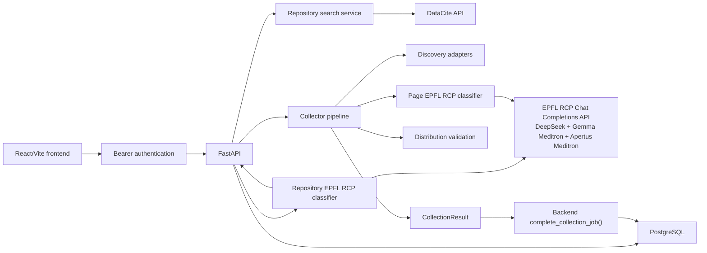
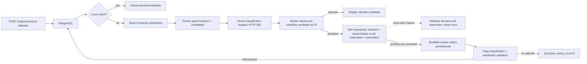
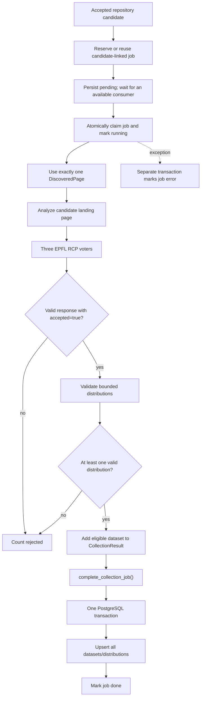

# Technical Design Document - Global Health Dataset Catalog

| Field | Value |
| --- | --- |
| Status | Current architecture |
| Last verified | 2026-09-11 |
| Runtime | React/Vite, FastAPI, Python collector, PostgreSQL |

This document describes the system that exists now. Proposed product,
multi-repository, governance, and production work is kept in the
[roadmap](roadmap.md). The historical SQLite decision is kept in
[ADR 0001](adr/0001-postgresql-only.md).

## 1. Purpose and Scope

The application helps a technical user:

- search DataCite for dataset candidates relevant to a query;
- inspect progressive EPFL RCP relevance decisions;
- automatically collect accepted external candidates through the normal gates;
- inspect repository candidates and their collection progress;
- discover candidate distributions from accepted landing pages;
- classify records as individual health-relevant datasets;
- validate file/API links lightly;
- inspect datasets persisted in PostgreSQL.

The application stores metadata and links. It does not download and retain
dataset files, prove scientific validity, enforce source officiality, or provide
a production review workflow.

## 2. Current Architecture



The runtime has four main ownership boundaries:

| Area | Responsibility | Main paths |
| --- | --- | --- |
| Frontend | Search, progressive status, automatic collection tracking, saved-result display | `frontend/src/App.jsx`, `frontend/src/components/` |
| Backend | HTTP contracts, validation, job orchestration | `backend/app/main.py`, `backend/app/routes/` |
| Collector | Discovery, extraction, classification, validation | `collector/` |
| Database | Schema, sources, jobs, atomic completion, upserts | `backend/app/db/` |

## 3. Frontend Capabilities

`frontend/src/App.jsx` coordinates Search and Catalog sections and runtime API
access:

- `RepositorySearchSection.jsx` searches repository metadata and shows candidate
  counts, progressive classification, warnings, rejected results, and errors;
- `CollectedDatasetsSection.jsx` lists persisted datasets, distributions, and
  validation information.

Repository candidate classification runs progressively with two frontend
workers. An accepted external candidate reserves an automatic collection job;
its card separately shows candidate acceptance and collection state. The
frontend polls active jobs and distinguishes pending/running, saved, completed
without a valid file, and failed outcomes. Successful jobs refresh the persisted
dataset list. There is no source administration view or manual collection-start
endpoint. In token mode the user enters an access token at runtime; the browser keeps it in `sessionStorage`
and sends it only to protected API routes. No token is compiled through a
`VITE_*` build variable.

There is no obsolete manual pasted-HTML collector flow in the current UI.

## 4. HTTP API Inventory

`POST /sources` and all listed `/collector` routes except
`GET /collector/collected-datasets` require a configured Bearer token. Protected
searches are owned by the token's stable owner ID. Missing or invalid
credentials return HTTP 401; exhausted per-minute quotas return HTTP 429 with a
`Retry-After` header.

| Method | Route | Current behavior |
| --- | --- | --- |
| GET | `/health` | Returns `{"status":"ok"}`; it does not test dependencies |
| GET | `/sources` | Lists configured source records |
| POST | `/sources` | Creates a source after Pydantic and DB validation |
| GET | `/sources/{source_id}/page` | Redirects to the configured source URL |
| POST | `/collector/repository-candidates/{candidate_id}/classify` | Persists an owned classification request; returns 202 while queued/running, 200 when terminal |
| GET | `/collector/repository-candidates/{candidate_id}` | Reads an owned candidate, decision and collection follow-up |
| GET | `/collector/repository-analyses/latest` | Restores the owner’s last search containing repository candidates |
| GET | `/collector/collection-jobs/{job_id}` | Returns job status and counters |
| GET | `/collector/collected-datasets` | Lists persisted datasets and distributions |
| POST | `/collector/search-datasets` | Searches collected datasets first, then repository providers on no match |

Collection workers consume committed `pending` jobs directly from PostgreSQL.
On startup, the single-process MVP preserves pending jobs and marks interrupted
`running` jobs, running searches and `classifying` candidates as errors. There
are no automatic collection retries, worker leases or multi-process ownership.
Use one API process and instance. Classification uses the same bounded consumer
implementation with a separate executor: online search results are persisted as
`queued` in the transaction that completes the search, before HTTP acknowledgement.
The browser only follows these initial classifications. Interrupted `classifying` candidates require explicit
retry; an external LLM response lost before persistence may need another call.

### How Repository Search and Source Collection Relate

`POST /collector/search-datasets` first authenticates and consumes the owner's
search quota, then creates an owned durable `search_sessions` row and queries
collected datasets. Only when the local query has no match does it
call external providers, charge classification quota for each unique candidate,
and atomically persist and enqueue normalized results in `repository_candidates`.
Quota failure returns an error before any candidates are saved. Explicit retries
submit only `candidate_id`; ownership and the original query come from PostgreSQL.
A positive decision reserves a candidate-linked collection
job. DataCite metadata is never
copied into `collected_datasets`: the job fetches the landing page and uses the
normal page-classification and distribution-validation gates before
`complete_collection_job()` may write a dataset.



## 5. Repository Search Flow

```mermaid
flowchart TD
    Query["User query + Bearer token"] --> Authenticate["Authenticate owner"]
    Authenticate --> SearchQuota["Consume repository-search quota"]
    SearchQuota --> SearchRoute["POST /collector/search-datasets"]
    SearchRoute --> LocalNormalize["Remove catalog-generic terms<br/>for local lookup only"]
    LocalNormalize --> LocalSearch["PostgreSQL english weighted full-text search"]
    LocalSearch --> LocalMatch{"Local match?"}
    LocalMatch -->|yes| LocalResults["Return origin=database<br/>with distributions"]
    LocalMatch -->|no| Service["search_repository_metadata()"]
    Service --> Provider["DataCite provider"]
    Provider --> Filter["Require title + HTTP(S) URL"]
    Filter --> InitialQuota["Consume classification quota for unique candidates"]
    InitialQuota --> Persist["Atomically save queued candidates<br/>and complete search session"]
    Persist --> UI["Return search_id + candidate_id"]
    Persist --> Claim
    UI -->|explicit retry or legacy pending candidate| ClassifyRoute["Authenticate candidate owner<br/>no metadata body"]
    ClassifyRoute -->|already accepted or rejected| Existing["Read existing decision and follow-up; no reservation"]
    ClassifyRoute -->|new classification or explicit classification retry| ClassifyQuota["Consume classification quota<br/>before eligible LLM work"]
    ClassifyQuota --> ReserveClassify["pending -> queued<br/>persist then return HTTP 202"]
    ReserveClassify --> Claim["Available worker claims queued -> classifying"]
    Claim --> Reload["Read owner, query and metadata from PostgreSQL"]
    Reload --> RepoClassifier["EPFL RCP ensemble<br/>2 positive votes, 3 usable responses"]
    RepoClassifier --> Decision{"Positive structured decision?"}
    Decision -->|no| Rejected["Display rejected candidate; no job"]
    Decision -->|yes| StoreAccepted["Begin transaction: persist accepted decision"]
    StoreAccepted --> Reserve["Reserve on the same connection and transaction"]
    Reserve --> Saved{"Normalized URL already collected?"}
    Saved -->|yes| Catalogued["Commit; return state=saved"]
    Saved -->|no, pending/running job| Reuse["Associate candidate; commit; return active job"]
    Saved -->|no active job| Pending["Create job + association; commit"]
    Pending --> Worker["Worker claims pending job when capacity is free"]
    Worker --> CandidatePipeline["Collect only the candidate landing page"]
    CandidatePipeline --> Gates["Normal page + distribution validation gates"]
    Gates --> Outcome{"Collection outcome"}
    Outcome -->|dataset retained| Persist["Atomic persistence; state=saved"]
    Outcome -->|none retained| Empty["done + saved_count=0; state=empty"]
    Outcome -->|fetch / classifier / validation exception| Failed["state=error"]
```



The local search uses a trigger-maintained `tsvector` and a GIN index. Title has
the highest weight, followed by description, publisher/geography, then hosting
platform/uploader/dataset URL. Results are ordered by relevance and `updated_at`.
The catalog-specific normalizer removes only `data`, `dataset`, and `database`;
the PostgreSQL `english` configuration handles language stop words and stemming.
The original query remains unchanged in `search_sessions` and is used for
responses, DataCite, LLMs, and the UI. The browser cannot replace candidate
metadata or the query at classification time, and another authenticated owner
receives a not-found response for that candidate ID.
Database errors return HTTP 500 and never trigger an online fallback. This
pre-stable full-text configuration change has no upgrade migration; an older
local database must be recreated. Search is currently optimized for primarily
English metadata rather than complete bilingual retrieval.

DataCite is the only provider enabled by default. Its query includes
`resource-type-id=dataset`, a page size, and relevance sorting. Provider output
is normalized into a fixed metadata contract.

Partial-provider handling is implemented: a provider `ValueError` is logged and
returned as a warning when another provider succeeds. The operation fails only
when every active provider fails. With the current one-provider default, a
DataCite failure therefore fails the search.

Repository classification asks whether the metadata is relevant to the user's
query. It does not independently establish health relevance, source trust,
working distributions, or publication eligibility. In the current classifier
contract, both `relevant` and `somewhat_relevant` decisions count as accepted
and trigger automatic collection. An accepted result remains an external
candidate until automatic collection independently fetches its page, passes
page classification, and validates at least one distribution. Only that
validated `CollectionResult` can be persisted; DataCite metadata is never copied
directly into `collected_datasets`.

## 6. Source Collection Flow



Collection, network access, and LLM calls happen outside PostgreSQL
transactions. `complete_collection_job()` locks the running job, derives the
authoritative `source_url` from it, saves every dataset, and marks the job done
inside one transaction. A failed write rolls back the entire completion.
`accepted_count` reports datasets retained after distribution validation,
whereas an unexpected classifier or validation exception fails the job.

Automatic repository collection substitutes a single `DiscoveredPage` with
`discovery_method=repository_search` for broad source discovery. It then uses
the same page-analysis, classification, download-check, persistence, and error
handling primitives as the collector pipeline.

## 7. Discovery

The discovery manager composes adapters for supported catalogue families and a
generic fallback. The active `ADAPTERS` tuple contains CKAN, Socrata, data.json,
and the generic website adapter. The generic adapter uses sitemap-driven page
discovery and falls back to the source URL.

A Dataverse module exists in the source tree but is not imported or registered
by `collector/discovery/adapters/__init__.py`; Dataverse support is therefore not
an active runtime capability.

Structured records become `DiscoveredPage` objects with normalized metadata and
distribution candidates. Generic HTML pages are fetched and extracted before
classification. Discovery is bounded by `CollectorConfig`.

Provider-specific rules belong under `collector/discovery/adapters/`. Shared
metadata and URL utilities remain in shared collector modules.

## 8. Classification

Both default classifiers run three concurrent calls through EPFL RCP's
Chat Completions API. DeepSeek uses `RCP_DEEPSEEK_API_KEY` and `RCP_DEEPSEEK_MODEL`
(default `deepseek-ai/DeepSeek-V4-Flash-0731`). Gemma and Apertus use
`RCP_GEMMA_MEDITRON_API_KEY` and `RCP_APERTUS_MEDITRON_API_KEY`, respectively,
with model variables `RCP_GEMMA_MEDITRON_MODEL`
(default `EPFLiGHT/Gemma-3-27B-MeditronFO`) and `RCP_APERTUS_MEDITRON_MODEL`
(default `EPFLiGHT/Apertus-70B-MeditronFO`). Each HTTP call is synchronous but
the ensemble runs its voters in separate threads. Both classifiers use
`votes_required=2` and `minimum_successful_votes=3`; any unavailable or malformed
vote fails classification. The existing audit shape holds all three votes.
Model availability and credentials must be verified on the deployment endpoint.

The classifiers are intentionally separate:

| Classifier | Input | Decision |
| --- | --- | --- |
| `EnsembleRepositoryRelevanceClassifier` | User query plus repository metadata | Query relevance label |
| `EnsemblePageClassifier` | Page metadata/text plus distributions | Individual dataset and health relevance |

Repository relevance responses use a strict conditional contract.
`missing_information` must contain at least one nonempty item when the label is
`insufficient_information`, and must be empty for every other label. A response
that violates this relationship is a classification error rather than being
silently rewritten. Errors never silently reduce the configured voter count.

Exact prompts, payloads, schemas, aggregation, and failure behavior are described
in [Classification Architecture](classification-architecture.md).

## 9. Distribution Validation

Candidates are tried in descending probability order, deduplicated by URL.
The collector tries up to three distinct links and stops after the first
available distribution by default. Attempt and saved-resource limits are
configured independently.

Structured discovery skips the dataset HTML page only when it already supplies
plausible data links. Otherwise, page extraction fills missing metadata from
the adapter before one classification; date and license evidence retains both
sources. Pages without data links skip classification. A `data.json` catalog
record URL is not treated as an HTML landing page.

`validate_distribution()` uses `HEAD` for metadata and requires a bounded `GET`
sample to confirm access. Results carry `status` and a public `reason`; legacy
`ok` is derived from `status == "available"`. Authentication and CAPTCHA responses
are `restricted`, missing URLs are `unavailable`, and empty, failed or ambiguous
responses are `unconfirmed`. HTML is never accepted as a data distribution.
JSON error envelopes and empty results are rejected; an incomplete JSON sample
remains unconfirmed. Failed checks survive dataset rejection in the collection
job's `validation_failures` audit field.

For HTTP 206, total size comes from valid `Content-Range`, or compatible HEAD
metadata when the total is unknown; the partial `Content-Length` is never used
as the full size. Schema migration 5 stores sizes as `BIGINT` and adds validation
status, reason and job audit fields. LLM provider responses are separately limited
to 2 MiB before decoding or parsing JSON.

Headers and a small sample may refine the detected format. This is an
availability/type probe, not a complete file download or content audit.

Untrusted HTTP requests for HTML, JSON, sitemaps, and distributions pass through
`open_public_http_url()`. Each connection resolves the destination once, rejects
the complete answer if any address is non-public, and opens a socket directly
to a validated numeric address. Retries only use that answer; every redirect
creates a new validated connection, including redirects to the same hostname.
The original hostname is retained for HTTP Host, TLS SNI, and certificate
verification. Environment and explicit proxies are disabled. The conservative
address policy also rejects CGNAT and IPv6 transition/translation ranges.

The production container installs an independent nftables output policy before
starting the API. Only DNS to configured resolvers, TCP 5432 to the resolved
`postgres` service, replies to incoming connections, necessary IPv6 neighbour
discovery, and public TCP 80/443 are allowed. Operators can block additional
CIDRs with `EGRESS_BLOCKED_CIDRS`. Bootstrap fails closed if the firewall cannot
be installed, then starts the API as UID/GID 10001 with all capabilities removed.
This container policy does not apply to a Python process started on the host.

Traefik routes require HTTPS and a configured hostname, with HTTP redirection
and HSTS. PostgreSQL has no published port and uses an internal database network.
The external Traefik still needs working entrypoints and certificates; see
[Secure Deployment](DEPLOYMENT.md) for setup and runtime verification.

Dataset identity validation is deliberately separate from network safety.
`normalize_http_url()` accepts only normalized HTTP(S) URLs with a hostname and
valid port and rejects credentials, control characters, and backslashes. HTML
canonicals are accepted only on the fetched page's hostname. Invalid structured
dataset URLs are rejected before LLM classification, while
`CollectedDataset.__post_init__` enforces the invariant for every construction
path. The API exposes persisted dataset URLs as Pydantic `HttpUrl` values.

## 10. Persistence and Schema

The application uses PostgreSQL through an async psycopg pool. The current
schema contains:

- `schema_migrations`;
- `data_sources`;
- `search_sessions`;
- `repository_candidates`;
- `collection_jobs`;
- `collection_job_candidates`;
- `collected_datasets`;
- `collected_distributions`;
- `dataset_discovery_observations`.

`CollectedDataset` normalizes its HTTP(S) identity URL before persistence, and
`collected_datasets.dataset_url` is unique. Repeated exact normalized URLs
update the existing record and create a discovery observation. This is not
semantic deduplication by DOI, title, version, or mirror relationship.

`search_sessions` owns the original query and its local/online terminal state.
`repository_candidates` stores bounded provider metadata and the atomic
`pending -> queued -> classifying -> accepted|rejected|error` state machine. A uniqueness
constraint deduplicates `(search_session_id, source, url)` within a search.

`complete_candidate_classification()` persists the decision and reserves its
collection on one connection and in one transaction. Reservation failure rolls
back the decision too; a later explicit classification retry may repeat the LLM
call. LLM and network calls run outside this transaction. Automatic collection
locks the accepted candidate before checking prior work.
`collection_jobs.kind` distinguishes manual source work from repository
candidate work, and `repository_candidate_id` records the original candidate.
`collection_job_candidates` records all candidates associated with a newly
created or reused job, in the reservation transaction. Reading a job requires
an association to a candidate belonging to the authenticated user's search;
an inaccessible job returns the same 404 response as a missing job.
A partial unique index prevents multiple active jobs for the same candidate;
an URL-level advisory lock and second partial index prevent candidates from
different searches creating concurrent jobs for the same normalized URL. The
reservation reuses only active `pending` or `running` jobs and skips collection
when the URL was already saved. Repeating classification on an accepted candidate
uses `get_candidate_collection()` to read its latest explicitly associated job,
even after `error` or an empty `done`. It never reserves again. A new candidate
may still create a new job after a terminal attempt at the same URL; the internal
reservation primitive supports this, but there is no collection retry endpoint.
Legacy accepted candidates without a job or saved result return the controlled
`collection_not_scheduled` error without silently starting work. Terminal rows
remain attempt history. Dataset deduplication uses normalized dataset URLs.

Schema version 2 migrates the supported version 1 baseline without deleting
data, backfilling the original job/candidate associations. Previously shared
associations were not stored and cannot be inferred safely from URL equality.
Version 3 adds the classification `queued` state without a new table or data loss.
Historical schemas predating the baseline remain unsupported. The schema
checks reject a database marked current when required tables are absent.

`search_sessions.owner_id` is the authorization boundary for repository
candidates. It comes only from server-side token configuration, never from a
request body. Candidate reads, state transitions, and automatic collection
reservation join through the session and require the same owner ID.
`api_rate_limits` stores one atomic fixed-minute counter per owner and operation;
the window resets in the same upsert, so historical minute rows do not
accumulate. `collection_workers()` maintains a fixed number of consumers using a
dedicated executor. Each claims a single pending job using `FOR UPDATE SKIP LOCKED`
and finishes execution and persistence before claiming another. PostgreSQL holds
the backlog, and the worker cannot see jobs before the creating transaction commits.
Normal shutdown stops claims and drains active jobs before closing the DB pool.

The complete schema is shown in
[Database Schema Diagram](database-schema-diagram.md). PostgreSQL-only startup
and the decision not to migrate the historical SQLite data are recorded in
[ADR 0001](adr/0001-postgresql-only.md).

## 11. Configuration

| Variable | Required | Purpose |
| --- | --- | --- |
| `DATABASE_URL` | Yes for backend | PostgreSQL connection |
| `RCP_DEEPSEEK_API_KEY` | Yes for classification | EPFL RCP authentication |
| `RCP_DEEPSEEK_MODEL` | No | DeepSeek voter model; defaults to `deepseek-ai/DeepSeek-V4-Flash-0731` |
| `RCP_GEMMA_MEDITRON_API_KEY` | Yes for classification | Gemma RCP credential |
| `RCP_APERTUS_MEDITRON_API_KEY` | Yes for classification | Apertus RCP credential; may have the same value as Gemma's |
| `RCP_GEMMA_MEDITRON_MODEL` | No | Defaults to `EPFLiGHT/Gemma-3-27B-MeditronFO` |
| `RCP_APERTUS_MEDITRON_MODEL` | No | Defaults to `EPFLiGHT/Apertus-70B-MeditronFO` |
| `API_ACCESS_TOKENS` | Yes for backend | JSON object mapping stable owner IDs to unique Bearer tokens of 32-512 characters |
| `API_SEARCH_REQUESTS_PER_MINUTE` | No | Search quota per owner; defaults to `10` |
| `API_CLASSIFICATION_REQUESTS_PER_MINUTE` | No | LLM classification quota per owner; defaults to `20` |
| `API_SOURCE_CREATION_REQUESTS_PER_MINUTE` | No | Source-creation quota per owner; defaults to `10` |
| `CLASSIFICATION_MAX_CONCURRENCY` | No | Concurrent classification runs per backend process; defaults to `2` |
| `COLLECTION_MAX_CONCURRENCY` | No | Concurrent collection runs per backend process; defaults to `2` |
| `VITE_API_BASE_URL` | No | Frontend API base; defaults to `http://127.0.0.1:8001` |
| `TEST_DATABASE_URL` | No | Enables PostgreSQL integration tests |

Python dependency constraints are defined only in `pyproject.toml`; `uv.lock`
locks their resolved versions for local development, CI, and the backend image.
Use `uv sync --locked --extra dev` locally. Frontend dependencies are defined in
`frontend/package.json` and locked in `frontend/package-lock.json`; use `npm ci`.
CI tests Python 3.9 and 3.11 with PostgreSQL 16, runs frontend tests and a production
build, and separately verifies the backend container firewall. Docker uses Python
3.11, also selected locally by `.python-version`. OS packages and base images
remain outside the Python dependency lock.

## 12. Non-Functional Requirements and Runtime Limits

The current MVP prioritizes bounded work and visible failure over exhaustive
crawling. The limits below are code defaults, not production capacity targets.

| Concern | Current limit | Enforcement point |
| --- | ---: | --- |
| Collector HTTP timeout | 10 seconds/request | `CollectorConfig.request_timeout_seconds` |
| EPFL RCP HTTP timeout | 20 seconds/request | `HTTPJSONLLMClient` |
| Pages analyzed per source | 5 | `CollectorConfig.max_pages_per_source` |
| Distinct distribution attempts per dataset | 3 | `CollectorConfig.max_distribution_attempts` |
| Distributions retained per dataset | 1 | `CollectorConfig.max_distributions_saved` |
| Distribution partial-GET sample | 65,536 bytes | `CollectorConfig.max_sample_bytes` |
| HTML response body | 1,000,000 bytes | `fetch_public_html()` |
| JSON discovery response body | 5,000,000 bytes | `fetch_json_url()` |
| Sitemap/robots response body | 5,000,000 bytes | `fetch_text_url()` |
| Sitemaps traversed | 10/source | `MAX_SITEMAPS_PER_SOURCE` |
| Generic adapter sitemap results | 50/source | `GenericWebsiteAdapter.max_sitemap_urls` |
| Sitemap utility hard cap | 1,000/source | `MAX_URLS_PER_SOURCE` |
| DataCite search results | 10/query | provider `page_size` |
| CKAN/Socrata/data.json rows | 5/discovery call | adapter `rows` defaults |
| Repository candidate classifications | 2 concurrent classifications | frontend workers and backend executor |
| Repository LLM calls | up to 6 concurrently | 2 classifications x 3 EPFL RCP calls |
| Collection runs | 2 concurrently per backend process by default | dedicated backend executor |
| Repository searches | 10/minute per owner by default | atomic PostgreSQL fixed-minute quota |
| Repository classifications | 20/minute per owner by default | atomic PostgreSQL fixed-minute quota |
| Source creation | 10/minute per owner by default | atomic PostgreSQL fixed-minute quota |
| Page text sent to a page LLM | 4,000 characters | `MAX_PAGE_TEXT_CHARS` |
| Distributions sent to a page LLM | 10 | `MAX_DISTRIBUTIONS` |
| Repository query | 300 characters | repository classification contract |
| Repository metadata JSON | 100,000 bytes | route bounding logic |

Network bodies are read one byte beyond their limit to detect overflow; an
overflow fails the affected operation. Distribution validation reads only a
bounded sample when a partial `GET` is needed. These limits reduce memory and
latency risk. Per-owner quotas protect application-level costly operations;
infrastructure-level connection and bandwidth limits remain a deployment
responsibility.

Availability expectations are intentionally local-MVP level:

- no uptime service-level objective is defined;
- pending collection jobs survive restart; the next single-process startup marks
  interrupted running jobs as `error`, without retrying them automatically;
- queued classifications survive restart; running ones become retryable errors;
- the frontend restores the last repository analysis after reload; a full history
  of searches is not implemented;
- no automatic retry budget is configured for external APIs or LLM calls;
- PostgreSQL is a mandatory startup dependency;
- the frontend expects the API at one configured base URL.

## 13. External Dependency Matrix

| Dependency | Used for | Timeout/bound | Failure behavior | Current fallback |
| --- | --- | --- | --- | --- |
| DataCite API | Repository search metadata | 10-second JSON fetch; 5 MB; 10 results | Provider raises `ValueError`; route returns 502 when all providers fail | Partial results are supported across providers, but only DataCite is active |
| CKAN API | Adapter detection and package discovery | 10-second JSON fetch; 5 MB; 5 rows | Detection failure returns `False`; failure after a positive detection propagates to the collection job | Next adapter is tried only when detection returns false |
| Socrata catalog API | Adapter detection and record discovery | 10-second JSON fetch; 5 MB; 5 rows | Same detect/discover distinction as CKAN | Next adapter on failed detection |
| data.json/DCAT endpoint | Adapter detection and record discovery | 10-second JSON fetch; 5 MB; 5 selected records | Same detect/discover distinction as CKAN | Next adapter on failed detection |
| Generic website/sitemap | Page discovery and HTML extraction | 10 seconds; 5 MB text; 1 MB HTML | robots/sitemap failures are skipped; HTML fetch failure rejects that page | Source URL fallback when sitemap discovery yields no entries |
| EPFL RCP Chat Completions API | Repository and page classification with `deepseek-ai/DeepSeek-V4-Flash-0731` by default | 20 seconds/model call; bounded payloads | A failed or malformed response raises a classification error | No provider or model fallback |
| PostgreSQL | Sources, jobs, collected metadata, transactions | Pool defaults 1-10 connections | Startup fails without DB; persistence rolls back on error; writing job `error` can also fail during outage | No storage fallback |

All untrusted collector destinations use the shared public-HTTP guard. EPFL RCP
uses a server-configured endpoint and does not consume a URL supplied by a
collected page.

Dataverse is intentionally absent from this matrix because it is not registered
at runtime. Its proposed integration is described in
[Multi-Repository Architecture](props/multi-repository-architecture.md).

## 14. Seed and Upsert Rules

### Source seeds

The schema defines two WHO source seeds:

- `who_gho_indicators`;
- `who_gho_life_expectancy`.

Startup inserts missing seeds with `ON CONFLICT(source_key) DO NOTHING`.
Therefore startup never overwrites an existing source row, including local
changes to a seed. Seed keys are reserved and cannot be created through the
public `POST /sources` path.

`upsert_collector_data_source()` is a separate internal operation. It may update
name, description, theme, and URL for an existing key, including a seed key. It
must not be confused with non-destructive startup seeding.

### Collected dataset upsert

`collected_datasets` conflicts on the exact normalized `dataset_url`:

- `source_url`, classification signals, `last_seen_at`, and `updated_at` are
  refreshed;
- incoming non-empty title, description, publisher, hosting platform, uploader,
  and discovery method replace stored values;
- empty incoming text does not erase an existing non-empty value;
- incoming geography replaces stored geography only when non-empty;
- `first_seen_at` remains the original timestamp.

Every successful observation inserts a `dataset_discovery_observations` row so
the collection job, source URL, discovery method, and observation time remain
auditable.

### Distribution upsert

Distributions conflict on `(dataset_id, url, format)`. Discovery fields and
`last_seen_at` are refreshed. A new validation result replaces the stored
validation fields and advances `last_checked_at`; if a later crawl observes the
distribution without validating it, the previous validation result is
preserved.

The active background collection path performs all dataset, distribution,
observation, and job-completion writes inside the single
`complete_collection_job()` transaction. The lower-level
`save_collected_datasets()` entry point performs a standalone batch transaction
and does not change job state.

## 15. Security Boundaries

Implemented controls include:

- server-configured Bearer authentication for costly and mutating routes;
- search-session ownership enforced in candidate SQL reads and transitions;
- atomic PostgreSQL quotas per owner and operation;
- Pydantic validation and bounded repository payload fields;
- JSON-only EPFL RCP responses with an embedded schema plus local validation;
- untrusted prompt fields treated as evidence, not instructions;
- public HTTP(S) destination validation and redirect checks;
- bounded HTML, JSON, sitemap, and distribution reads;
- parameterized SQL;
- atomic completion transactions.

Current limitations include:

- static tokens are an MVP identity mechanism, without OAuth/OIDC, expiry,
  roles, self-service revocation, or institutional single sign-on;
- authenticated users share source and collection-job records; only repository
  sessions and candidates have per-owner authorization;
- permissive local-development CORS origins only;
- no source allowlist or complete trust-tier enforcement;
- no enforced license policy;
- no automated privacy/sensitivity review;
- no production secret-management or audit-log design.

Policy requirements that exceed current enforcement remain tracked in the
[roadmap](roadmap.md).

## 16. Error Handling and Observability

Repository provider failures produce sanitized API warnings for partial success.
Classification requests are acknowledged after persistence, normally with HTTP
202. Classifier failures are stored by the worker, exposed through sanitized GET
responses, and require `retry=true` for another attempt. If persisting a decision
or its collection reservation fails, the transaction rolls back and the worker
makes a separate best-effort transition from `classifying` to `error`. Retrying
can repeat the LLM call. If PostgreSQL itself is unavailable, the error update
can also fail; startup recovery handles remaining `classifying` rows.

Search failures after session creation make a best-effort terminal `error`
update, including failures while completing local results or bounding external
candidates. Fetch, classifier and validation exceptions attempt to mark the
collection job `error`. A successfully fetched and analyzed candidate without
a valid dataset is represented as a completed empty collection.

Collection jobs persist counters, messages, errors, discovery methods, and
timestamps. Application logging exists, but there is no metrics backend,
distributed tracing, alerting, or centralized log policy.

## 17. Tests and Quality Checks

Test areas include routes, database behavior, collection, discovery adapters,
sitemaps, repository search, page/repository ensembles, LLM payload parsing, and
safe HTTP fetching.

Last verified locally:

```text
pytest with PostgreSQL: 245 passed
frontend tests: 14 passed
ruff: passed
frontend build: passed
```

The skipped tests require a reachable PostgreSQL server. The complete check is:

```bash
.venv/bin/ruff check .
TEST_DATABASE_URL="$DATABASE_URL" .venv/bin/pytest
npm --prefix frontend test
npm --prefix frontend run build
```

Counts are verification evidence for the stated date, not an architectural
contract.

## 18. Risk Register

| Priority | Risk | Current exposure | Mitigation or next control |
| --- | --- | --- | --- |
| Medium | Static access tokens are not a production identity system | Tokens have no expiry or roles and source/job records are shared | Keep tokens unique and secret for the MVP; replace them with institutional OAuth/OIDC and role-based authorization before broad multi-user use |
| High | Single-instance execution | Both queues persist requests, but interrupted running tasks require explicit retries | Add worker leases and bounded recovery before scaling instances |
| High | Repository relevance mistaken for catalogue approval | Repository acceptance precedes and differs from page/file validation | Keep candidate and collection states distinct; persist only through collection gates |
| High | Source authority, licence, and sensitivity not enforced | Technically valid records may still be unsuitable for publication | Implement policy gates and human review before public catalogue claims |
| Medium | One distribution validated by default | A valid secondary file can be missed | Validate ranked alternatives within a bounded budget |
| Medium | Normalized-URL-only duplicate identity | DOI-equivalent versions and mirrors can create separate records | Add persistent identifiers and version/mirror relationships |
| Medium | Three LLM models on one provider | RCP outage or any failed voter stops classification under the three-response quorum | Monitor per-model reliability and evaluate provider diversity if needed |
| Medium | External APIs have no retries | Transient failures can fail detection, search, or jobs | Add bounded retry/backoff with idempotent behavior |
| Medium | PostgreSQL tests can be skipped locally | DB regressions may escape a non-DB test run | Require `TEST_DATABASE_URL` in CI |
| Low | Volatile test counts in documentation | Counts become stale as tests change | Keep a verification date and update counts during review |

The HTTP transport pins validated DNS addresses, and the production container
enforces an independent egress policy. Public deployment still requires checking
the real Traefik certificate, inbound firewall and any internally routed public
CIDRs. When PostgreSQL is recreated with new addresses, restart the API to
refresh its narrow database exception. See [Secure Deployment](DEPLOYMENT.md).

## 19. Open Decisions

| Decision | Owner | Status | Needed outcome |
| --- | --- | --- | --- |
| Meaning and allowed use of "official" | Policy owner | Unassigned / open | Approved source tiers and UI wording |
| Multi-repository scope and Dataverse activation | Product/data owner | Unassigned / open | Approve providers, ordering, quotas, and benchmark |
| Human-review workflow | Data-governance owner | Unassigned / open | Define triggers, roles, decisions, and audit retention |
| Acceptable licences and restricted-access data | Legal/policy owner | Unassigned / open | Allow/review/deny policy |
| Authentication and deployment boundary | Security/infra owner | Unassigned / open | Roles, identity provider, and exposed routes |
| Multi-instance execution | Backend/infra owner | Unassigned / open | Extend the PostgreSQL queues with leases and bounded recovery |
| Provider-independent LLM voting | ML/technical owner | Unassigned / open | Decide resilience requirement and evaluation plan |
| Stable-release migration policy | Backend/data owner | Unassigned / open | Data-preserving migration and rollback process |

No owner assignment or decision in this table is implied by the current code.
The detailed provider proposal is isolated in
[Multi-Repository Architecture](props/multi-repository-architecture.md).

## 20. Current Limitations

- repository relevance does not independently enforce global-health relevance;
- source officiality and publisher authority are not enforced;
- licence acceptance is not enforced;
- normalized-URL-only deduplication does not model versions or mirrors;
- collection execution requires one API process/instance; interrupted running
  tasks are not retried automatically; completed external responses lost before
  persistence may require another LLM call;
- no human-review, publication status, or lifecycle workflow exists;
- no CI/staging/production architecture is defined in code.

These items belong to the [roadmap](roadmap.md), not to the current architecture
description.

## 21. Related Documents

- [Onboarding](ONBOARDING.md)
- [Collector Pipeline Diagram](collector-pipeline-diagram.md)
- [Classification Architecture](classification-architecture.md)
- [Database Schema Diagram](database-schema-diagram.md)
- [Roadmap](roadmap.md)
- [Multi-Repository Architecture](props/multi-repository-architecture.md)
- [ADR 0001 - PostgreSQL-only persistence](adr/0001-postgresql-only.md)
